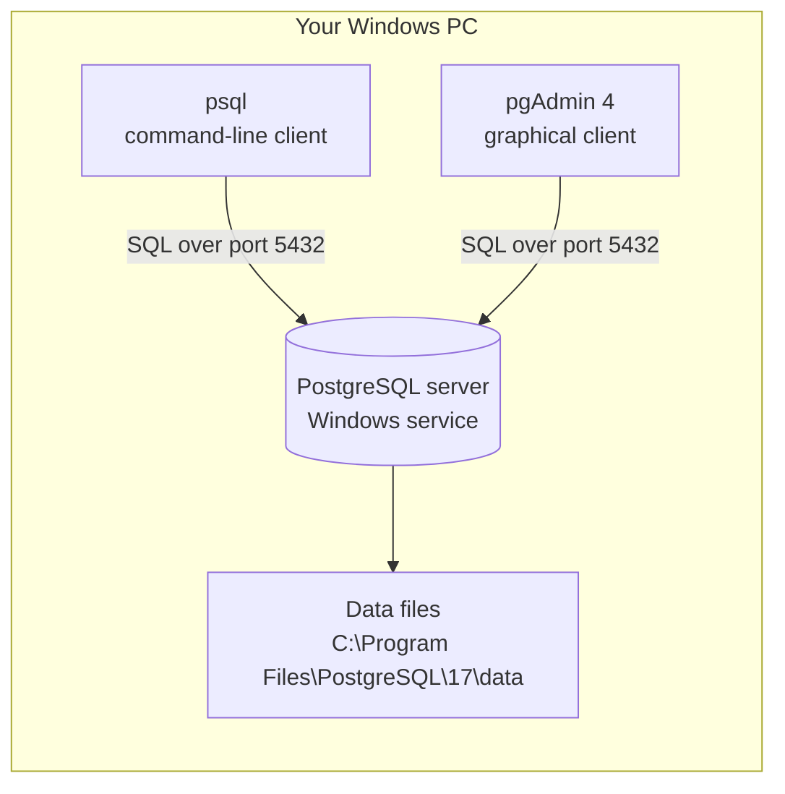

# Lab 00: Environment Setup — PostgreSQL, psql, and pgAdmin on Windows 11

> **Goal:** By the end of this lab you will have a working PostgreSQL database server running on your Windows machine, know how to connect to it two different ways, and have created the working folders and the first database you'll use in every later lab.
>
> **Time:** 1.5–2.5 hours
> **Prerequisites:** Windows 11 PC with admin rights, ~5 GB free disk space

---

## 1. Environment Setup

This whole lab *is* environment setup, so let's start with the big picture.

### 1.1 What you are about to install (and what these words mean)

Before installing anything, let's define the terms — you'll hear all of these in every data engineering job:

- **Database**: An organized collection of data, stored so it can be queried efficiently. Think of it as a set of smart spreadsheets (tables) that can be linked together and searched millions of rows at a time.
- **Relational database**: A database that stores data in **tables** (rows and columns) and lets you define **relationships** between tables (e.g., every order belongs to a customer). "Relational" comes from the mathematical term *relation*, which just means a table.
- **SQL** (Structured Query Language, pronounced "sequel" or "ess-cue-ell"): The language used to ask relational databases questions ("give me all orders over $100") and to modify data. It has been the standard since the 1970s and is arguably the single most durable skill in all of data work.
- **Database server**: A program that runs continuously in the background, holds the data, and answers SQL requests from clients. PostgreSQL is a database server.
- **Client**: Any program that connects to the server and sends SQL. We'll install two: **psql** (command-line) and **pgAdmin** (graphical).
- **PostgreSQL** (often shortened to "Postgres"): A free, open-source relational database server, in continuous development since 1986. It is widely considered the most standards-compliant and feature-rich open-source database, and it is the foundation many cloud warehouses (like Amazon Redshift) were built from.

**Why PostgreSQL and not MySQL/SQL Server/SQLite?** All are fine databases, but:
- PostgreSQL's SQL dialect is the closest to the ANSI standard, so what you learn transfers cleanly to Snowflake, Redshift, and BigQuery.
- It has first-class support for the analytical features this module teaches: window functions, CTEs, materialized views, `EXPLAIN ANALYZE`.
- It's free, installs natively on Windows, and is enormously popular in industry job postings.

### 1.2 Version requirements

Install the **latest stable major version** of PostgreSQL (at the time of writing that is PostgreSQL 17; anything from 15 upward works for this module). To check the current latest version, visit <https://www.postgresql.org/download/> — the download page always lists the current release.

Everything in this module works identically on PostgreSQL 15, 16, and 17.

### 1.3 Create your working folders first

Open **PowerShell** (press `Win`, type `powershell`, press Enter — no admin needed for this step) and run:

```powershell
New-Item -ItemType Directory -Force C:\dataeng\sk02\sql
New-Item -ItemType Directory -Force C:\dataeng\sk02\logs
New-Item -ItemType File -Force C:\dataeng\sk02\notes.md
```

**What this does:** Creates a folder tree at `C:\dataeng\sk02` with `sql\` (for the SQL scripts you'll write), `logs\` (for ETL logs in Labs 05–06), and an empty `notes.md`.

**Why here and not Documents/Desktop?** On many Windows 11 machines, Documents and Desktop are synced by OneDrive. OneDrive can lock files while syncing, which causes confusing intermittent errors when tools write to them. A plain path like `C:\dataeng` avoids that entirely, and short paths avoid Windows' historic 260-character path-length issues.

**Expected output:** PowerShell prints the created directory/file objects (Mode, LastWriteTime, Name). No red text.

**Verify:**

```powershell
Get-ChildItem C:\dataeng\sk02
```

You should see `sql`, `logs`, and `notes.md` listed.

> **macOS/Linux note:** use `mkdir -p ~/dataeng/sk02/{sql,logs}` and install PostgreSQL via Homebrew (`brew install postgresql@17`) or your package manager. Everything else in this module is identical.

---

## 2. Business Context

**Why does a data engineer need a local database?**

Every data engineering job involves a database somewhere: as a source you extract from, a warehouse you load into, or both. Companies run databases like PostgreSQL to power their applications (every order on an e-commerce site is an `INSERT` into a database) and to power analytics (every dashboard is a `SELECT`).

- **Who consumes this?** Application developers, analysts, data scientists, finance teams, executives reading dashboards — all downstream of someone who can run and query a database.
- **Where is it used in industry?** PostgreSQL specifically runs at Apple, Instagram, Spotify, Reddit, and thousands of smaller companies. It's also the default choice for startups.
- **What happens if the database fails?** The application stops taking orders. The dashboards go blank. This is why "database is down" is a page-the-on-call-engineer-at-3am event, and why we'll treat even our local install with production habits: know where the data lives, know where the logs are, know how to restart the service.

Installing your own server — rather than using a cloud sandbox — means you learn what's actually happening: services, ports, authentication, storage. That knowledge is exactly what separates an engineer from someone who only knows a query editor.

---

## 3. Concept Explanation

### 3.1 The client–server model

PostgreSQL uses a **client–server** architecture:



- The **server** runs as a **Windows service** — a background program that starts automatically when Windows boots, whether or not you're logged in. (Services are Windows' equivalent of Linux daemons.)
- Clients connect to the server over a network **port** — a numbered channel on your machine. PostgreSQL's default port is **5432**. Even when client and server are on the same PC, they talk through this port ("localhost:5432").
- The server stores everything in a **data directory** — a folder of binary files only the server should ever touch. You never edit these files directly; you go through SQL.

### 3.2 Key vocabulary you'll use constantly

| Term | Meaning |
|---|---|
| **Instance / cluster** | One running PostgreSQL server. Confusingly, Postgres calls a single server a "cluster" — it does *not* mean multiple machines. |
| **Database** | A named container of tables inside the server. One server hosts many databases. We'll create one called `freshmart`. |
| **Schema** | A namespace *inside* a database that groups tables (like folders for tables). The default is called `public`. We'll create `staging` and `warehouse` schemas in Lab 05. |
| **Table** | Rows and columns of data. |
| **Role / user** | An account that can log in and has permissions. The installer creates a superuser called `postgres`. |
| **Superuser** | A role that can do anything — like Windows Administrator. Fine locally; in production you'd use restricted roles (Lab 06 discusses this). |

### 3.3 Alternatives (so you know what you're *not* doing)

| Option | Why we're not using it here |
|---|---|
| SQLite | Brilliant embedded database, but no server, no roles, weaker analytical SQL — doesn't teach production skills. |
| Docker container | Great in SK-03, but adds a virtualization layer to debug. Native install teaches you services, ports, and file locations directly. |
| Cloud database (RDS, Neon, Supabase) | Costs money or has limits, needs an account, and hides the server administration you should learn once. |

---

## 4. Step-by-Step Implementation

### Step 1 — Download the installer

1. Go to <https://www.postgresql.org/download/windows/>.
2. Click **"Download the installer"** (this takes you to EDB, the company that packages the official Windows installer).
3. Choose the **latest stable version** for **Windows x86-64** and download it (~350 MB).

**Why the EDB installer?** It bundles the server, psql, and pgAdmin 4 in one guided install — perfect for a first setup.

**Common mistake:** downloading the 32-bit or macOS installer. Check the filename contains `windows-x64`.

### Step 2 — Run the installer

Right-click the downloaded `.exe` → **Run as administrator**. Walk through the wizard:

1. **Installation Directory:** accept the default `C:\Program Files\PostgreSQL\17` (your version number may differ).
2. **Select Components:** keep all four checked — **PostgreSQL Server**, **pgAdmin 4**, **Stack Builder**, **Command Line Tools**. (Stack Builder is an optional add-on downloader; we won't use it, but it's harmless.)
3. **Data Directory:** accept the default (`...\17\data`). This is where your actual data lives. Write this path in your `notes.md`.
4. **Password:** you're setting the password for the `postgres` superuser. Choose something you will remember, e.g. a passphrase. **Write it in your password manager — if you lose it, recovery is fiddly.** For a learning machine, something memorable is fine; never reuse a real password.
5. **Port:** accept **5432**. If the installer says the port is in use, see Troubleshooting below.
6. **Locale:** accept the default.
7. Click through to **Install** (takes a few minutes), then **Finish**. Untick "Launch Stack Builder" when offered.

**Expected result:** wizard completes with no errors.

**Troubleshooting:**

| Problem | Fix |
|---|---|
| "Port 5432 already in use" | You (or another app) already have a Postgres instance. Either uninstall the old one, or accept port 5433 — but then **every** connection in this module must add `-p 5433`. Simpler: free up 5432. |
| Installer fails near the end with an "initdb" error | Usually antivirus interference or a synced/locked data folder. Temporarily pause third-party antivirus, ensure the data directory is on a local non-synced drive, and re-run the installer. |
| "The program can't start because MSVCP140.dll is missing" | Install the Microsoft Visual C++ Redistributable (x64) from Microsoft's site, then re-run. |

### Step 3 — Verify the service is running

The installer registers PostgreSQL as a Windows service and starts it. Confirm in PowerShell:

```powershell
Get-Service -Name postgresql*
```

**Expected output:**

```
Status   Name                DisplayName
------   ----                -----------
Running  postgresql-x64-17   postgresql-x64-17 - PostgreSQL Server 17
```

**Why verify?** "It installed" and "it's running" are different claims. Production habit #1: after any deployment, verify the service state — never assume.

If Status is `Stopped`, start it (this one needs an **admin** PowerShell — right-click PowerShell → Run as administrator):

```powershell
Start-Service postgresql-x64-17
```

You now also know how to restart the database if it ever misbehaves: `Restart-Service postgresql-x64-17` (admin PowerShell).

### Step 4 — Put psql on your PATH

**What is PATH?** An environment variable — a named value the operating system keeps for programs to read — listing folders Windows searches when you type a command. The installer does *not* add PostgreSQL's tools to PATH, so `psql` won't work in PowerShell yet.

Add it (regular PowerShell, adjust `17` to your version):

```powershell
[Environment]::SetEnvironmentVariable(
  "Path",
  [Environment]::GetEnvironmentVariable("Path","User") + ";C:\Program Files\PostgreSQL\17\bin",
  "User")
```

**Why "User" scope?** It changes PATH only for your account, needing no admin rights, and persists across reboots.

**Now close and reopen PowerShell** (PATH changes only apply to new windows — forgetting this is the #1 gotcha), then verify:

```powershell
psql --version
```

**Expected output:** something like `psql (PostgreSQL) 17.x`.

**Troubleshooting:** `psql : The term 'psql' is not recognized` → you didn't reopen PowerShell, or the version number in the path is wrong. Check the folder actually exists: `Get-ChildItem "C:\Program Files\PostgreSQL"`.

### Step 5 — First connection with psql

```powershell
psql -U postgres -h localhost -d postgres
```

**What the flags mean:** `-U postgres` = connect as the `postgres` user; `-h localhost` = the server is on this machine; `-d postgres` = open the built-in database named `postgres` (every install has one; it's a lobby, not where your data goes).

Enter the password you set in Step 2 (nothing appears as you type — that's normal). **Expected output:**

```
psql (17.x)
WARNING: Console code page (437) differs from Windows code page (1252)...
Type "help" for help.

postgres=#
```

That warning about code pages is cosmetic on Windows and safe to ignore for this module. The `postgres=#` prompt means you are **inside** psql, talking to the server. The `#` means superuser.

Try your first SQL:

```sql
SELECT version();
```

**Type the semicolon!** psql sends nothing until it sees `;`. If you press Enter and get a `postgres-#` continuation prompt (note the `-`), psql is waiting for the rest of your statement — type `;` and Enter.

**Expected output:** one row describing your PostgreSQL version and platform.

Essential psql meta-commands (these start with `\` and are psql features, not SQL):

| Command | Does |
|---|---|
| `\l` | List databases |
| `\c freshmart` | Connect to database `freshmart` |
| `\dt` | List tables in the current database |
| `\d tablename` | Describe a table's columns |
| `\timing on` | Show how long each query takes (we use this a lot in Lab 03) |
| `\i 'C:/dataeng/sk02/sql/file.sql'` | Run a SQL script file (note **forward slashes**) |
| `\q` | Quit psql |

### Step 6 — Create the module database

Still inside psql:

```sql
CREATE DATABASE freshmart;
```

**Expected output:** `CREATE DATABASE`

**Why a separate database?** Isolation. Real teams never build projects in the default `postgres` database; each project gets its own. If you make a mess, you can `DROP DATABASE freshmart;` and start clean without touching anything else.

**Verify:**

```sql
\l
```

You should see `freshmart` in the list. Connect to it:

```sql
\c freshmart
```

Expected: `You are now connected to database "freshmart" as user "postgres".`

**Common mistake:** running `CREATE DATABASE` and then creating tables while still connected to `postgres`. Your tables "disappear" — they're just in the wrong database. Always check the prompt: it shows the current database name (`freshmart=#`).

### Step 7 — First connection with pgAdmin

1. Press `Win`, type **pgAdmin 4**, open it. It launches in a window (recent versions) or your browser — either is fine.
2. First launch asks you to set a **master password**. This protects pgAdmin's saved passwords locally; pick something memorable.
3. In the left tree, expand **Servers → PostgreSQL 17**. Enter your `postgres` password and tick **Save Password**.
4. Expand **Databases** — you should see **freshmart** (right-click Databases → Refresh if not).
5. Click `freshmart`, then open **Tools → Query Tool** (or the ⚡ icon). This is a SQL editor connected to freshmart.
6. In the Query Tool, run (press **F5** to execute):

```sql
SELECT current_database(), current_user, now();
```

**Expected output:** one row: `freshmart | postgres | <current timestamp>`.

**When to use which client?** pgAdmin for browsing, learning, and reading big result sets; psql for scripts, automation, and anywhere a GUI isn't available (real servers). This module uses both; every lab's SQL works in either.

### Step 8 — A smoke-test table (create, insert, query, drop)

**A smoke test** is a minimal end-to-end check that the whole system works. In the Query Tool (or psql, connected to `freshmart`):

```sql
CREATE TABLE smoke_test (
    id         SERIAL PRIMARY KEY,   -- SERIAL: auto-incrementing integer
    note       TEXT NOT NULL,        -- TEXT: variable-length string; NOT NULL: required
    created_at TIMESTAMPTZ DEFAULT now()  -- timestamp with time zone, defaults to "now"
);

INSERT INTO smoke_test (note) VALUES ('PostgreSQL is alive');

SELECT * FROM smoke_test;
```

**Expected output:** one row: `1 | PostgreSQL is alive | 2026-…`. Don't worry about the syntax details yet — Lab 01 explains every piece. This just proves you can create, write, and read.

Clean up (leave no test junk behind — a production habit):

```sql
DROP TABLE smoke_test;
```

### Step 9 — Save your connection details safely

Create `C:\dataeng\sk02\connection_info.md` with your **non-secret** connection details:

```markdown
# My PostgreSQL connection
- Host: localhost
- Port: 5432
- Superuser: postgres
- Password: (in my password manager — NOT written here)
- Data directory: C:\Program Files\PostgreSQL\17\data
- Service name: postgresql-x64-17
```

**Why not write the password?** Habit. In production, credentials in plain-text files get committed to Git, leaked, and exploited — it is one of the most common real-world breach causes. Start the habit now: secrets live in a password manager (or later, a secrets manager), never in project files.

**Bonus — passwordless psql for scripting:** psql reads a file called `pgpass.conf` at `%APPDATA%\postgresql\pgpass.conf`. Create it with this single line (fill in your password):

```
localhost:5432:*:postgres:YOUR_PASSWORD
```

Now `psql -U postgres -d freshmart` connects without prompting — which matters when you script ETL runs in Lab 06. This file lives in your user profile (not the project folder) and is the officially supported place for local credentials.

---

## 5. Production Engineering Practices

Even a local install deserves production habits. Here's what you just practiced, and why each matters:

1. **Verification after every change** (Steps 3–8). Every step had an "expected output". *Failure story:* an engineer "installed" a database on a new server, declared done, and left. The service had silently failed to start; the application team lost half a day discovering it. A 5-second `Get-Service` would have caught it.
2. **Know where your data and logs live.** Your data directory is `...\17\data`; server logs are in `...\17\data\log\`. When something breaks, the log is where the truth is. Open that folder now and skim today's log file — you'll see your own connections recorded.
3. **Secrets stay out of project files** (Step 9). Password manager or `pgpass.conf`, never `notes.md`, never Git.
4. **Isolation per project** (Step 6). Separate database per project means a mistake has a small blast radius — the same reasoning behind separate dev/test/prod environments.
5. **Clean up test artifacts** (Step 8). Leftover `test_table_2_final_v3` tables are how real warehouses become unmaintainable swamps.
6. **Document your environment** (`connection_info.md`). Six months from now — or the colleague who inherits your machine setup — will thank you.

---

## 6. Reflection

### What you learned
You installed a real database server, learned the client–server model, connected with two different clients, created a database, and ran your first SQL — plus the operational basics (services, ports, PATH, data directory, logs) that most tutorials skip and most jobs assume.

### Why it matters
Every subsequent lab, and most data engineering roles, sit on top of exactly this: a running relational database you can connect to, query, and administer at a basic level.

### Interview questions

1. **"What is the difference between PostgreSQL, a database, and a schema?"** — PostgreSQL is the server software; a database is a named container of objects within one server; a schema is a namespace inside a database that groups tables. One server → many databases → many schemas → many tables.
2. **"How does a client connect to PostgreSQL?"** — Over TCP to a host and port (default 5432), authenticating as a role, into a specific database. Locally that's `localhost:5432` as user `postgres`.
3. **"What port does PostgreSQL use by default?"** — 5432. Knowing default ports (Postgres 5432, MySQL 3306, SQL Server 1433) is a common quick screen.
4. **"Where does PostgreSQL store its data on disk, and would you ever edit those files?"** — In the data directory (on Windows typically `C:\Program Files\PostgreSQL\<ver>\data`). Never edit directly; all access goes through the server via SQL. Backups use tools like `pg_dump`, not file copies of a running server.
5. **"What is a superuser and why shouldn't applications connect as one?"** — A role with unrestricted privileges. Applications should use least-privilege roles so a bug or compromise can't drop tables or read everything. (Trap: saying "it's fine because we trust the app" — the point is limiting blast radius, not trust.)
6. **"psql or pgAdmin — which is better?"** — Trap question: neither. psql for scripting/automation/servers, GUI tools for exploration. A strong answer mentions you'd use psql in CI/CD because it's scriptable.
7. **"How would you check whether the database server is running on a Windows host?"** — `Get-Service postgresql*` (or Services.msc), then confirm connectivity with a trivial query like `SELECT 1;` — service running and server answering are separate checks.

**Common interview trap:** confusing "cluster" (in Postgres: one server instance) with a multi-machine cluster. If asked about "a Postgres cluster," clarify which meaning is intended — that clarification itself signals experience.

### Key takeaways
- PostgreSQL = server (Windows service) + clients (psql, pgAdmin) talking over port 5432.
- Always verify: service running → can connect → can query.
- One project = one database. Secrets never live in project files.
- You now have `freshmart` — the empty stage on which Labs 01–06 build a warehouse.

**Next:** [Lab 01 — SQL Foundations](Lab_01_SQL_Foundations.md), where you'll load FreshMart's data and write your first real queries.
