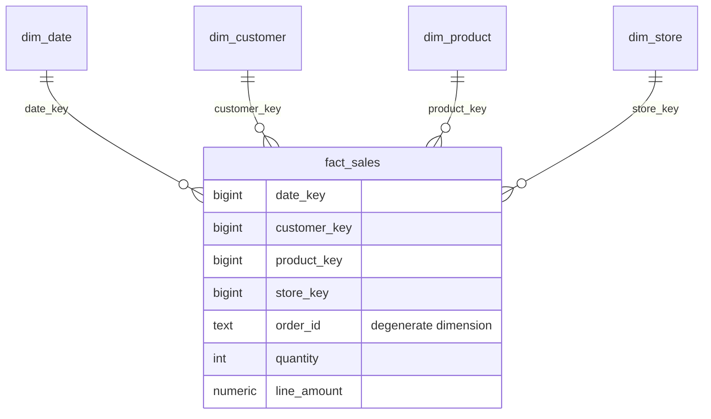

# Lab 04 — Dimensional Modeling: Star Schema, Grain & Slowly Changing Dimensions

> **Scenario:** FreshMart has agreed: reporting moves off the transactional database into a proper analytics warehouse. Before writing a single line of ETL, you must *design* it. This lab is where you stop being a SQL writer and start being a data modeler.
>
> **Time:** 4–5 hours | **Difficulty:** Intermediate | **Prerequisite:** Labs 01–03

---

## 1. Environment Setup

No new software. Verify the environment and create the warehouse **schema** (a schema is a named folder for tables inside a database — it keeps warehouse tables cleanly separated from the OLTP tables):

```sql
CREATE SCHEMA IF NOT EXISTS dw;
```

**Expected output:** `CREATE SCHEMA`.
**Verify:** `\dn` in psql lists `dw` alongside `public`.
**Common mistake:** creating a whole new *database* instead. A schema in the same database lets Lab 05's ETL read OLTP tables and write warehouse tables in one SQL statement — no cross-database plumbing.

Create the script file:

```powershell
New-Item -ItemType File -Path C:\dataeng\sk02\sql\04_star_schema.sql -Force
```

---

## 2. Business Context

FreshMart's pain (from the labs so far):

- Reports hammer the OLTP database that runs the checkouts (Lab 03 showed why big aggregations must scan everything).
- Every analyst writes joins from scratch; each encodes business rules slightly differently ("do returns count as revenue?").
- **History is being destroyed silently.** When a customer moves from Kumasi to Accra, the OLTP system *overwrites* `city`. Every past order now looks like it happened under the new city. Last year's "revenue by city" report can never be reproduced again.

The industry-standard answer since the 1990s is the **dimensional model** (Ralph Kimball's methodology): a database *shaped for questions, not for transactions*. Who consumes it: BI dashboards (Power BI in SK-06 will connect to exactly this shape), analysts, ML feature pipelines. What happens if the design is wrong: ETL gets rebuilt (weeks), dashboards get renumbered (trust destroyed). Modeling errors are the most expensive errors in data engineering because everything downstream sits on them.

---

## 3. Concept Explanation

### OLTP vs OLAP

| | OLTP (what you have) | OLAP / warehouse (what you'll build) |
|---|---|---|
| Purpose | Run the business (record a sale) | Understand the business (analyze sales) |
| Shape | Normalized — no duplication, many narrow tables | Denormalized — deliberate duplication, few wide tables |
| Typical query | Fetch/update 1 row by key | Aggregate millions of rows |
| Optimized for | Fast small writes | Fast big reads |

### The star schema

One central **fact table** (measurements: numbers you sum/average) surrounded by **dimension tables** (context: who, what, where, when). Drawn out, it looks like a star:



**Why this shape:** every business question becomes the same query pattern — join facts to a couple of dimensions, GROUP BY dimension attributes, SUM facts. One join per dimension, no fanout risk (each fact row matches exactly one row per dimension), and BI tools understand it natively. **Alternative:** *snowflake schema* normalizes the dimensions (e.g., store → city → region as separate tables) — saves a little space, costs extra joins and complexity; Kimball (and this module) says don't, denormalize the dimension.

### Grain — the most important sentence you will write

The **grain** is what exactly one fact row represents. Ours: **"one row per product line on a completed order."** Declared *first*, before choosing any columns, because:

- Every fact must be true at that grain (order-level shipping cost does NOT belong on a line-grain row — it would be double-counted when summed).
- Mixed grains in one table are the #1 modeling disaster.

### Keys: surrogate vs natural

- **Natural key:** the ID from the source system (`customer_id = 42`).
- **Surrogate key:** a meaningless auto-generated warehouse key (`customer_key = 1017`).

Why bother? Three reasons: (1) source systems get replaced/merged — surrogate keys insulate the warehouse; (2) **SCD Type 2 requires them** — one customer will have *multiple* rows over time, so the natural key can't be the primary key; (3) small integer keys join fast.

### Dimension flavors

- **Conformed dimension:** the same dimension shared by multiple fact tables (one `dim_date` for sales *and* inventory facts) — this is what makes cross-process analysis possible.
- **Degenerate dimension:** a dimension attribute with no table of its own — `order_id` lives directly in the fact row for drill-down/audit.
- **Role-playing dimension:** one physical dimension used in multiple roles (`dim_date` as order date and ship date) via different foreign keys.

### Slowly Changing Dimensions (SCD)

What happens when a dimension attribute changes (customer moves city)?

| Type | Strategy | History | Use when |
|---|---|---|---|
| **Type 1** | Overwrite the value | Lost | Corrections; attributes where history has no analytical value (fixing a typo in a name) |
| **Type 2** | Close the old row, insert a new row with new surrogate key + validity dates | Preserved perfectly | Anything you report on over time (segment, city, region) |
| Type 3 | Add a "previous value" column | One step only | Rare; niche |

Type 2 mechanics — the row versions:

| customer_key | customer_id | city | segment | valid_from | valid_to | is_current |
|---|---|---|---|---|---|---|
| 1017 | 42 | Kumasi | Standard | 2023-04-01 | 2025-02-10 | false |
| 2244 | 42 | Accra | Loyalty | 2025-02-10 | 9999-12-31 | true |

Facts loaded while the customer lived in Kumasi point to key 1017 forever. History is safe.

---

## 4. Step-by-Step Implementation

You will design the FreshMart warehouse using Kimball's four questions, then write its DDL. (Loading it is Lab 05 — design and build are deliberately separate, as they are in real projects.)

### Step 1 — The four design decisions (write them in notes.md)

1. **Business process:** retail sales (order lines).
2. **Grain:** one row per product line on a completed order.
3. **Dimensions:** date, customer, product, store (+ degenerate: order_id).
4. **Facts:** quantity, line_amount.

**Why this order:** facts and dimensions only make sense *relative to a grain*. Skipping straight to columns is how mixed-grain tables happen.
**Verify:** for each proposed fact, ask "is this true for one order line?" `line_amount` yes; "order total" no → excluded.
**Common mistake:** modeling what the source system has instead of what the business asks. Start from the questions ("revenue by region by month"), not the tables.

### Step 2 — Create dim_date

**What/why:** every warehouse has a date dimension: pre-computed calendar attributes so no query ever does date math. It's populated once (Lab 05) and never changes (no SCD needed).

```sql
CREATE TABLE dw.dim_date (
    date_key        INT PRIMARY KEY,          -- YYYYMMDD, e.g. 20250115
    full_date       DATE NOT NULL UNIQUE,
    year            INT  NOT NULL,
    quarter         INT  NOT NULL,
    month           INT  NOT NULL,
    month_name      TEXT NOT NULL,
    day_of_month    INT  NOT NULL,
    day_of_week     INT  NOT NULL,             -- 1 = Monday
    day_name        TEXT NOT NULL,
    is_weekend      BOOLEAN NOT NULL
);
```

**Expected output:** `CREATE TABLE`.
**Why an INT `YYYYMMDD` key:** human-readable in facts, compact, sorts chronologically. (The one accepted exception to "surrogate keys are meaningless.")
**Verify:** `\d dw.dim_date` shows the columns.
**Common mistake:** storing raw timestamps in the fact and computing month/quarter in every query — slow, repetitive, and inconsistent across analysts.

### Step 3 — Create dim_customer with SCD Type 2 plumbing

```sql
CREATE TABLE dw.dim_customer (
    customer_key    BIGINT GENERATED ALWAYS AS IDENTITY PRIMARY KEY,  -- surrogate
    customer_id     INT  NOT NULL,            -- natural key from OLTP
    full_name       TEXT NOT NULL,
    email           TEXT,
    city            TEXT NOT NULL,            -- SCD2 tracked
    segment         TEXT NOT NULL,            -- SCD2 tracked
    valid_from      DATE NOT NULL,
    valid_to        DATE NOT NULL DEFAULT '9999-12-31',
    is_current      BOOLEAN NOT NULL DEFAULT TRUE
);
CREATE INDEX idx_dim_customer_nk ON dw.dim_customer (customer_id, is_current);
```

**Expected output:** table + index created.
**Design decisions to note:** `city` and `segment` are Type 2 (we report on them historically); `full_name`/`email` are Type 1 (corrections — overwrite). A dimension can mix types per column.
**Why `'9999-12-31'` not NULL for open rows:** range queries (`WHERE d BETWEEN valid_from AND valid_to`) work without NULL gymnastics.
**Verify:** `INSERT` a dummy row without specifying key/valid_to/is_current — defaults fill in. Then `DELETE` it.
**Common mistake:** making `customer_id` UNIQUE. It must NOT be — SCD2 stores multiple versions per natural key. Uniqueness that matters: at most one `is_current = true` row per `customer_id` (you'll *enforce* that with a partial unique index in Lab 06).

### Step 4 — Create dim_product and dim_store

```sql
CREATE TABLE dw.dim_product (
    product_key   BIGINT GENERATED ALWAYS AS IDENTITY PRIMARY KEY,
    product_id    INT  NOT NULL,
    product_name  TEXT NOT NULL,
    category      TEXT NOT NULL,              -- SCD2 tracked (recategorizations matter)
    unit_price    NUMERIC(10,2) NOT NULL,     -- Type 1 (current list price)
    valid_from    DATE NOT NULL,
    valid_to      DATE NOT NULL DEFAULT '9999-12-31',
    is_current    BOOLEAN NOT NULL DEFAULT TRUE
);

CREATE TABLE dw.dim_store (
    store_key   BIGINT GENERATED ALWAYS AS IDENTITY PRIMARY KEY,
    store_id    INT  NOT NULL,
    store_name  TEXT NOT NULL,
    region      TEXT NOT NULL                 -- Type 1 for FreshMart (regions are stable)
);
```

**Expected output:** two tables.
**Note the judgment call:** `dim_store` is Type 1 only — FreshMart's 8 stores never change region, so SCD2 machinery would be complexity without benefit. *Per-dimension SCD decisions are exactly what interviewers probe.*
**Common mistake:** blanket-applying SCD2 everywhere "to be safe." Every Type 2 dimension complicates every load and every join. Choose deliberately, document the choice.

### Step 5 — Create the fact table

```sql
CREATE TABLE dw.fact_sales (
    sales_key     BIGINT GENERATED ALWAYS AS IDENTITY PRIMARY KEY,
    date_key      INT    NOT NULL REFERENCES dw.dim_date (date_key),
    customer_key  BIGINT NOT NULL REFERENCES dw.dim_customer (customer_key),
    product_key   BIGINT NOT NULL REFERENCES dw.dim_product (product_key),
    store_key     BIGINT NOT NULL REFERENCES dw.dim_store (store_key),
    order_id      INT    NOT NULL,            -- degenerate dimension
    order_line_id INT    NOT NULL UNIQUE,     -- natural key of the grain → idempotency anchor
    quantity      INT    NOT NULL CHECK (quantity > 0),
    line_amount   NUMERIC(12,2) NOT NULL CHECK (line_amount >= 0)
);
CREATE INDEX idx_fact_sales_date     ON dw.fact_sales (date_key);
CREATE INDEX idx_fact_sales_customer ON dw.fact_sales (customer_key);
CREATE INDEX idx_fact_sales_product  ON dw.fact_sales (product_key);
CREATE INDEX idx_fact_sales_store    ON dw.fact_sales (store_key);
```

**Expected output:** table + four indexes.
**Why `order_line_id UNIQUE`:** one source line = one fact row. This constraint makes accidental double-loading *impossible* — the database itself enforces idempotency. Lab 05 leans on this hard.
**Why FKs in a warehouse (debated in industry):** at our scale they're free insurance against orphan keys. At billion-row scale, teams often drop them and enforce integrity with quality checks instead (you'll write those in Lab 06) — know both positions.
**Common mistake:** adding `region` or `month` directly to the fact "for convenience." That's the dimension's job; duplicating it in facts bloats the biggest table and rots when dimensions change.

### Step 6 — Dry-run the model on paper

**What/why:** before any ETL exists, prove the model answers the business questions. Write (don't run — tables are empty) the query for *"monthly revenue by region, using the customer's segment at time of sale"*:

```sql
SELECT d.year, d.month, st.region, c.segment, SUM(f.line_amount) AS revenue
FROM dw.fact_sales f
JOIN dw.dim_date     d  ON d.date_key     = f.date_key
JOIN dw.dim_store    st ON st.store_key   = f.store_key
JOIN dw.dim_customer c  ON c.customer_key = f.customer_key
GROUP BY d.year, d.month, st.region, c.segment;
```

**Verify the SCD2 payoff:** no `valid_from/valid_to` filtering needed — the fact row already points at the customer version that was current at sale time. *"Segment at time of sale" is free.* For "current segment" analysis instead, you'd join through the natural key to `is_current = true` rows.
**Common mistake:** realizing at this stage that a question can't be answered (e.g., "profit by product" — we have no cost column). Better now than after the ETL is built. That's the entire point of the dry run.

Save all DDL to `04_star_schema.sql`.

---

## 5. Production Engineering Practices

1. **Grain declaration in writing, signed off.** *Failure story:* a team loaded order-level shipping fees into a line-grain fact. Every SUM over shipping was multiplied by average line count (~3×). Finance caught it during an audit — after two quarters of reports. A one-sentence grain statement in the design doc, reviewed by the analyst team, prevents this.
2. **Design docs precede DDL.** The four-step design (process, grain, dimensions, facts) belongs in a markdown doc in the repo — your capstone requires exactly this.
3. **Schema separation.** `dw` schema vs `public` OLTP tables: separate permissions, separate backup priorities, clear blast radius.
4. **Naming conventions.** `dim_`/`fact_` prefixes, `_key` for surrogates, `_id` for natural keys. Boring and consistent beats clever.
5. **Constraints as executable documentation.** Every CHECK, FK, and UNIQUE you wrote encodes a business rule the database now enforces for free. In Lab 06 you'll add validation for the rules constraints can't express.

---

## 6. Reflection

**What you learned:** why OLTP schemas fail analytics, star schema design via Kimball's four decisions, grain discipline, surrogate vs natural keys, dimension flavors (conformed, degenerate, role-playing), and choosing SCD types per dimension.

**Why it matters:** modeling is the most durable skill in this module. Query syntax transfers between databases automatically; *design judgment* is what interviews for senior roles test.

### Interview questions

1. **What is the grain of a fact table and why declare it first?** *What one row represents. Every fact/dimension decision depends on it; mixed grains cause double-counting that no query can fix.*
2. **Star vs snowflake schema?** *Star denormalizes dimensions into single wide tables — fewer joins, BI-friendly. Snowflake normalizes dimensions into sub-tables — saves space, adds joins. Kimball practice: star.*
3. **Why surrogate keys instead of source-system IDs?** *Insulation from source changes/merges, required for SCD2 multi-version rows, compact fast joins.*
4. **Explain SCD Type 1 vs Type 2 and when you'd choose each.** *Type 1 overwrites (corrections, no analytical history value). Type 2 versions rows with validity dates (any attribute you report on over time). Choose per column, per dimension, based on business questions.*
5. **What's a degenerate dimension?** *A dimension attribute stored on the fact with no dimension table — e.g., order number. Used for drill-down and audit.*
6. **What's a conformed dimension and why does it matter?** *A dimension shared across fact tables — enables consistent cross-process analysis ("sales vs inventory by the same date/product"). It's how enterprise warehouses stay coherent.*
7. **How does a fact row 'remember' history under SCD2?** *It stores the surrogate key of the dimension version current at load time. Historical reports need no date-range logic — the pointer is the history.*
8. **Can a fact table have no numeric facts?** *Yes — a factless fact table records that an event occurred (e.g., student attendance). You count rows.*

**Common trap:** "Why not just add valid_from/valid_to to the OLTP table?" Because OLTP apps update in place and their queries assume one row per entity; versioning belongs in the warehouse layer that exists to preserve history.

**Next:** [Lab 05 — Building the Warehouse (SQL ETL)](Lab_05_Building_the_Warehouse_SQL_ETL.md) — the empty star you just built gets its data, incrementally and idempotently.
