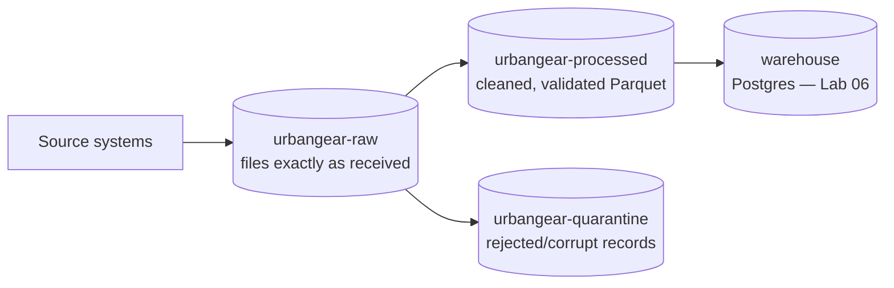

# Lab 01 — Docker & MinIO Fundamentals: Buckets, boto3, and the Data-Lake Layout

> **Module:** SK-03 Batch ETL and Orchestration Engineer
> **Time estimate:** 3–4 hours
> **Prerequisites:** Lab 00 completed — the full stack starts cleanly with `docker compose up -d`.

---

## 1. Environment Setup

Nothing new to install. Verify the Lab 00 environment before continuing:

```powershell
cd C:\projects\sk03-batch-etl
docker compose up -d
docker compose ps
```

**Expected:** all services `Up`, `airflow-init` `Exited (0)`. If anything is unhealthy, fix it with Lab 00 §1.8 before continuing — every step below depends on MinIO being reachable.

One addition: we'll run Python **inside the airflow-scheduler container** (it already has `boto3` installed from the custom image — no Windows Python setup needed). Verify:

```powershell
docker exec -it airflow-scheduler python -c "import boto3; print(boto3.__version__)"
```

**Expected:** `1.34.131`. If you get `ModuleNotFoundError`, rebuild: `docker compose up -d --build`.

**Common install problems:**

| Symptom | Fix |
|---|---|
| `Error response from daemon: ... is not running` | `docker compose up -d` first |
| `boto3` missing | You edited the Dockerfile; restore Lab 00 §1.6 and rebuild with `--build` |

---

## 2. Business Context

Meet your client for Labs 01–07: **UrbanGear**, a mid-size online retailer selling outdoor equipment. Today their "pipeline" is a person: every morning an analyst downloads last night's order export from an SFTP folder, opens it in Excel, fixes broken rows by hand, and pastes totals into a dashboard. It takes three hours, breaks weekly, and once reported revenue **double** because the same file was processed twice.

UrbanGear has decided to do what nearly every company at their size does: land raw files in **object storage** (S3 in production, MinIO here), then process them automatically. Your first job is the foundation everyone else builds on: **the data-lake layout** — which buckets exist, how objects are named, and how code (not humans clicking a console) reads and writes them.

Who consumes this? Every later component: Spark reads from the raw bucket (Lab 03), Airflow sensors watch for arrivals (Lab 05), and ultimately analysts query what flows out the other end. If the layout is sloppy — inconsistent names, no dates in keys, everything in one bucket — every downstream tool inherits the mess, forever. Storage layout is one of the few decisions that is nearly impossible to change later, because every consumer hard-codes paths.

---

## 3. Concept Explanation

### Object storage, one level deeper

Lab 00 introduced the idea: MinIO/S3 stores **objects** (blob + metadata) under **keys** inside **buckets**. Three consequences matter for pipeline design:

1. **Keys are just strings.** `raw/orders/date=2026-07-01/orders.csv` looks like folders, but there is no folder object — the console just renders `/` as hierarchy. "Creating an empty folder" is not a real operation.
2. **Objects are immutable.** You cannot append to or edit an object; you replace it whole. Batch pipelines therefore write *new* objects per run rather than editing files — which, as you'll see in Lab 05, is half the secret to idempotency.
3. **Listing is a query.** "Give me every object whose key starts with `raw/orders/date=2026-07-01/`" is how pipelines discover input. Fast, prefix-based listing is why keys embed the date.

### The medallion-style layout we'll use

The industry convention (you'll hear "medallion architecture" or "bronze/silver/gold" at Databricks shops, "raw/processed/curated" elsewhere) is: **never modify raw data; each stage writes to its own zone.**



- `urbangear-raw` — untouched inputs. Why keep them? **Reprocessing.** When (not if) a bug is found in your cleaning logic, you re-run against raw. Delete raw and a bug becomes permanent data loss.
- `urbangear-processed` — Spark's output: validated, columnar Parquet (Lab 03 explains Parquet).
- `urbangear-quarantine` — the **dead-letter** zone: records/files that failed validation, kept for investigation instead of silently dropped.

**Key convention** (memorize — every lab uses it):

```
raw/orders/date=2026-07-01/orders_20260701_0300.csv
<zone-ish prefix>/<dataset>/date=<ISO date>/<file>_<date>_<HHMM>.csv
```

The `date=` style is **Hive-style partitioning** — Spark and most tools recognize it automatically and can prune reads to one day.

### Why boto3, not the console?

The MinIO web console is for humans exploring. Pipelines use code. **boto3** is AWS's official Python SDK; because MinIO speaks the S3 API, boto3 works against it by pointing `endpoint_url` at MinIO. Alternatives: the AWS CLI (great interactively, awkward in Python logic), MinIO's own `mc` client (MinIO-specific — less transferable), `s3fs` (nice for pandas, thinner control). boto3 is the industry default and everything you learn transfers to real AWS unchanged.

---

## 4. Step-by-Step Implementation

### Step 4.1 — Create the three buckets (with code, not clicks)

Create `C:\projects\sk03-batch-etl\jobs\setup_buckets.py`:

```python
"""Lab 01: create UrbanGear's data-lake buckets. Safe to re-run (idempotent)."""
import boto3
from botocore.exceptions import ClientError

s3 = boto3.client(
    "s3",
    endpoint_url="http://minio:9000",      # container-to-container hostname
    aws_access_key_id="minioadmin",
    aws_secret_access_key="minioadmin123",
)

BUCKETS = ["urbangear-raw", "urbangear-processed", "urbangear-quarantine"]

for bucket in BUCKETS:
    try:
        s3.head_bucket(Bucket=bucket)          # cheap "does it exist?" check
        print(f"exists : {bucket}")
    except ClientError:
        s3.create_bucket(Bucket=bucket)
        print(f"created: {bucket}")
```

Run it **inside the container** (which is why `endpoint_url` uses `minio`, not `localhost` — Lab 00 §3 explains this):

```powershell
docker exec -it airflow-scheduler python /opt/airflow/jobs/setup_buckets.py
```

- **Why the try/head_bucket pattern:** running the script twice must not crash. "Create if absent, otherwise do nothing" is your first taste of **idempotency** — you'll meet it constantly.
- **Expected output:** three `created:` lines. Run it again — three `exists :` lines.
- **Verify:** http://localhost:9001 → Object Browser shows all three buckets.
- **Common mistakes:** `EndpointConnectionError` → you used `localhost:9000` inside the container, or MinIO is down. `InvalidAccessKeyId` → credential typo.

### Step 4.2 — Generate UrbanGear's sample order files

Create `C:\projects\sk03-batch-etl\jobs\generate_orders.py`:

```python
"""Lab 01: generate one day of UrbanGear order CSVs (deterministic per date)."""
import csv, io, random, sys
import boto3

date = sys.argv[1] if len(sys.argv) > 1 else "2026-07-01"
random.seed(date)                      # same date -> same data, always (reproducible!)

PRODUCTS = [("P100", "Trail Backpack", 89.99), ("P200", "Camp Stove", 45.50),
            ("P300", "Headlamp", 19.99), ("P400", "Tent 2P", 199.00)]

rows = []
for i in range(500):
    pid, name, price = random.choice(PRODUCTS)
    qty = random.randint(1, 5)
    rows.append({
        "order_id": f"{date.replace('-','')}-{i:05d}",
        "order_ts": f"{date}T{random.randint(0,23):02d}:{random.randint(0,59):02d}:00",
        "product_id": pid, "product_name": name,
        "quantity": qty, "unit_price": price,
        "amount": round(qty * price, 2),
        "customer_email": f"user{random.randint(1,200)}@example.com",
    })

buf = io.StringIO()
writer = csv.DictWriter(buf, fieldnames=rows[0].keys())
writer.writeheader()
writer.writerows(rows)

s3 = boto3.client("s3", endpoint_url="http://minio:9000",
                  aws_access_key_id="minioadmin", aws_secret_access_key="minioadmin123")
key = f"raw/orders/date={date}/orders_{date.replace('-','')}_0300.csv"
s3.put_object(Bucket="urbangear-raw", Key=key, Body=buf.getvalue().encode("utf-8"))
print(f"uploaded s3://urbangear-raw/{key} ({len(rows)} rows)")
```

Run it for three dates:

```powershell
docker exec -it airflow-scheduler python /opt/airflow/jobs/generate_orders.py 2026-07-01
docker exec -it airflow-scheduler python /opt/airflow/jobs/generate_orders.py 2026-07-02
docker exec -it airflow-scheduler python /opt/airflow/jobs/generate_orders.py 2026-07-03
```

- **Why `random.seed(date)`:** deterministic data means re-running a date reproduces the same file — essential for testing idempotency later, and how real teams build reliable test fixtures.
- **Why `put_object` with an in-memory buffer:** small files don't need a temp file on disk; pipelines usually stream. (For files >100 MB you'd use `upload_file`, which does multipart automatically.)
- **Expected output:** one `uploaded s3://...` line per run.
- **Verify** in the console: `urbangear-raw` → drill into `raw/orders/` → you see three `date=` "folders", each holding one CSV of ~40 KB.
- **Common mistake:** running the generator on Windows Python — `minio` won't resolve. All scripts in this module run via `docker exec` unless a lab says otherwise.

### Step 4.3 — List and read objects like a pipeline does

At an interactive Python prompt inside the container (`docker exec -it airflow-scheduler python`):

```python
import boto3
s3 = boto3.client("s3", endpoint_url="http://minio:9000",
                  aws_access_key_id="minioadmin", aws_secret_access_key="minioadmin123")

# 1. Discover a day's input by prefix — this is what Lab 05's sensor does
resp = s3.list_objects_v2(Bucket="urbangear-raw", Prefix="raw/orders/date=2026-07-02/")
for obj in resp.get("Contents", []):
    print(obj["Key"], obj["Size"], obj["LastModified"])

# 2. Read an object's first lines
body = s3.get_object(Bucket="urbangear-raw",
                     Key="raw/orders/date=2026-07-02/orders_20260702_0300.csv")["Body"]
print(body.read(200).decode())
```

- **Expected:** one key listed with its size and timestamp, then the CSV header plus part of the first row.
- **Why `resp.get("Contents", [])`:** when a prefix matches nothing, S3 omits `Contents` entirely — indexing it directly crashes on empty days. Real pipelines hit "no files yet" constantly (that's a **late file**, and Lab 05 is largely about it).
- **Note `list_objects_v2` pagination:** it returns at most 1,000 keys per call. Our data is small, but production code uses `get_paginator("list_objects_v2")`. Remember this — it's a classic interview trap.

Exit with `exit()`.

### Step 4.4 — Explore the containers themselves

Sharpen the Docker skills you'll debug with all module:

```powershell
docker compose logs --tail 20 minio          # last 20 log lines of one service
docker exec -it minio ls /data               # objects live here inside the container
docker stats --no-stream                     # CPU/memory per container
```

- **Verify:** `ls /data` shows your three bucket names as directories — a peek behind MinIO's curtain (this on-disk layout is MinIO's private business; code must always go through the API).
- **Common mistake:** editing files under `/data` directly. Never do this — it corrupts MinIO's metadata.

### Step 4.5 — Clean-up discipline

Nothing to delete this time — the buckets and the three days of orders are the **starting state for Lab 02 and Lab 03**. Just note what exists: 3 buckets, 3 raw daily files.

```powershell
docker compose stop     # end of session
```

---

## 5. Production Engineering Practices

**1. Stop hard-coding credentials — start now.** Both scripts embed `minioadmin123`. Acceptable for a first draft; not for anything shared. The minimum bar is environment variables — and Lab 00's compose file already injects `MINIO_ENDPOINT`, `MINIO_ACCESS_KEY`, `MINIO_SECRET_KEY` into the Airflow containers. Refactor `setup_buckets.py` yourself:

```python
import os
s3 = boto3.client("s3",
    endpoint_url=os.environ["MINIO_ENDPOINT"],
    aws_access_key_id=os.environ["MINIO_ACCESS_KEY"],
    aws_secret_access_key=os.environ["MINIO_SECRET_KEY"])
```

Every script from Lab 02 onward uses this pattern. **Failure story:** a contractor's helper script with hard-coded prod keys got copied into a public gist as "example code"; the keys were live. Rotating them broke 14 undocumented scripts that also hard-coded them. Environment-based config would have made rotation a non-event.

**2. Naming conventions are an API.** Once Spark, Airflow, and dbt all assume `raw/orders/date=YYYY-MM-DD/`, that string *is a contract*. Write it down (a `config/` note or README) and change it only deliberately. **Failure story:** one upstream team changed `dt=` to `date=` in key names without telling anyone; downstream jobs "succeeded" while processing zero files for nine days — nobody validated row counts (Lab 07 fixes that class of failure with a quality gate).

**3. Idempotent setup scripts.** `setup_buckets.py` can run 1 or 100 times with the same end state. Every provisioning script you ever write should have this property, because retries and re-runs are a fact of life — orchestrators (Lab 05) retry *automatically*.

---

## 6. Reflection

**What you learned:** how object storage actually behaves (keys not folders, immutable objects, prefix listing), a production data-lake layout (raw / processed / quarantine with Hive-style `date=` partitions), and how to script it all with boto3 running inside containers.

**Why it matters:** every subsequent lab reads or writes these exact buckets and key patterns. And because MinIO is S3-API-identical, you have effectively already learned S3 scripting for SK-04.

### Interview questions

1. **Why keep raw data unchanged instead of cleaning it in place?** Reprocessing and audit. Bugs in transform logic are recoverable only if the original input still exists; regulators and debugging both need "what did we actually receive?"
2. **What is Hive-style partitioning in object keys?** Embedding `column=value` (e.g., `date=2026-07-01`) in the key path so engines can prune reads to matching partitions without scanning everything.
3. **How do you list more than 1,000 objects with boto3?** `list_objects_v2` paginates at 1,000; use a paginator or loop on `ContinuationToken`.
4. **Can you append to an S3 object?** No — objects are immutable; you write a new object (or a new version). Design pipelines to write new keys per run.
5. **What's a dead-letter / quarantine location for?** Storing records or files that failed validation so they can be inspected and reprocessed rather than silently lost.
6. **How does boto3 talk to MinIO instead of AWS?** Pass `endpoint_url` pointing at MinIO; the S3 API is identical, so all other code is unchanged.
7. **Why did `list_objects_v2` return no `Contents` key?** Empty result sets omit it — code must handle "no files" as a normal case, not an exception.
8. **Where should credentials live in a script?** Never in code. Environment variables at minimum; a secrets manager or the orchestrator's connection store in production.

**Interview traps:** "S3 has folders, right?" (No — key prefixes rendered as folders.) "Is listing a bucket free/instant?" (It's paginated and, on real S3, costs per request — key design matters.)

**Key takeaways:**
- Buckets: `urbangear-raw`, `urbangear-processed`, `urbangear-quarantine`. Key contract: `raw/orders/date=YYYY-MM-DD/…`.
- All scripts run inside containers → endpoint is `http://minio:9000`.
- Setup code must be idempotent; credentials come from the environment.

**Next:** [Lab 02 — PySpark Fundamentals](Lab_02_PySpark_Fundamentals.md), where Spark reads the order files you just created and you learn why it can do so across 100 machines without changing a line.
