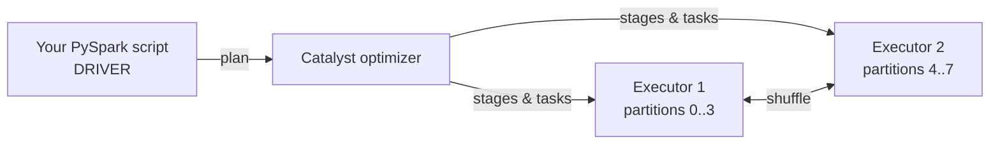

# Lab 02 — PySpark Fundamentals: DataFrames, Lazy Evaluation, and the Execution Model

> **Module:** SK-03 Batch ETL and Orchestration Engineer
> **Time estimate:** 4–6 hours
> **Prerequisites:** Lab 01 completed — buckets exist, three days of UrbanGear orders sit in `urbangear-raw`.

---

## 1. Environment Setup

Verify the stack and the Lab 01 data:

```powershell
cd C:\projects\sk03-batch-etl
docker compose up -d
docker compose ps
docker exec -it airflow-scheduler python -c "import boto3,os; s3=boto3.client('s3',endpoint_url=os.environ['MINIO_ENDPOINT'],aws_access_key_id=os.environ['MINIO_ACCESS_KEY'],aws_secret_access_key=os.environ['MINIO_SECRET_KEY']); print([o['Key'] for o in s3.list_objects_v2(Bucket='urbangear-raw',Prefix='raw/orders/')['Contents']])"
```

**Expected:** three keys, `date=2026-07-01` through `date=2026-07-03`. Missing? Re-run Lab 01 Step 4.2.

**New for this lab: a reusable Spark session helper.** Lab 00's smoke test typed five s3a settings by hand; we never do that again. Create `C:\projects\sk03-batch-etl\jobs\spark_common.py`:

```python
"""Shared SparkSession factory for all SK-03 jobs. Import, don't copy-paste."""
import os
from pyspark.sql import SparkSession

def get_spark(app_name: str) -> SparkSession:
    return (
        SparkSession.builder
        .appName(app_name)
        # The two JARs that teach Spark to speak S3 (downloaded once, then cached)
        .config("spark.jars.packages",
                "org.apache.hadoop:hadoop-aws:3.3.4,"
                "com.amazonaws:aws-java-sdk-bundle:1.12.262")
        # Point the s3a connector at MinIO using the env vars from docker-compose
        .config("spark.hadoop.fs.s3a.endpoint", os.environ["MINIO_ENDPOINT"])
        .config("spark.hadoop.fs.s3a.access.key", os.environ["MINIO_ACCESS_KEY"])
        .config("spark.hadoop.fs.s3a.secret.key", os.environ["MINIO_SECRET_KEY"])
        .config("spark.hadoop.fs.s3a.path.style.access", "true")
        .getOrCreate()
    )
```

Verify it (first run downloads the JARs — allow a minute):

```powershell
docker exec -it airflow-scheduler python -c "import sys; sys.path.insert(0,'/opt/airflow/jobs'); from spark_common import get_spark; s=get_spark('verify'); print(s.version); s.stop()"
```

**Expected:** log noise, then `3.5.1`.

| Problem | Fix |
|---|---|
| `JAVA_HOME not set` | Custom image not built — `docker compose up -d --build` |
| JAR download hangs | VPN/proxy; retry off VPN. JARs cache in the container afterwards |
| `KeyError: 'MINIO_ENDPOINT'` | You're outside the container, or compose env section was edited |

---

## 2. Business Context

UrbanGear's daily order file is 500 rows — pandas territory. But UrbanGear is acquiring a competitor: soon it's 40 million rows/day plus clickstream files in the hundreds of GB. **Pandas loads everything into one machine's RAM; at some size, there is no machine big enough.**

Apache Spark's answer: split the data into chunks (**partitions**), process chunks in parallel across many machines (**executors**), and coordinate from one brain (**driver**). Companies run the exact code you'll write here across thousands of cores — Spark is the default batch compute engine at most enterprises (natively, or via Databricks/EMR/Glue).

Who consumes Spark's output? Downstream storage (Lab 03 writes Parquet), warehouses, ML feature pipelines. What happens when Spark jobs fail or are written naively? Jobs that ran in minutes take hours (cloud bills explode), nightly SLAs are missed, and analysts start the day without data. The engineers who can *read the Spark UI and explain why a job is slow* are the ones who get paid to fix that — this lab makes you one of them.

---

## 3. Concept Explanation

### The cast of characters

- **Driver** — the process running *your* Python script. Builds the plan, hands out work, collects results.
- **Executors** — worker processes that hold data partitions and run tasks. In our compose stack, `spark-worker` hosts them.
- **Cluster manager** — decides which machines run executors. Ours is Spark **standalone** (`spark-master`); production uses YARN or Kubernetes; the code is identical.
- **DataFrame** — a distributed table: named, typed columns, with rows spread across partitions on executors. Looks like pandas; behaves very differently.

### Lazy evaluation — the concept people fail interviews on

Spark operations come in two kinds:

- **Transformations** (`select`, `filter`, `withColumn`, `groupBy`, `join`) — *describe* a computation. They return instantly because **nothing runs**. Spark just extends its plan.
- **Actions** (`show`, `count`, `collect`, `write`) — *demand a result*. Only now does Spark optimize the accumulated plan and execute it.

Why lazy? Optimization. If you filter to one day *after* reading a year of data, Spark can rewrite the plan to read only that day's partition (**predicate pushdown**). An eager engine (pandas) can't — it already loaded the year.

### Jobs, stages, tasks, shuffles

When an action fires: the plan becomes a **job**; the job splits into **stages** at every **shuffle** boundary; each stage runs as parallel **tasks** (one per partition). A **shuffle** is the expensive part: redistributing rows across executors over the network, required whenever rows must be grouped by key (`groupBy`, `join`, `distinct`). Slow Spark jobs are almost always shuffle problems or skew problems — you'll see one live in the Spark UI below.



### Alternatives, honestly

| Tool | Sweet spot | Why not here |
|---|---|---|
| pandas | < a few GB, one machine | Doesn't scale; no cluster story |
| Polars / DuckDB | Single-node, blazing fast up to ~100s of GB | Superb tools, but limited multi-machine scaling; less common in enterprise batch stacks |
| SQL in the warehouse | Data already loaded | Can't parse raw files in a lake |
| Spark | Huge files in object storage; enterprise standard | Overkill below ~1 GB (its overhead dominates) — we accept that trade-off to learn it |

---

## 4. Step-by-Step Implementation

### Step 4.1 — Your first DataFrame

Open an interactive PySpark session:

```powershell
docker exec -it airflow-scheduler python
```

```python
import sys; sys.path.insert(0, "/opt/airflow/jobs")
from spark_common import get_spark
spark = get_spark("lab02-explore")

orders = spark.read.option("header", "true").option("inferSchema", "true") \
    .csv("s3a://urbangear-raw/raw/orders/date=2026-07-01/")
orders.printSchema()
```

- **Why the trailing `/`:** you point Spark at the *prefix*, not one file — it reads every file under it. That's how the same code handles 1 file or 500.
- **Expected:** a schema with `order_id: string`, `quantity: integer`, `amount: double`, etc. Note: **nothing was read yet except a sample for schema inference** — `read` is (mostly) lazy too.
- **Common mistake:** `Path does not exist: s3a://urbangear-raw/...` → typo in prefix, or Lab 01 data missing.

### Step 4.2 — Transformations are free; actions do the work

```python
from pyspark.sql import functions as F

big = orders.filter(F.col("amount") > 100)          # instant — nothing ran
enriched = big.withColumn("category",
    F.when(F.col("unit_price") > 100, "premium").otherwise("standard"))  # instant

enriched.show(5)          # ACTION — now Spark reads, filters, computes
print(enriched.count())   # ACTION — runs the plan AGAIN (note this!)
```

- **Expected:** five rows with the new `category` column, then a count in the low hundreds.
- **What to internalize:** the two actions each executed the full plan from the file up. Spark does not cache results between actions unless told to (`.cache()`), a top-3 source of "why is my job slow" for beginners.
- **Verify laziness yourself:** run `orders.filter(F.col("amount") > 1e9)` — returns instantly even though it "matches nothing", because nothing ran.

### Step 4.3 — Aggregation, and your first shuffle

```python
daily = (spark.read.option("header", "true").option("inferSchema", "true")
         .csv("s3a://urbangear-raw/raw/orders/")           # ALL days at once
         .groupBy("product_name")
         .agg(F.sum("amount").alias("revenue"),
              F.count("*").alias("orders_n"))
         .orderBy(F.desc("revenue")))
daily.show()
```

- **Expected:** four product rows; Tent 2P on top (highest price).
- **What happened:** `groupBy` forced a **shuffle** — rows for the same product had to meet on the same executor. This job therefore ran as (at least) two stages.
- **Inspect the plan:** `daily.explain()` — find `Exchange hashpartitioning(product_name…)`. `Exchange` *is* the shuffle. Reading plans becomes second nature; start now.

### Step 4.4 — Read the Spark UI

Keep the Python session open. In your browser open the **application UI** — for jobs run inside the Airflow container (local mode), it's on the driver: run `print(spark.sparkContext.uiWebUrl)` — it shows an internal URL on port 4040. Expose it once for this lab: exit Python, then re-enter with a port published is not possible on a running container, so use the simplest route — run the same session on the Spark master container instead, where Lab 00 already published the UI:

```powershell
docker exec -it spark-master bash -c "cp /opt/jobs/spark_common.py /tmp/ 2>/dev/null; MINIO_ENDPOINT=http://minio:9000 MINIO_ACCESS_KEY=minioadmin MINIO_SECRET_KEY=minioadmin123 spark-submit --master spark://spark-master:7077 --packages org.apache.hadoop:hadoop-aws:3.3.4,com.amazonaws:aws-java-sdk-bundle:1.12.262 --conf spark.hadoop.fs.s3a.endpoint=http://minio:9000 --conf spark.hadoop.fs.s3a.access.key=minioadmin --conf spark.hadoop.fs.s3a.secret.key=minioadmin123 --conf spark.hadoop.fs.s3a.path.style.access=true /opt/jobs/lab02_agg.py"
```

…where `C:\projects\sk03-batch-etl\jobs\lab02_agg.py` is the Step 4.3 aggregation as a script, ending with `input("open the UI, then press Enter to finish")` before `spark.stop()`:

```python
"""Lab 02: aggregation job submitted to the real cluster so we can watch the UI."""
from pyspark.sql import SparkSession, functions as F

spark = SparkSession.builder.appName("lab02-agg").getOrCreate()   # confs come from spark-submit
daily = (spark.read.option("header", "true").option("inferSchema", "true")
         .csv("s3a://urbangear-raw/raw/orders/")
         .groupBy("product_name")
         .agg(F.sum("amount").alias("revenue")))
daily.show()
input("Open http://localhost:8081 -> Running Applications -> lab02-agg -> Application Detail UI. Press Enter to finish.")
spark.stop()
```

While it waits, open **http://localhost:8081**, click the running `lab02-agg` application → **Application Detail UI**. Explore:

1. **Jobs tab** — one job per action; click it.
2. **Stages** — two stages, split at the shuffle. Note "Shuffle Read/Write" byte counts.
3. **Executors tab** — your one worker, its cores, task counts.

- **Why this matters:** "the job is slow" tickets are solved here — find the stage eating the time, check shuffle sizes and task skew (one task far slower than its siblings = skewed key).
- **Common mistakes:** UI shows nothing → the app already finished (that's why we added `input()`); master UI (8081) only *links* to app UIs while apps run.
- Press Enter in the terminal to let the job finish.

### Step 4.5 — When NOT to use Spark

One deliberate contrast. Inside `docker exec -it airflow-scheduler python`:

```python
import time, sys; sys.path.insert(0, "/opt/airflow/jobs")
from spark_common import get_spark
from pyspark.sql import functions as F
spark = get_spark("lab02-timing")
t0 = time.time()
spark.read.option("header", True).csv("s3a://urbangear-raw/raw/orders/") \
    .agg(F.sum("amount")).show()
print(f"Spark: {time.time()-t0:.1f}s for ~1500 rows")
spark.stop()
```

**Expected:** several seconds — for data pandas would sum in milliseconds. Spark's startup, planning, and task-scheduling overhead is the price of scalability. **Takeaway for interviews:** knowing when a tool is *wrong* is as valuable as knowing how to use it.

---

## 5. Production Engineering Practices

**1. Never `inferSchema` in production.** It made exploration easy, but it (a) scans data twice, and (b) *guesses* — a day where every `quantity` happens to be null infers `string`, and downstream code explodes. Production jobs declare schemas explicitly; Lab 03 does this and rejects rows that don't conform. **Failure story:** a retailer's job inferred a zip-code column as integer for months; New England zips (`02134`) lost their leading zeros, corrupting a shipping-cost model. Nobody noticed until customers complained.

**2. Beware `collect()`.** `df.collect()` pulls the entire distributed dataset into the driver's memory. On lab data, fine; on production data, it kills the driver (`OutOfMemoryError`) and the job with it. Use `show(n)`, `take(n)`, or write results to storage. **Failure story:** an intern's debugging `collect()` left in a nightly job worked for a year — until a marketing campaign 40×'d the data and the job OOM-killed itself at 2 AM three nights straight.

**3. Reuse the session factory; log the app name.** `spark_common.get_spark("meaningful-name")` gives every job (a) one place to fix config and (b) a searchable name in the Spark UI and logs. Naming jobs `test2_final` is how nobody can tell which job is eating the cluster.

---

## 6. Reflection

**What you learned:** the driver/executor model, DataFrames, transformations vs. actions and lazy evaluation, shuffles as stage boundaries, reading `explain()` and the Spark UI, and Spark's honest overhead trade-off.

**Why it matters:** Lab 03 turns this into a real cleaning job; Lab 05 orchestrates it. Every performance conversation you'll ever have about Spark is in terms of stages, tasks, and shuffles.

### Interview questions

1. **Transformation vs. action?** Transformations lazily build a plan (`filter`, `groupBy`); actions trigger execution (`count`, `show`, `write`). Nothing runs until an action.
2. **Why is Spark lazy?** So the optimizer sees the whole plan and can prune reads, push down predicates, and fuse operations before executing.
3. **What is a shuffle and why is it expensive?** Redistributing rows across executors by key (for joins/groupBys); it hits network + disk and forms stage boundaries. Most tuning is shuffle management.
4. **Driver vs. executor?** Driver plans and coordinates (runs your script); executors hold partitions and execute tasks in parallel.
5. **What's wrong with `collect()` on large data?** It funnels all partitions into driver memory — OOM. Write to storage or `take(n)` instead.
6. **What does `Exchange` mean in a Spark plan?** A shuffle. Seeing it in `explain()` output tells you where stage boundaries and network cost occur.
7. **Why not `inferSchema` in production?** Extra pass over data and type guesses that vary with the day's data; declare schemas explicitly.
8. **Would you use Spark for a 50 MB file?** No — startup/planning overhead dominates; pandas/Polars/DuckDB finish before Spark's session starts. Spark buys *scalability*, not speed on small data.

**Interview traps:** "Does `filter()` immediately reduce memory usage?" (No — nothing ran.) "Two actions on the same DataFrame — how many times does the file get read?" (Twice, unless cached.) "Is Spark always faster than pandas?" (Only past single-machine scale.)

**Key takeaways:**
- Plan lazily, execute on actions; the UI shows jobs → stages (shuffle boundaries) → tasks.
- `spark_common.get_spark()` is now the only way you create sessions.
- Explicit schemas, no `collect()`, meaningful app names.

**Next:** [Lab 03 — Spark Transformations & Partitioned Writes](Lab_03_Spark_Transformations_and_Partitioned_Writes.md) — a real cleaning job with explicit schemas, dead-letter routing to the quarantine bucket, and date-partitioned Parquet output.
