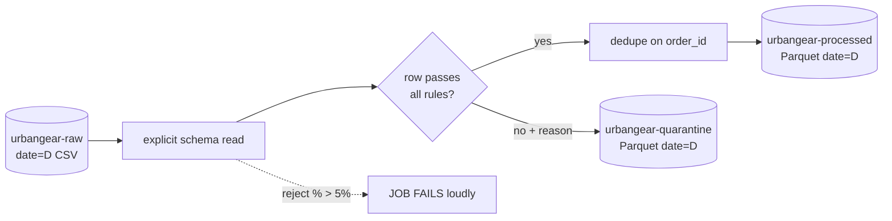

# Lab 03 — Spark Transformations & Partitioned Writes: Cleaning, Dead-Letter Routing, Parquet in MinIO

> **Module:** SK-03 Batch ETL and Orchestration Engineer
> **Time estimate:** 4–6 hours
> **Prerequisites:** Labs 01–02 — buckets + 3 days of raw orders exist, `jobs/spark_common.py` works.

---

## 1. Environment Setup

Verify, as always:

```powershell
cd C:\projects\sk03-batch-etl
docker compose up -d
docker exec -it airflow-scheduler python -c "import sys; sys.path.insert(0,'/opt/airflow/jobs'); from spark_common import get_spark; s=get_spark('verify'); print('SPARK_OK', s.version); s.stop()"
```

**Expected:** `SPARK_OK 3.5.1`. Nothing new to install — this lab is pure code in `jobs\`.

**One data addition:** this lab needs *dirty* data. Extend the generator — add this block to `generate_orders.py` right before the `buf = io.StringIO()` line:

```python
# --- Lab 03: inject realistic dirt (about 4% of rows) ---
for i, r in enumerate(rows):
    if i % 50 == 0:  r["amount"] = ""                        # missing amount
    if i % 61 == 0:  r["quantity"] = -2                      # impossible quantity
    if i % 73 == 0:  r["customer_email"] = "not-an-email"    # bad email
rows.append(dict(rows[10]))                                  # duplicate order row
```

Regenerate one day so it contains dirt:

```powershell
docker exec -it airflow-scheduler python /opt/airflow/jobs/generate_orders.py 2026-07-04
```

**Verify:** the console shows the new object under `date=2026-07-04/`. (Overwriting an existing date is fine too — same key, replaced object.)

---

## 2. Business Context

UrbanGear's raw order exports are dirty in exactly the ways all real feeds are: missing values (a payment-service timeout leaves `amount` blank), impossible values (returns encoded as negative quantities by one legacy system), malformed fields, and duplicated rows (the export job occasionally re-emits a row after its own retry).

The analyst used to fix these by hand in Excel. Your job: a Spark job that, for a given date, **reads raw CSV → validates every row against explicit rules → writes clean rows as partitioned Parquet to `urbangear-processed` → routes bad rows, with a reason, to `urbangear-quarantine`**.

Why does the quarantine matter to the business? Silently dropping bad rows understates revenue; silently keeping them corrupts it. Quarantining makes data quality *visible and quantifiable* — "0.8% of yesterday's orders failed validation, all missing amounts, all from the payment gateway" is an email that gets a source system fixed. This clean/reject split with full accounting (rows in = rows clean + rows rejected) is the beating heart of every serious batch pipeline, and it is exactly what the FinCore capstone grades you on.

---

## 3. Concept Explanation

### Parquet — why every pipeline writes it

CSV is a human format: text, row-oriented, schema-free, uncompressed. **Parquet** is a machine format:

- **Columnar** — values of each column stored together. A query touching 2 of 40 columns reads ~5% of the bytes.
- **Typed** — the schema travels with the file. No re-inference, no zip-code-as-integer bugs.
- **Compressed** — columnar layout compresses brilliantly (similar values adjacent); 5–10× smaller than CSV is typical.
- **Splittable with statistics** — engines skip whole chunks using embedded min/max stats.

Rule of thumb across the industry: **ingest whatever arrives; store and serve Parquet.** (Newer table formats — Delta Lake, Iceberg — are Parquet plus a transaction log; know the name, meet them in Further Reading.)

### Partitioned writes

`df.write.partitionBy("date")` writes keys like `processed/orders/date=2026-07-01/part-*.parquet` — the same Hive-style layout Lab 01 chose for raw. Readers filtering on `date` then read *only那 folder* (partition pruning). Choose partition columns that queries filter on and that have sane cardinality: `date` is perfect (365/year); `customer_id` is catastrophic (millions of tiny files).

### Write modes and the idempotency preview

Spark write modes: `error` (default, fails if path exists), `append` (adds files — **duplicates on re-run!**), `overwrite` (replaces). For batch pipelines the winning pattern is **overwrite exactly one date partition per run**: re-running a day replaces that day, touching nothing else. Lab 05 builds full idempotency on top of exactly this behavior.

### Validation strategy: filter, don't crash

Two philosophies: *fail the job* on any bad row (right for financial ledgers where partial data is worse than none) or *quarantine and continue* (right for orders/analytics where 99% good data now beats 100% never). UrbanGear chooses quarantine-and-continue, **plus a threshold**: if >5% of rows are bad, something systemic is wrong — the job fails loudly instead. You get both behaviors from one design.



---

## 4. Step-by-Step Implementation

### Step 4.1 — The job skeleton with an explicit schema

Create `C:\projects\sk03-batch-etl\jobs\clean_orders.py`:

```python
"""Lab 03: validate raw UrbanGear orders for one date; write Parquet + quarantine.
Usage: python clean_orders.py <YYYY-MM-DD>
"""
import sys
sys.path.insert(0, "/opt/airflow/jobs")
from pyspark.sql import functions as F
from pyspark.sql.types import (StructType, StructField, StringType,
                               IntegerType, DoubleType)
from spark_common import get_spark

REJECT_THRESHOLD = 0.05   # fail the job if more than 5% of rows are bad

SCHEMA = StructType([
    StructField("order_id",       StringType(),  False),
    StructField("order_ts",       StringType(),  True),
    StructField("product_id",     StringType(),  True),
    StructField("product_name",   StringType(),  True),
    StructField("quantity",       IntegerType(), True),
    StructField("unit_price",     DoubleType(),  True),
    StructField("amount",         DoubleType(),  True),
    StructField("customer_email", StringType(),  True),
])

def main(run_date: str) -> None:
    spark = get_spark(f"clean-orders-{run_date}")
    src = f"s3a://urbangear-raw/raw/orders/date={run_date}/"
    raw = (spark.read.option("header", "true")
                .option("mode", "PERMISSIVE")     # malformed cells become null, row survives to be judged
                .schema(SCHEMA)
                .csv(src))
```

- **Why `PERMISSIVE`:** the alternative modes are `DROPMALFORMED` (silently discards — never acceptable) and `FAILFAST` (one bad byte kills the whole day). Permissive turns unparseable cells into nulls so *our rules*, not the CSV parser, decide a row's fate — with a recorded reason.
- **Why nullable `True` almost everywhere:** the schema describes what *can arrive*, not what's *acceptable*. Rules enforce acceptability next.

### Step 4.2 — Validation rules that record their reason

Continue the file:

```python
    checked = (raw
        .withColumn("reject_reason", F.concat_ws("; ",
            F.when(F.col("order_id").isNull(), F.lit("missing order_id")),
            F.when(F.col("amount").isNull() | (F.col("amount") <= 0),
                   F.lit("bad amount")),
            F.when(F.col("quantity").isNull() | (F.col("quantity") <= 0),
                   F.lit("bad quantity")),
            F.when(~F.col("customer_email").rlike(r"^[^@\s]+@[^@\s]+\.[^@\s]+$"),
                   F.lit("invalid email")),
        )))

    good = checked.filter(F.col("reject_reason") == "").drop("reject_reason")
    bad  = checked.filter(F.col("reject_reason") != "")
```

- **How this works:** each `F.when(...)` yields the reason string or null; `concat_ws` joins non-nulls. A clean row gets `""`; a row with two problems gets `"bad amount; bad quantity"` — the quarantine explains itself.
- **Common mistake:** writing `F.col("amount") != None` — always use `.isNull()`; SQL null semantics make `!=` comparisons with null yield null, not true.

### Step 4.3 — Deduplicate, count, enforce the threshold

```python
    total = raw.count()
    good_deduped = good.dropDuplicates(["order_id"])
    n_good, n_bad = good_deduped.count(), bad.count()
    n_dupes = total - n_good - n_bad

    print(f"[clean_orders] date={run_date} total={total} "
          f"clean={n_good} rejected={n_bad} duplicates_removed={n_dupes}")

    if total == 0:
        raise SystemExit(f"NO INPUT for {run_date} — refusing to write empty output")
    if n_bad / total > REJECT_THRESHOLD:
        raise SystemExit(f"REJECT RATE {n_bad/total:.1%} exceeds "
                         f"{REJECT_THRESHOLD:.0%} — systemic issue, failing loudly")
```

- **Why `dropDuplicates(["order_id"])` and not `distinct()`:** distinct requires *every* column identical; real duplicates often differ in a timestamp. Business key wins.
- **Why the accounting line:** `total = clean + rejected + duplicates` must reconcile. Print it every run; Lab 05 puts it in Airflow logs; Lab 07 stores it in an audit table. If the equation breaks, your job is losing data.
- **Why fail on zero input:** "successfully processed nothing" is the most poisonous outcome in batch — it masks missing files (remember Lab 01's `dt=`/`date=` story).

### Step 4.4 — Partitioned writes to processed and quarantine

Finish the file:

```python
    dst_good = f"s3a://urbangear-processed/processed/orders/date={run_date}/"
    dst_bad  = f"s3a://urbangear-quarantine/quarantine/orders/date={run_date}/"

    good_deduped.write.mode("overwrite").parquet(dst_good)
    if n_bad > 0:
        bad.write.mode("overwrite").parquet(dst_bad)

    print(f"[clean_orders] wrote {dst_good} and "
          f"{dst_bad if n_bad else '(no rejects)'}")
    spark.stop()

if __name__ == "__main__":
    if len(sys.argv) != 2:
        raise SystemExit("usage: clean_orders.py <YYYY-MM-DD>")
    main(sys.argv[1])
```

- **Why we build the `date=` path ourselves instead of `partitionBy`:** the job processes exactly one date, so writing directly into that partition path plus `mode("overwrite")` guarantees re-runs replace *only* this day. (`partitionBy` + global overwrite can delete *other* days unless you enable dynamic partition overwrite — a famous foot-gun; we sidestep it entirely.)

Run it on the dirty day and a clean day:

```powershell
docker exec -it airflow-scheduler python /opt/airflow/jobs/clean_orders.py 2026-07-04
docker exec -it airflow-scheduler python /opt/airflow/jobs/clean_orders.py 2026-07-01
```

- **Expected (07-04):** accounting line with `clean≈480`, `rejected≈20`, `duplicates_removed=1`, then two `wrote` paths.
- **Verify in MinIO console:** `urbangear-processed` → `processed/orders/date=2026-07-04/` contains `part-*.snappy.parquet` + a `_SUCCESS` marker; quarantine bucket has its Parquet too.
- **Verify content reads back:**

```powershell
docker exec -it airflow-scheduler python -c "import sys; sys.path.insert(0,'/opt/airflow/jobs'); from spark_common import get_spark; s=get_spark('check'); df=s.read.parquet('s3a://urbangear-quarantine/quarantine/orders/date=2026-07-04/'); df.groupBy('reject_reason').count().show(truncate=False); s.stop()"
```

**Expected:** counts per reject reason — your data-quality report, for free.

### Step 4.5 — Prove re-runs are safe

Run 07-04 again, then count rows in processed output before/after:

```powershell
docker exec -it airflow-scheduler python /opt/airflow/jobs/clean_orders.py 2026-07-04
```

**Expected:** identical accounting line; the partition was *replaced*, not appended. Change `overwrite` to `append` mentally and picture the double-revenue incident from Lab 01's backstory — that's the entire case for this design. Finally, clean run for the remaining days:

```powershell
docker exec -it airflow-scheduler python /opt/airflow/jobs/clean_orders.py 2026-07-02
docker exec -it airflow-scheduler python /opt/airflow/jobs/clean_orders.py 2026-07-03
```

---

## 5. Production Engineering Practices

**1. Parameterize everything a run varies by.** `run_date` arrives as an argument, never hard-coded, never `datetime.today()`. Why not "today"? Because Lab 05 will re-run *past* dates (backfills), and a job that computes its own date can only ever process today. **A batch job must be a pure function of its parameters.** Failure story: a job using `today()` was down for a weekend; on Monday it processed Monday — Saturday and Sunday simply never existed in the warehouse until someone noticed the gap at quarter close.

**2. Loud failure beats quiet success.** Both `SystemExit` calls (zero input, reject threshold) turn data problems into *process* failures — the thing orchestrators can see, retry, and page humans about. Failure story: a feed's schema changed and every row was quarantined for 12 days while the job "succeeded" green; a 5% threshold would have paged someone in one night.

**3. Reconciliation accounting.** in = clean + rejected + deduped, printed every run. This one-line habit is what auditors, debugging sessions, and 3 AM incident calls all reach for first. Lab 07 formalizes it into an audit table with history.

**4. Structured, greppable logs.** Every print is prefixed `[clean_orders]` with `key=value` pairs. When Airflow captures thousands of log lines, `grep "clean_orders.*date=2026-07-04"` finds your run instantly. Free now, priceless later.

---

## 6. Reflection

**What you learned:** explicit schemas with PERMISSIVE reads, rule-based validation that records reasons, business-key deduplication, reject thresholds, single-partition overwrite writes, Parquet, and reconciliation accounting.

**Why it matters:** this file *is* the pattern. Lab 05 wraps it in orchestration; Lab 07 adds a warehouse-side quality gate; the FinCore capstone asks you to reproduce the pattern from scratch on new data.

### Interview questions

1. **Why Parquet over CSV for processed data?** Columnar (read only needed columns), typed schema embedded, heavily compressed, splittable with min/max statistics for skipping.
2. **How do you handle bad records in a Spark batch job?** Read PERMISSIVE with explicit schema, apply validation rules that tag a reject reason, route rejects to a quarantine path, and fail the job if the reject rate crosses a threshold.
3. **What's dangerous about `mode("append")` in a scheduled job?** Retries/re-runs write the data again — duplicates. Prefer overwriting a deterministic partition per run.
4. **How do you choose a partition column?** One that queries filter on, with bounded cardinality — `date` is the classic. High-cardinality partitioning creates millions of small files and kills listing performance.
5. **`dropDuplicates(["order_id"])` vs `distinct()`?** distinct compares all columns; dropDuplicates dedupes on a business key even when other columns (timestamps) differ.
6. **Why is "job succeeded with 0 rows" dangerous?** It hides missing input. Treat empty input as an error (or an explicit, logged decision), never a silent success.
7. **Why must batch jobs take the run date as a parameter?** Re-runs and backfills. A job computing "today" internally can't reprocess the past and produces gaps after outages.
8. **What is a dead-letter pattern?** Failed records are persisted elsewhere with diagnostic context instead of dropped — enabling investigation, metrics, and reprocessing.

**Interview traps:** "Just use `DROPMALFORMED`?" (Silent data loss — always account for every row.) "Overwrite the whole table each run?" (Only the run's partition — global overwrite plus concurrent runs = wiped table.)

**Key takeaways:**
- Pattern: explicit schema → tag reasons → split good/bad → dedupe → threshold → overwrite one `date=` partition.
- Accounting line every run: `total = clean + rejected + duplicates`.
- The job is a pure function of `run_date`.

**Next:** [Lab 04 — Airflow Fundamentals & First DAG](Lab_04_Airflow_Fundamentals_First_DAG.md) — the tool that will run `clean_orders.py` every night without you.
