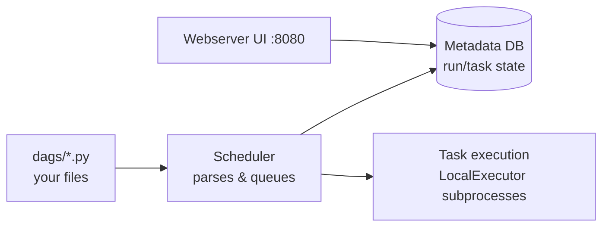

# Lab 04 — Airflow Fundamentals & First DAG: Scheduler, Operators, Data Intervals

> **Module:** SK-03 Batch ETL and Orchestration Engineer
> **Time estimate:** 4–6 hours
> **Prerequisites:** Labs 00–03. Airflow UI reachable at http://localhost:8080 (`admin`/`admin`).

---

## 1. Environment Setup

Nothing to install — Airflow has been running since Lab 00. Verify both halves of it:

```powershell
cd C:\projects\sk03-batch-etl
docker compose up -d
docker compose ps
```

**Expected:** `airflow-webserver` `Up (healthy)`, `airflow-scheduler` `Up`. Log in at http://localhost:8080. The DAG list is empty (you deleted the smoke test in Lab 00 — if `lab00_smoke_test` still shows, delete `dags\smoke_test_dag.py` and refresh after ~60s).

**Know your folder wiring:** anything you save into `C:\projects\sk03-batch-etl\dags\` appears inside both Airflow containers at `/opt/airflow/dags` (the compose volume mount), and the scheduler re-scans that folder roughly every 30 seconds. Your edit loop all lab: save file in VS Code → wait/refresh UI.

| Problem | Fix |
|---|---|
| UI login fails | `docker compose logs airflow-init` — if init failed, `docker compose down` then `up -d` |
| DAGs never appear | File saved outside `dags\`; or syntax error — `docker compose logs airflow-scheduler \| Select-String -Pattern "Error"` |
| UI painfully slow | Low RAM — `docker compose stop spark-master spark-worker` for this lab (no Spark needed today) |

---

## 2. Business Context

UrbanGear now owns a good cleaning job (Lab 03) — that *someone must remember to run*, every night, for the right date, after the file arrives, retrying transient failures, and telling a human when it truly breaks. Today that "someone" is you typing `docker exec`. That does not survive contact with vacations, 3 AM, or a second pipeline.

An **orchestrator** is the piece of infrastructure whose whole job is *when, in what order, and what happens on failure*. Apache Airflow is the industry's most widely deployed one — it's what job ads mean by "workflow orchestration." Managed versions run everywhere (AWS MWAA, GCP Cloud Composer, Astronomer), so what you learn here transfers directly.

Who consumes Airflow's "output"? Every downstream team, indirectly: analysts get fresh data because Airflow ran things in order; on-call engineers get *one* pane of glass showing every pipeline's state; auditors get run history. When orchestration fails — or worse, doesn't exist — you get the classic mess: cron jobs on forgotten servers, scripts that assume other scripts already ran, and outages nobody notices for days.

---

## 3. Concept Explanation

### What Airflow actually is

Airflow is three cooperating pieces (you've been running them since Lab 00):

- **Scheduler** — reads your DAG files, decides what's due, queues tasks, enforces retries.
- **Webserver** — the UI: run history, logs, manual triggers.
- **Metadata DB** (`airflow-db` Postgres) — every run/task state lives here; the other two are stateless.

### DAGs, tasks, operators

A **DAG** (Directed Acyclic Graph) is your workflow: **tasks** (nodes) plus **dependencies** (edges), with no cycles — "clean before load" can't also require "load before clean." You define DAGs in ordinary Python files. Tasks are instances of **operators** — reusable task templates: `BashOperator` (run a shell command), `PythonOperator` (call a function), plus hundreds of provider operators (Postgres, S3, Spark…). Key mental model: **the DAG file is a *description*, not a script** — it must evaluate in seconds; heavy work belongs *inside* task execution, never at module level.

### The scheduling model — where everyone gets burned

The single most misunderstood thing in Airflow, and a guaranteed interview topic:

**A scheduled run processes a *data interval*, and it runs at the *end* of that interval.** A daily DAG's run "for July 1" covers data of July 1 and *executes early on July 2* — because July 1's data isn't complete until July 1 ends. Inside a task, the template variable `{{ ds }}` (the "logical date" / start of the data interval) is `2026-07-01` for that run. **This is exactly the `run_date` parameter Lab 03's job wants.**

Corollaries:

- `start_date=June 1, schedule=@daily`, deployed today → with `catchup=True` Airflow creates a run *per missed day* since June 1 (a **backfill** — powerful, dangerous if unintended). We set `catchup=False` until Lab 05 where we use catchup deliberately.
- The first run happens one full interval *after* `start_date`.

### Alternatives, honestly

Cron: fires on time but knows nothing about success, order, retries, or history. Dagster/Prefect: modern rivals with nicer Python ergonomics and stronger data-asset concepts — genuinely good; Airflow still dominates installed base. Managed ETL (Glue workflows, ADF): fine inside one cloud, weaker as a general control plane. Learn Airflow's *concepts* (intervals, idempotent tasks, retries) and every one of these tools becomes a dialect.



---

## 4. Step-by-Step Implementation

### Step 4.1 — A minimal real DAG

Create `C:\projects\sk03-batch-etl\dags\urbangear_hello.py`:

```python
"""Lab 04: first real DAG — three tasks, a dependency fan-in, daily schedule."""
from datetime import datetime, timedelta
from airflow import DAG
from airflow.operators.bash import BashOperator
from airflow.operators.python import PythonOperator

default_args = {
    "owner": "data-eng",
    "retries": 2,                                # try 3 times total
    "retry_delay": timedelta(minutes=1),
}

def summarize(**context):
    ds = context["ds"]                           # logical date, e.g. "2026-07-01"
    print(f"[urbangear_hello] pretending to summarize orders for {ds}")

with DAG(
    dag_id="urbangear_hello",
    description="Lab 04 teaching DAG - no real work",
    start_date=datetime(2026, 7, 1),
    schedule="@daily",
    catchup=False,                               # do NOT backfill history (yet)
    default_args=default_args,
    tags=["lab04", "urbangear"],
) as dag:

    check_env = BashOperator(
        task_id="check_minio",
        bash_command="curl -sf http://minio:9000/minio/health/live && echo MINIO_OK",
    )
    print_date = BashOperator(
        task_id="print_logical_date",
        bash_command="echo 'processing data interval starting {{ ds }}'",
    )
    summary = PythonOperator(task_id="summarize", python_callable=summarize)

    [check_env, print_date] >> summary           # both must succeed first
```

- **`>>` syntax:** "left runs before right." The list makes two tasks parallel prerequisites of one — a *fan-in*.
- **`{{ ds }}`:** Jinja templating; Airflow renders it per-run. This is how tasks learn "which date am I?" without computing `today()` — the Lab 03 principle, delivered.
- **`default_args`:** defaults applied to every task; retries at the *task* level, not the DAG level.

Save; within ~60s `urbangear_hello` appears at http://localhost:8080. **Common mistakes:** import error → DAG missing, red banner at top of UI shows the traceback; forgetting `catchup=False` → surprise runs for every day since July 1.

### Step 4.2 — Trigger, watch, read logs

1. Toggle the DAG **on** (switch left of its name).
2. Press **▶ Trigger DAG**.
3. Open **Grid** view: rows = tasks, columns = runs. Watch squares go light-green (running) → dark-green (success). Note `check_minio` and `print_logical_date` run *simultaneously* — LocalExecutor runs parallel subprocesses.
4. Click the `summarize` square → **Logs**.

**Expected:** the log contains your `pretending to summarize...` line and `Marking task as SUCCESS`. Note the log's header shows attempt `1 of 3` — your retry config is live.

**Verify the dependency graph:** the **Graph** tab shows two boxes fanning into one. If `summary` ran before the others finished, your `>>` line is wrong.

### Step 4.3 — Watch a retry actually happen

Learning retries on a healthy task teaches nothing. Break one deliberately — change `check_minio`'s command to:

```python
        bash_command="curl -sf http://minio:9999/minio/health/live && echo MINIO_OK",
```

(9999: nothing listens there.) Save, wait for the re-parse, trigger again. In Grid view the task turns **yellow (up_for_retry)**, waits ~1 min, retries, and after attempt 3 turns **red (failed)**; `summarize` becomes **upstream_failed** (never ran — the dependency protected it).

Open the failed task's logs and use the **attempt selector** (dropdown: 1, 2, 3) — every attempt kept its own log. This is your bread-and-butter incident view.

**Now fix the port back to 9000**, save, and in Grid view click the failed `check_minio` square → **Clear task** (confirm). Clearing = "forget this result and re-run"; the task reruns, succeeds, and `summarize` proceeds. **You just did a production recovery** — no re-deploy, no manual re-trigger of the whole DAG.

### Step 4.4 — Prove to yourself how the schedule fires

You *could* wait until midnight UTC; instead, inspect what Airflow planned. UI → your DAG → **Details** tab: see `Next Run` and note it's the day boundary. Then confirm the interval semantics with one command:

```powershell
docker exec -it airflow-scheduler airflow dags next-execution urbangear_hello
```

**Expected:** the upcoming midnight UTC. When that run eventually fires, its `{{ ds }}` will be *yesterday's* date — the interval it covers. Say this sentence out loud until it's boring: **"the run executes after the interval it processes."** (Lab 05 exploits this to wire real dates into the Spark job.)

### Step 4.5 — A taste of the real thing

Preview of Lab 05 — replace `summarize` with a task that *actually calls* Lab 03's job for the run's own date. Add to the DAG (keep the old tasks):

```python
    clean_orders_preview = BashOperator(
        task_id="clean_orders_preview",
        bash_command="python /opt/airflow/jobs/clean_orders.py {{ ds }}",
    )
    summary >> clean_orders_preview
```

Trigger the DAG manually. A manual trigger's `{{ ds }}` is today's date, and there's no raw file for today — so the task **fails with `NO INPUT`**, exactly as Lab 03 designed.

**This failure is the correct behavior** and the perfect cliffhanger: the missing piece is (a) running with the *right* date and (b) *waiting for the file before starting*. That's Lab 05. Delete `urbangear_hello.py` when done (Lab 00's clean-up habit) — or keep it toggled **off**.

---

## 5. Production Engineering Practices

**1. DAG files must be cheap to import.** The scheduler re-imports every DAG file constantly. Code at module level — opening DB connections, listing buckets, `time.sleep` — runs on *every parse*, throttling the whole scheduler. All real work goes inside operators/callables. **Failure story:** one team put "fetch config from an API" at DAG-file top level; the API got slow, DAG parsing timed out, and *every* pipeline in the company stopped scheduling. One file, total outage.

**2. Retries are for transient failures — with backoff.** Network blips, container restarts, lock contention: retry-able. A schema error: retrying 50 times just delays the page. Set modest retries (2–3) with `retry_delay`/`retry_exponential_backoff`, and make sure the *task itself is safe to retry* — which is precisely why Lab 03's job overwrites its partition. Retrying an `append` job = duplicated data, automatically, forever.

**3. Owner, description, tags — the boring metadata that saves weekends.** In a company with 400 DAGs, `owner="data-eng"` and a real description are how on-call finds the human and the intent at 3 AM. Set them from day one; nobody backfills documentation later.

---

## 6. Reflection

**What you learned:** Airflow's architecture (scheduler / webserver / metadata DB), DAG-as-description, operators, dependencies, retries with per-attempt logs, clearing tasks for recovery, and — most importantly — the data-interval model and `{{ ds }}`.

**Why it matters:** Lab 05 combines everything: sensors that wait for files, `{{ ds }}` feeding `clean_orders.py`, deliberate catchup for backfills, and idempotency proofs. That DAG is UrbanGear's actual nightly pipeline.

### Interview questions

1. **What is a DAG and why acyclic?** A directed graph of tasks and dependencies; a cycle would make execution order undefined ("A before B before A").
2. **A daily DAG has `start_date=2026-07-01`. When does its first run execute, and what is its `ds`?** Early on July 2 (after the interval closes); `ds` = 2026-07-01 — runs execute at the end of the interval they process.
3. **What does `catchup=True` do?** On deployment/unpausing, creates runs for every missed interval since `start_date` — a built-in backfill. Powerful; must be intentional.
4. **Airflow vs. cron?** Cron only fires; Airflow adds dependencies, retries, per-task state/history/logs, backfills, alerting, and a UI — the difference between a timer and an orchestration platform.
5. **Where does Airflow keep state?** In its metadata database (Postgres). Scheduler and webserver are stateless — that's what makes them restartable/scalable.
6. **What does clearing a task do?** Erases its state so the scheduler re-runs it (and, by default, its downstream) — the standard recovery move after fixing the cause.
7. **Why must task code, not DAG-file top level, do the heavy work?** DAG files are re-parsed continuously by the scheduler; heavy module-level code degrades scheduling for every DAG.
8. **Task-level vs DAG-level retries?** Retries are configured per task (`default_args` sets a default). Only the failed task retries — succeeded upstreams don't re-run.

**Interview traps:** "The DAG scheduled for Monday runs on Monday, right?" (It runs Tuesday, covering Monday.) "Airflow processes data?" (No — it *coordinates*; compute happens in tasks/engines. Saying Airflow "is an ETL tool" invites a grilling.)

**Key takeaways:**
- DAG file = description; work lives in tasks; keep parsing cheap.
- `{{ ds }}` = the interval's date = your job's `run_date` parameter.
- Retries + idempotent tasks belong together; grid → square → logs is the debug path.

**Next:** [Lab 05 — Orchestrating the Spark Pipeline](Lab_05_Orchestrating_the_Spark_Pipeline.md) — sensors, real retries with backoff, idempotency proven by re-running, and your first deliberate backfill.
