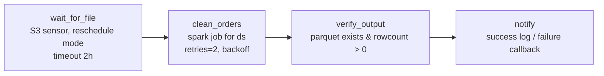

# Lab 05 — Orchestrating the Spark Pipeline: Sensors, Retries, Idempotency, Backfills

> **Module:** SK-03 Batch ETL and Orchestration Engineer
> **Time estimate:** 5–7 hours
> **Prerequisites:** Labs 00–04. `clean_orders.py` works for any date; you can read the Grid view and task logs.

---

## 1. Environment Setup

Verify the stack and both building blocks:

```powershell
cd C:\projects\sk03-batch-etl
docker compose up -d
docker exec -it airflow-scheduler python /opt/airflow/jobs/clean_orders.py 2026-07-01
```

**Expected:** the Lab 03 accounting line and two `wrote` paths.

**New this lab: an Airflow Connection for MinIO.** Sensors and hooks read credentials from Airflow's encrypted connection store — the proper home for secrets in DAGs (promised in Lab 00 §5). Create it via CLI:

```powershell
docker exec -it airflow-scheduler airflow connections add minio_s3 `
  --conn-type aws `
  --conn-login minioadmin `
  --conn-password minioadmin123 `
  --conn-extra '{\"endpoint_url\": \"http://minio:9000\"}'
```

**Verify:** UI → Admin → Connections → `minio_s3` exists. (Already exists? `airflow connections delete minio_s3` first.)

| Problem | Fix |
|---|---|
| `airflow: command not found` | You exec'd into the wrong container — use `airflow-scheduler` |
| Connection JSON mangled | PowerShell quoting — keep the backslash-escaped quotes exactly as shown |

---

## 2. Business Context

UrbanGear's order export lands "around 03:00" — except when the upstream job is slow (04:30), fails entirely (no file), or re-sends (duplicate). Lab 04's cliffhanger showed why a fixed-time trigger isn't enough: **schedule time ≠ data-arrival time**. The pipeline must *wait for evidence the file exists*, give up loudly after a deadline, retry transient infrastructure failures, and — because retries and re-runs are now automatic — be provably safe to run twice.

There's also history to fix: UrbanGear wants the warehouse loaded **from 2026-07-01 onward**, but you're deploying later. That's a **backfill** — running the pipeline for past dates — and it's a routine request in every data team ("we changed the logic; reprocess last quarter"). Teams whose pipelines aren't idempotent *fear* backfills; teams whose pipelines are treat them as a one-liner. Today you join the second group.

---

## 3. Concept Explanation

### Sensors — tasks that wait

A **sensor** is an operator whose job is to check a condition repeatedly until true (then succeed) or until timeout (then fail). Ours checks "does any object exist under `raw/orders/date=X/`?" Two operating modes matter:

- **`poke`** — the sensor occupies a worker slot the whole time it waits. Simple; wasteful when waits are long.
- **`reschedule`** — between checks the task *releases its slot* and is re-queued. Slightly more scheduler churn, near-zero resource cost. **Default choice for waits over a couple of minutes.** (Airflow's *deferrable* operators go further with a triggerer process — know the word, meet it in Resources.)

Sensor + timeout converts "file never came" from *silent absence* into a **red failed task with an alert** — absence becomes observable.

### Idempotency — the load-bearing concept of this module

An operation is **idempotent** if running it N times has the same effect as once. Why it's non-negotiable in batch: Airflow retries automatically, humans clear tasks, backfills re-run history. If a re-run duplicates data, every one of those safety features becomes a data-corruption feature.

How we achieve it, layer by layer:
- **Spark job:** overwrites exactly one `date=` partition (Lab 03) — re-run replaces, never appends.
- **Task design:** each task is a pure function of `{{ ds }}` — no `today()`, no "state left over from last run".
- **Warehouse loads (Lab 06–07):** delete-then-insert for the date, or MERGE on a key — same principle in SQL.

### Backfills and catchup

Two ways to run history: `catchup=True` on the DAG (Airflow auto-creates all missed intervals since `start_date`) or the explicit CLI `airflow dags backfill -s <start> -e <end>`. Both simply create runs whose `{{ ds }}` is a past date — **which only works because tasks take the date as a parameter.** Everything in Labs 03–04 was building to this sentence.



---

## 4. Step-by-Step Implementation

### Step 4.1 — The pipeline DAG, part 1: sensor

Create `C:\projects\sk03-batch-etl\dags\urbangear_orders_pipeline.py`:

```python
"""UrbanGear nightly orders pipeline: wait -> clean (Spark) -> verify.
Every task is a pure function of {{ ds }} => idempotent, backfillable."""
from datetime import datetime, timedelta
from airflow import DAG
from airflow.operators.bash import BashOperator
from airflow.operators.python import PythonOperator
from airflow.providers.amazon.aws.sensors.s3 import S3KeySensor

def _on_failure(context):
    ti = context["task_instance"]
    # In production this posts to Slack/PagerDuty. Locally we log loudly.
    print(f"[ALERT] task={ti.task_id} dag={ti.dag_id} ds={context['ds']} FAILED "
          f"after {ti.try_number - 1} attempts. Log: {ti.log_url}")

default_args = {
    "owner": "data-eng",
    "retries": 2,
    "retry_delay": timedelta(minutes=1),
    "retry_exponential_backoff": True,      # 1 min, then 2 min
    "on_failure_callback": _on_failure,
}

with DAG(
    dag_id="urbangear_orders_pipeline",
    start_date=datetime(2026, 7, 1),
    schedule="0 5 * * *",        # 05:00 UTC — file lands ~03:00, buffer for lateness
    catchup=False,               # we'll backfill explicitly in Step 4.4
    max_active_runs=1,           # backfill dates one at a time (laptop-friendly)
    default_args=default_args,
    tags=["urbangear", "lab05"],
) as dag:

    wait_for_file = S3KeySensor(
        task_id="wait_for_orders_file",
        aws_conn_id="minio_s3",
        bucket_name="urbangear-raw",
        bucket_key="raw/orders/date={{ ds }}/*",
        wildcard_match=True,
        mode="reschedule",           # free the worker slot between checks
        poke_interval=60,            # check every minute
        timeout=60 * 60 * 2,         # give up (fail loudly) after 2 hours
        retries=0,                   # a sensor timeout is real news — don't retry it
    )
```

- **Why `schedule="0 5 * * *"`:** cron syntax; runs 05:00 UTC covering the *previous* day (Lab 04's interval rule), two hours after the usual 03:00 drop.
- **Why `retries=0` on the sensor only:** it already waited 2 hours; retrying waits more and delays the alert. Transient-failure retries belong on the *compute* task.
- **Why the failure callback:** with 400 DAGs nobody watches the UI; failures must push to humans. Ours prints an `[ALERT]` line you can grep — the mechanism is identical for Slack/PagerDuty, only the function body changes.

### Step 4.2 — Part 2: the Spark task and a verification gate

Continue the file:

```python
    clean_orders = BashOperator(
        task_id="clean_orders",
        bash_command="python /opt/airflow/jobs/clean_orders.py {{ ds }}",
    )

    def _verify_output(**context):
        """Trust nothing: confirm the partition exists and has rows."""
        import sys; sys.path.insert(0, "/opt/airflow/jobs")
        from spark_common import get_spark
        ds = context["ds"]
        spark = get_spark(f"verify-{ds}")
        n = spark.read.parquet(
            f"s3a://urbangear-processed/processed/orders/date={ds}/").count()
        spark.stop()
        if n == 0:
            raise ValueError(f"output partition for {ds} is EMPTY")
        print(f"[verify] date={ds} clean_rows={n} OK")

    verify_output = PythonOperator(
        task_id="verify_output",
        python_callable=_verify_output,
    )

    wait_for_file >> clean_orders >> verify_output
```

- **Why verify what we just wrote:** the write task exiting 0 proves the *process* ended, not that the *data* is right. Independent verification catches partial writes, wrong paths, empty outputs. This is the seed of Lab 07's quality gate.
- **Common mistakes:** `{{ ds }}` inside a `python_callable` string does nothing — templating applies to operator *fields* (like `bash_command`); Python tasks read `context["ds"]`. Mixing these up is extremely common.

Save; wait for `urbangear_orders_pipeline` to appear in the UI. Toggle it **on**.

### Step 4.3 — Test the happy path and the sensor's two moods

**Mood 1 — file already there.** Trigger manually with a specific logical date so `{{ ds }}` matches data you have: UI → ▶ Trigger → **"Trigger DAG w/ config"** offers a *logical date* field — set `2026-07-02`. (CLI equivalent: `docker exec -it airflow-scheduler airflow dags trigger urbangear_orders_pipeline -l 2026-07-02`.)

**Expected in Grid:** sensor succeeds within its first poke (file exists), `clean_orders` prints the accounting line into its log, `verify_output` logs `clean_rows=... OK`. All dark green.

**Mood 2 — file late.** Trigger for `2026-07-06` (no data exists). The sensor goes **up_for_reschedule** (pink) and re-checks every minute. Now simulate the late arrival:

```powershell
docker exec -it airflow-scheduler python /opt/airflow/jobs/generate_orders.py 2026-07-06
```

Within a minute the sensor flips green and the pipeline proceeds. **You just watched the late-file problem get solved.** (Impatient? Lower `poke_interval` to 15.)

### Step 4.4 — The backfill

UrbanGear wants July 1–4 loaded. One command:

```powershell
docker exec -it airflow-scheduler airflow dags backfill urbangear_orders_pipeline -s 2026-07-01 -e 2026-07-04
```

- **What happens:** Airflow creates four runs, `ds` = 07-01…07-04, executed serially (`max_active_runs=1`). Watch them march across the Grid view.
- **Expected:** all four green (data exists for all four dates). Total time a few minutes — Spark session startup dominates.
- **Common mistakes:** backfilling a range with no data → sensors sit for 2 hours then fail; that's correct behavior, but on a laptop just Ctrl+C the backfill and mark the runs failed in the UI. Backfill ignores `catchup=False` — the flag only governs *automatic* catchup.

### Step 4.5 — Prove idempotency, on the record

Re-run a day that already succeeded and show nothing duplicates.

1. Count rows for 07-02 (run the `_verify_output` logic ad hoc):

```powershell
docker exec -it airflow-scheduler python -c "import sys; sys.path.insert(0,'/opt/airflow/jobs'); from spark_common import get_spark; s=get_spark('idem'); print('rows:', s.read.parquet('s3a://urbangear-processed/processed/orders/date=2026-07-02/').count()); s.stop()"
```

2. In Grid view, click 07-02's `clean_orders` square → **Clear** (with downstream). The tasks re-run.
3. Count again with the same command.

**Expected: identical row count.** That's the proof — clear/retry/backfill can never duplicate UrbanGear's data. Say it in interviews exactly this way: *"idempotent because each run overwrites a deterministic partition keyed by the data interval."*

---

## 5. Production Engineering Practices

**1. Alert on the *absence* of success, not just presence of failure.** Our callback fires when tasks fail — but what if the scheduler dies and nothing runs at all? Production teams add SLAs / freshness checks ("if no success by 07:00, page"). Lab 07 implements a freshness check on the warehouse side. **Failure story:** a scheduler VM filled its disk on Dec 24; no failures fired because nothing *ran*. The gap was found Jan 2. Silence is not health.

**2. Timeouts everywhere.** The sensor has one; compute tasks should too (`execution_timeout=timedelta(hours=1)` on heavy tasks). A hung task holding a slot forever is worse than a failed one — it blocks the queue *and* the alert. Add it to `clean_orders` yourself as an exercise.

**3. Credentials in Connections, config in one place.** The DAG contains **zero secrets** — the sensor uses `minio_s3`; the Spark job reads env vars. Bucket names and thresholds still hide in Python; Lab 07 lifts them into Airflow **Variables** so ops can change them without a deploy. Config drift across five files is how "we changed the bucket name" becomes a week-long incident.

**4. `max_active_runs=1` unless proven safe.** Parallel runs of the same pipeline writing adjacent partitions are *usually* fine with our design — but they compete for laptop RAM and, in shared warehouses, for locks. Start serial; loosen deliberately with evidence.

---

## 6. Reflection

**What you learned:** S3 sensors (poke vs. reschedule, timeouts as loud absence-detection), retries with exponential backoff, failure callbacks, template-driven dating (`{{ ds }}` end to end), explicit backfills, and an on-the-record idempotency proof.

**Why it matters:** this DAG is a production-shaped pipeline: it waits for evidence, fails loudly, recovers safely, and can reprocess history fearlessly. Labs 06–07 extend it into the warehouse; the FinCore capstone requires every one of these behaviors on new data.

### Interview questions

1. **What is a sensor and when do you use reschedule mode?** A task that polls a condition until true or timeout. Reschedule mode releases the worker slot between pokes — right for any wait longer than a few minutes.
2. **How do you handle a source file that sometimes never arrives?** Sensor with a timeout aligned to the SLA + failure alerting: absence becomes a red, paged failure instead of silent staleness.
3. **Define idempotency and how you'd implement it in a batch pipeline.** Same effect for N runs as for 1. Deterministic, parameter-keyed outputs: overwrite the run's partition in the lake; delete-then-insert or MERGE in the warehouse; no `today()` in code.
4. **Why must retries and idempotency come together?** Retries re-execute work automatically; if re-execution isn't safe, every retry risks duplicating or corrupting data.
5. **How do you backfill in Airflow?** `airflow dags backfill -s ... -e ...` (or enable catchup). Each created run gets a historical data interval; tasks parameterized by `ds` process the right slice.
6. **Where should credentials live in Airflow?** Connections (encrypted in the metadata DB) or an external secrets backend — never in DAG code or repo files.
7. **`{{ ds }}` in a PythonOperator callable — why doesn't it render?** Jinja templates render only in operators' templated fields; Python callables read the context (`context["ds"]`) instead.
8. **What's the danger of `catchup=True` on a new DAG with an old `start_date`?** An instant, possibly enormous, unplanned backfill hammering sources and the cluster the moment the DAG is unpaused.

**Interview traps:** "Sensors are just sleep loops, right?" (Poke vs. reschedule vs. deferrable — resource behavior differs enormously.) "Retry the sensor on timeout?" (No — timeout is the *signal*; retrying delays the alert.)

**Key takeaways:**
- Wait for evidence → compute keyed by `ds` → verify independently → alert on failure.
- Backfills are one command *because* every task is a pure function of the interval.
- Prove idempotency by re-running and counting; don't assert it, demonstrate it.

**Next:** [Lab 06 — dbt Transformations & Tests](Lab_06_dbt_Transformations_and_Tests.md) — clean Parquet reaches the warehouse, and SQL models with built-in tests turn it into tables analysts trust.
