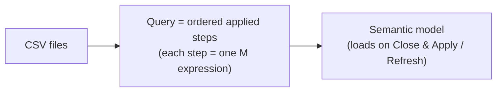

# Lab 02 — Power Query: Data Ingestion & Transformation

> **Module:** SK-06 Power BI Analytics Practitioner
> **Estimated time:** 6–7 hours
> **Builds on:** Lab_01 (you saw the dirty data break a naive report). Start from a **new blank file**, not `NorthStar_Lab01.pbix` — the naive file stays as a museum piece.
> **Produces:** `C:\PowerBI_Labs\NorthStar\pbix\NorthStar_Lab02.pbix` — all six tables ingested, cleaned, and parameterized.

Power Query is the "E" and "T" of ETL with a GUI on top and a functional language (M) underneath. In SK-03 you wrote transformations in code; here you click them — but every click **writes code for you**, and by the end of this lab you'll read and edit that code directly.

---

## 1. Environment Setup

Nothing new to install. Verify:

1. Lab_00/Lab_01 complete; six CSVs in `C:\PowerBI_Labs\NorthStar\data\`.
2. Open Power BI Desktop → **File → Options → Global → Power Query Editor** → ensure **"Display the Formula Bar"** is checked. You need to see the M code your clicks generate.
3. Create the new file now: **File → Save As** → `C:\PowerBI_Labs\NorthStar\pbix\NorthStar_Lab02.pbix`.

**Common problem:** Power Query preview feels slow on VMs. Options → **Global → Data Load** → reduce "Maximum number of simultaneous evaluations" to 2–4, and remember previews sample only the top ~1000 rows — full data loads only on Close & Apply.

---

## 2. Business Context

NorthStar's Monday analyst doesn't just paste charts — most of her day is **cleaning**: fixing region names typed three ways, removing return rows that shouldn't be in the sales total, chasing blank customer IDs. Industry folklore says data people spend 60–80% of their time preparing data; whatever the true number, preparation is where correctness is won or lost.

Why clean **in Power Query** rather than by hand or in DAX?

- **Repeatable:** hand-edits in Excel die with each new export. Power Query steps re-run identically on every refresh — clean once, benefit forever. This is the same idempotency argument from SK-03, in a GUI.
- **Right layer:** cleaning in DAX or in visuals runs the fix on *every query, for every user*; cleaning in Power Query runs it *once per refresh*. Upstream is cheaper and safer.
- **Auditable:** the applied-steps list *is* the documentation of what was done to the data.

Who consumes this work? Every downstream layer — the model, every measure, every visual, every decision. **If ingestion fails**, refresh fails and dashboards go stale; worse, if ingestion silently mangles data, dashboards stay fresh and *wrong*. The capstone (FR-02) makes "never silently drop rows" a contractual requirement for exactly this reason.

---

## 3. Concept Explanation

### 3.1 What Power Query is

A data preparation engine embedded in Power BI (and Excel, and Fabric — the skill transfers). You define a **query** per source; each query is a sequence of **applied steps**; each step is a line of **M code**; the output loads into the model on **Close & Apply** and re-executes on every refresh.

Think of it as a recorded, replayable pipeline:



### 3.2 M in one box

M is a **functional** language: each step is an expression that takes the previous step's table and returns a new one. A generated query looks like:

```m
let
    Source = Csv.Document(File.Contents("C:\...\stores.csv"), [Delimiter=","]),
    #"Promoted Headers" = Table.PromoteHeaders(Source),
    #"Changed Type" = Table.TransformColumnTypes(#"Promoted Headers", {{"store_id", Int64.Type}})
in
    #"Changed Type"
```

`let` introduces named steps; `in` returns the final one; `#"..."` quotes names containing spaces. **M is case-sensitive** (`Table.PromoteHeaders`, not `table.promoteheaders`) — the #1 beginner error when hand-editing. You rarely write M from scratch; you click, then read/adjust.

### 3.3 Order matters

Steps run top-to-bottom. Filter out negative quantities *before* computing an "is-return" flag and the flag can never be true. Changing types before fixing bad values turns bad values into **step-level errors**. When a query misbehaves, click through the steps one at a time and watch the preview — that's Power Query debugging.

### 3.4 Query folding (know it, even though CSVs can't do it)

Against a database source, Power Query tries to translate your steps back into **native SQL** so the database does the heavy lifting — this is **query folding**. Filters, column removal, and joins usually fold; some steps break folding, and everything after runs locally. CSVs can't fold (files can't run SQL), but in production against a warehouse you check folding via right-click a step → **View Native Query** (enabled = folding). Interviewers love this topic; the practical rule is *put foldable steps first*.

### 3.5 Alternatives

Cleaning could happen upstream (dbt/Spark from SK-03 — best for heavy, shared transformations), in the source extract (SQL views), or in Power Query (best when the fix is BI-specific or upstream is out of your control — very common for consultants). The wrong place is DAX or hand-edited files.

---

## 4. Step-by-Step Implementation

### Step 1 — Parameterize the data folder (do this FIRST)

Hard-coded paths break the moment the file moves to a colleague's machine (`C:\Users\you\...` doesn't exist for them). Fix it before creating any query:

1. **Home → Transform data** to open the Power Query editor.
2. **Home → Manage Parameters → New Parameter**: Name `DataFolder`, Type `Text`, Current Value `C:\PowerBI_Labs\NorthStar\data\` (keep the trailing backslash) → OK.

**Why:** one edit point when the path changes — the same config-vs-code separation you practiced in SK-01/SK-03. **Verification:** `DataFolder` appears in the Queries pane on the left.

### Step 2 — Ingest stores.csv and clean the region casing

1. **New Source → Text/CSV** → pick `stores.csv` → **OK** (inside the editor this lands as a query, no Load/Transform choice needed).
2. In the formula bar for the `Source` step, replace the hard-coded path so it uses the parameter:

   ```m
   = Csv.Document(File.Contents(DataFolder & "stores.csv"), [Delimiter=",", Encoding=65001, QuoteStyle=QuoteStyle.Csv])
   ```

   **Verification:** preview unchanged. If you get `Expression.Error: The name 'DataFolder' wasn't recognized`, check spelling/case — M is case-sensitive.
3. Confirm the auto-generated **Promoted Headers** and **Changed Type** steps exist. Check types: `store_id` should be *Whole Number*, names *Text*.
4. **Find the dirt.** Select the `region` column → **Transform ribbon → Data Preview group**: enable **Column quality / Column distribution / Column profile**. The distribution shows ~8–12 distinct region values where the business has 4 — `North`, `NORTH`, `north` counted separately. Also click **Column profile** and note it profiles the top 1000 rows unless you switch the status-bar setting to "Column profiling based on entire data set" (do that for these small files).
5. **Fix it:** select `region` → **Transform → Format → Capitalize Each Word**, then **Transform → Format → Trim** (defensive — trailing spaces are invisible and deadly in joins).

   ```m
   = Table.TransformColumns(#"Changed Type", {{"region", Text.Proper, type text}})
   ```

   **Verification:** column distribution now shows exactly **4** distinct regions. If you still see 5+, look for trailing spaces (Trim missing) or a typo'd value that needs **Replace Values** instead.
6. Rename the query `dim_store` (right-hand Query Settings pane → Name). Naming convention: dimensions `dim_*`, facts `fact_*` — Lab_03 relies on this.

**Common mistake:** using **Replace Values** ("NORTH"→"North") for every variant — brittle; a new variant next refresh sneaks through. Prefer rule-based fixes (Proper + Trim) over enumerate-the-bad-values fixes.

### Step 3 — Ingest the other dimensions

Repeat the pattern (New Source → parameterized path → verify types → rename):

- `products.csv` → `dim_product`. Verify 500 rows (status bar bottom-left), types: ids whole numbers, `unit_cost`/prices *Fixed decimal number* (currency-safe; avoids floating-point drift — same lesson as SK-02's `NUMERIC`).
- `customers.csv` → `dim_customer` (2,000 rows).
- `promotions.csv` → `dim_promotion` (12 rows). Check `start_date`/`end_date` typed as *Date* (not DateTime — dates without times compress better and join cleanly to a date dimension).

**Verification for all:** no step shows an error triangle; row counts match Lab_00's numbers.

### Step 4 — Ingest sales.csv and handle the defects properly

1. New Source → `sales.csv` → parameterize the path → rename `fact_sales`.
2. Types: `order_date` **Date**; `quantity` Whole Number; `unit_price`, `discount_pct` Fixed decimal / Decimal; ids Whole Number. **Watch for:** if `customer_id` auto-typed as *Text*, the blank values confused detection — set it to Whole Number manually; genuine blanks become `null`, which is what we want.
3. **Nulls (guest checkouts):** do **not** delete these rows — the sale happened; only the customer is unknown. Instead, standardize: select `customer_id` → **Transform → Replace Values** → Value to Find: `null` → Replace With: `-1`. In Lab_03 you'll add an "Unknown customer" row (`customer_id = -1`) to `dim_customer` so these sales still join. This is the classic **unknown member** pattern.

   ```m
   = Table.ReplaceValue(#"Changed Type", null, -1, Replacer.ReplaceValue, {"customer_id"})
   ```

4. **Negative quantities (returns):** business decision required — and the *realistic* answer is "returns are real events; keep them, but make them identifiable." Add a flag: **Add Column → Custom Column**, name `is_return`:

   ```m
   if [quantity] < 0 then true else false
   ```

   Set its type to True/False. Do **not** filter the rows out — net revenue *should* include returns; some analyses will exclude them via the flag.
5. **Add the revenue ingredients once, at the right layer.** Add a custom column `net_amount`:

   ```m
   [quantity] * [unit_price] * (1 - [discount_pct])
   ```

   Type: Fixed decimal number. *Why here and not DAX?* A pure row-level computation with no filter-context dependence is cheapest computed once at refresh time. (Lab_04 discusses the column-vs-measure trade-off properly — measures still do the aggregating.)
6. **Verification:**
   - Column quality on `customer_id`: 0% empty.
   - Filter dropdown on `is_return`: both true and false present; true is ~1% (Lab_00 planted ~1% returns).
   - `net_amount` spot check: pick any row, multiply by hand.

**Troubleshooting:** a column full of `Error` after a type change = values that can't convert (e.g., text in a numeric column). Click one Error cell to read the reason; fix the value *before* the type step, or right-click the column → **Replace Errors** with `null` — but only when you've understood the cause. Blindly replacing errors is silent data loss with extra steps.

### Step 5 — Ingest targets.csv, and fix its shape

1. New Source → `targets.csv` → parameterize → rename `fact_targets` (96 rows: 4 regions × 24 months).
2. Check the shape: if the file is **wide** (one column per region), it must be unpivoted — facts want one row per (month, region). Select the month column → right-click → **Unpivot Other Columns**; rename `Attribute`→`region`, `Value`→`target_revenue`. If your generated file is already tall (month, region, target), skip unpivoting — but *know* this move; reshaping wide→tall is a top-3 real-world Power Query task.
3. Ensure `region` casing matches `dim_store`'s cleaned values (apply Proper+Trim here too — both sides of a future join must agree).

**Verification:** 96 rows; 4 distinct regions; month column typed Date.

### Step 6 — Close & Apply, then prove idempotency

1. **Home → Close & Apply.** Watch the load dialog; all six queries should load without errors.
2. **Home ribbon → Refresh** — everything reloads and re-cleans from the raw files. Refresh **again**. Row counts identical both times (check Table view). That's idempotency: same input, same output, any number of runs.
3. Save. This file is Lab_03's starting point.

**Expected output:** Data pane shows `dim_store`, `dim_product`, `dim_customer`, `dim_promotion`, `fact_sales`, `fact_targets`. **Common mistake:** a query set to "Enable load = off" (right-click menu) silently doesn't appear in the model — check that all six are load-enabled.

---

## 5. Production Engineering Practices

- **Parameterized configuration.** `DataFolder` is the module's first real config management. In production the same mechanism switches a model between Dev and Prod databases without touching queries. *Failure story:* a report worked on the developer's laptop for months; published to the Service, refresh failed instantly — hard-coded `C:\Users\dave\...`. The gateway machine had no such path. One parameter would have made it a 30-second fix.
- **Never silently drop rows.** Every defect got an explicit, documented decision: nulls → unknown member; returns → flagged, kept. The dangerous alternative — "Remove Rows" and move on — makes totals quietly wrong forever. The capstone escalates this into a required audit table (FR-03).
- **Rule-based cleaning over value-enumeration.** `Text.Proper` + `Text.Trim` survives new data; a list of Replace Values does not.
- **Types are contracts.** Fixed decimal for money, Date not DateTime, whole numbers for keys. Wrong types cause wrong joins, bloated models, and floating-point pennies.
- **Applied steps are documentation** — but only if named. Right-click any non-obvious step → Rename (e.g., `Flagged returns`), and use step **Properties → Description** for the why.

---

## 6. Reflection

### What you learned

Power Query as repeatable ETL; M's let/in structure and case sensitivity; profiling tools; the unknown-member pattern; flagging vs deleting; unpivoting; parameters; query folding; idempotent refresh.

### Interview questions

1. **What is Power Query and how does it relate to the rest of Power BI?**
   *The ingestion/transformation layer of the .pbix. Each query is a sequence of M steps re-executed on every refresh; output loads into the semantic model. It's ETL — extract and transform — with the model as the load target.*
2. **What is query folding and why do you care?**
   *Power Query translating applied steps into the source's native query language (e.g., SQL) so the source does the work. It matters for performance and refresh time. Check via View Native Query; keep foldable steps early because a folding-breaking step stops folding for everything after it.*
3. **You find null customer IDs in a sales feed. Walk me through your handling.**
   *First diagnose the cause (guest checkout? capture bug?). Don't delete — the sales are real. Replace null with a sentinel key (−1), add an unknown-member row to the customer dimension so joins don't orphan, and surface the null rate so the business can see data quality. Deleting rows silently understates revenue.*
4. **Where should data cleaning happen: source, pipeline, Power Query, or DAX?**
   *As far upstream as you control. Source/pipeline fixes benefit all consumers; Power Query is right when the fix is BI-specific or upstream is out of reach; DAX is the wrong layer — it re-pays the cost on every query and hides the logic from refresh-time auditing.*
5. **Calculated column in Power Query vs in DAX — how do you choose?**
   *Row-level, filter-independent logic (net_amount, flags) → Power Query: computed once at refresh, compresses well, and can fold to the source. Logic depending on model relationships or filter context → DAX. Prefer upstream when both work.*
6. **What does 'idempotent refresh' mean and how did you verify it?**
   *Refreshing any number of times yields the same result — no duplication, no drift. Verified by refreshing twice and comparing row counts. It matters because production refreshes rerun after failures; a non-idempotent load double-counts.*
7. **Trap: "Just use Replace Errors to make the red cells go away."**
   *Replace Errors without diagnosis is silent data loss. First click an error to read its cause, fix the root (usually value-vs-type mismatch or step order), and only then decide whether a null replacement is legitimate — and count how many you replaced.*

### Common traps

- Claiming CSVs query-fold (they can't — no engine behind them).
- "I removed the bad rows" as a proud answer — interviewers hear *silent data loss*.

### Key takeaways

1. Every click writes M; read the formula bar until it stops being scary.
2. Clean by rule, keep by default, flag what's suspect, parameterize what varies.
3. Your six queries are now a small, idempotent, documented pipeline — the model in Lab_03 stands on them.

**Next up:** [Lab_03_Data_Modeling.md](Lab_03_Data_Modeling.md) — turn six clean tables into a star schema that can finally answer "revenue by region."
