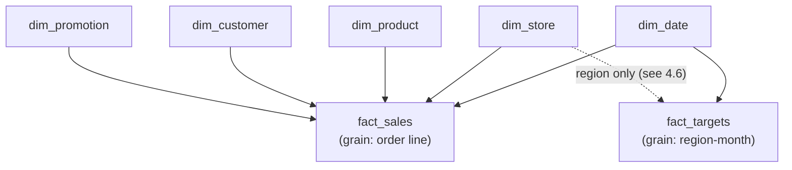

# Lab 03 — Data Modeling: Star Schema & Relationships

> **Module:** SK-06 Power BI Analytics Practitioner
> **Estimated time:** 6–7 hours
> **Builds on:** Lab_02 — open `NorthStar_Lab02.pbix`, then **File → Save As** → `NorthStar_Lab03.pbix` before touching anything.
> **Produces:** `NorthStar_Lab03.pbix` — a working star schema with a marked fiscal date dimension.

This is the most important lab in the module. DAX behavior (Labs 04–05), report performance, and RLS (Lab_06) all sit on top of the model you build here. Most "DAX problems" in real projects are actually model problems.

---

## 1. Environment Setup

Nothing new to install.

1. Open `NorthStar_Lab02.pbix` → Save As `C:\PowerBI_Labs\NorthStar\pbix\NorthStar_Lab03.pbix`.
2. Verify all six tables exist in the Data pane and Lab_02's cleaning is intact (4 distinct regions in `dim_store`, no null `customer_id` in `fact_sales`).
3. Confirm again that **Auto date/time is OFF** (Options → Global → Data Load) — this lab builds the *explicit* date table that replaces it.
4. Optional but recommended from this lab on: install **Tabular Editor 2** (free) from `github.com/TabularEditor/TabularEditor/releases` — download the installer, next-next-finish; it appears under Power BI Desktop's **External Tools** ribbon. Not required for any step below.

---

## 2. Business Context

Lab_01's Failure 1: the CFO asked for "quantity by region" and the flat file couldn't answer. The general form of that question — **measure by attribute** ("revenue by category", "returns by region by month") — is 90% of all business questions. A data model exists to make every measure-by-attribute combination *automatic*.

There's a second, subtler business need: **one version of the truth**. When "revenue by region" is computed via ad-hoc VLOOKUPs in five spreadsheets, five numbers emerge. When it's computed by one model with one set of relationships, everyone slices the same truth. Amara (the capstone CTO) will demand exactly this for 200 tenants.

**Who consumes the model?** Report builders (maybe future-you), self-service analysts connecting to the published model, and every visual every user renders. **If it's wrong** — a missed relationship, a wrong cardinality — numbers don't error; they come out *plausible and wrong* (typically identical values repeated down a column, or totals that double-count). The worst failure mode in BI, again.

Industry context: the star schema comes from Ralph Kimball's dimensional modeling methodology (1990s), and it remains the standard shape for analytics because both humans *and* Power BI's VertiPaq engine are optimized for it. This is the same dimensional thinking you met in SK-02 — now with an engine that rewards it directly.

---

## 3. Concept Explanation

### 3.1 Facts and dimensions

- A **fact table** records *events/measurements*: one row per thing that happened, at a declared **grain**. `fact_sales`: one row per order line item. Mostly numbers + foreign keys; long and narrow; grows forever.
- A **dimension table** describes *context*: who/what/where/when. `dim_store`: one row per store, with region, district, name. Short and wide; changes slowly.

Rule of thumb: **you aggregate facts, you filter and group by dimensions.**

### 3.2 The star schema

Dimensions around facts, one hop each:



Why a star and not one big flat table? Flat tables repeat every dimension attribute on every fact row (bloat, poor compression, update anomalies) and can't hold two facts at different grains. Why not full **normalization** (3NF, as in SK-02's OLTP designs)? Analytics queries would need many joins per question; stars keep it to one hop, which VertiPaq is built for. A middle form, the **snowflake** (dimensions split into sub-dimensions), is generally avoided in Power BI — flatten dimensions in Power Query instead.

### 3.3 Relationships = filter propagation

A Power BI relationship is not a join you write per-query; it's a standing rule: **filters flow from the one side to the many side**. Click "West" in `dim_store` → the relationship filters `fact_sales` to West's rows → every measure recalculates. That's the entire magic of Lab_01's cross-filtering, made explicit.

Key properties of every relationship:

- **Cardinality:** one-to-many (`1:*`) is the healthy norm (one store, many sales). One-to-one is rare. **Many-to-many means neither side is unique — usually a symptom of dirty keys or a missing bridge table**, not a design choice.
- **Cross-filter direction:** **Single** (dimension→fact) is the default and should stay that way. **Both** (bidirectional) makes filters flow backwards too; it occasionally has legitimate uses but causes ambiguity, performance loss, and RLS surprises — the capstone requires written justification for any non-single relationship (FR-08).
- **Active vs inactive:** only one active relationship between two tables. A second (e.g., `ship_date` → `dim_date`) stays inactive and is invoked per-measure with DAX `USERELATIONSHIP` (Lab_05).

### 3.4 Why an explicit date dimension

Time is the one dimension every business shares, and the one where "attributes" are *computed* (fiscal year, quarter, weekday). A dedicated `dim_date` — one row per calendar day, spanning your data's full range — gives every fact the same calendar, powers DAX time intelligence (Lab_05), and encodes **NorthStar's July-1 fiscal year**, which no auto-generated calendar can do. You'll **mark it as the date table** so time-intelligence functions trust it.

---

## 4. Step-by-Step Implementation

### Step 1 — Survey the model and remove accidental relationships

1. Open **Model view** (third icon, left edge). You see six tables, possibly with lines between them — Power BI **auto-detects** relationships by matching column names/values on load.
2. Inspect each auto-created line (click it; properties show at right). Auto-detection is convenient and occasionally wrong — engineers verify. **Delete any relationship you can't explain** (right-click the line → Delete). It's faster to rebuild deliberately than to audit guesses.

*Why:* an unexplained relationship is an unexplained filter path — the modeling equivalent of mystery code in production.

### Step 2 — Create the core relationships deliberately

For each: **drag the key from the dimension onto the matching key in the fact** (or Model view → Manage relationships → New).

| From (1 side) | To (* side) | Verify |
|---|---|---|
| `dim_store[store_id]` | `fact_sales[store_id]` | 1:*, single direction, active |
| `dim_product[product_id]` | `fact_sales[product_id]` | 1:*, single |
| `dim_customer[customer_id]` | `fact_sales[customer_id]` | 1:*, single — see Step 3 first if it fails |
| `dim_promotion[promotion_id]` | `fact_sales[promotion_id]` | 1:*, single |

**Expected output:** the dialog auto-selects "Many to one", "Single". If it proposes **many-to-many**, STOP — your dimension key isn't unique. Diagnose: Table view → select the dimension → check for duplicate ids (usually a Power Query mishap, e.g., headers not promoted or a duplicated row). Never accept m:m to "make the error go away."

**Verification:** in Report view, table visual with `dim_store[region]` + `fact_sales[quantity]` → four regions with *different* numbers. If every region shows the same total, the relationship isn't filtering (wrong columns, or you used two fact columns).

### Step 3 — Add the Unknown Customer row

Lab_02 mapped null customers to `-1`, but `dim_customer` has no `-1` row, so those sales currently match nothing on the one side (Power BI handles this with a hidden blank member — you'll see a `(Blank)` customer). Make it explicit:

1. **Transform data** → select `dim_customer` → **Home → Advanced Editor**, and append an unknown row by wrapping the final step (adapt the last step name to yours):

   ```m
   let
       // ... existing steps ...
       FinalTyped = #"Changed Type",
       AddUnknown = Table.InsertRows(FinalTyped, 0,
           {[customer_id = -1, first_name = "Unknown", last_name = "Customer",
             city = "Unknown", loyalty_tier = "None"]})
   in
       AddUnknown
   ```

   Match the record's fields to your actual columns (Advanced Editor shows them); every column must be present or you'll get a record-field error.
2. Close & Apply. **Verification:** matrix of `dim_customer[last_name]` by quantity now shows a "Customer, Unknown" row (~2% of quantity) and **no blank row**.

**Why it matters:** blank members confuse business users ("who is blank?"); an explicit Unknown row is self-documenting and countable.

### Step 4 — Build dim_date in DAX

Two standard ways to build a date table: Power Query (M) or a DAX **calculated table**. Both are fine; we use DAX here so you meet calculated tables before Lab_04.

1. Report view → **Modeling ribbon → New table** → paste, then adjust the date span to cover your generated data (check min/max `order_date` in Table view first):

   ```dax
   dim_date =
   VAR MinDate = DATE ( 2024, 7, 1 )    -- start of first fiscal year in the data
   VAR MaxDate = DATE ( 2026, 6, 30 )   -- end of last fiscal year
   RETURN
   ADDCOLUMNS (
       CALENDAR ( MinDate, MaxDate ),
       "Year", YEAR ( [Date] ),
       "Month Number", MONTH ( [Date] ),
       "Month", FORMAT ( [Date], "MMM YYYY" ),
       "Month Sort", YEAR ( [Date] ) * 100 + MONTH ( [Date] ),
       "Weekday", FORMAT ( [Date], "ddd" ),
       "Weekday Number", WEEKDAY ( [Date], 2 ),
       "Fiscal Year",
           "FY" & IF ( MONTH ( [Date] ) >= 7, YEAR ( [Date] ) + 1, YEAR ( [Date] ) ),
       "Fiscal Quarter",
           "Q" & ROUNDUP ( ( MOD ( MONTH ( [Date] ) + 5, 12 ) + 1 ) / 3, 0 ),
       "Fiscal Month Number", MOD ( MONTH ( [Date] ) + 5, 12 ) + 1
   )
   ```

   Line-by-line: `CALENDAR` returns one row per day between two dates; `ADDCOLUMNS` appends computed columns; the fiscal expressions shift July→month 1 (July 2025 belongs to **FY2026**, per NorthStar's convention that the FY is named for the year it *ends* in — the same convention the capstone uses, C-03).
2. **Verification (do not skip):** Table view → filter `dim_date` to 2025-07-01 → expect `Fiscal Year = FY2026`, `Fiscal Quarter = Q1`, `Fiscal Month Number = 1`. Check 2025-06-30 → `FY2025`, `Q4`, month 12. Off-by-one here poisons every time-intelligence measure in Lab_05.
3. **Sort the text months correctly:** select the `Month` column → **Column tools → Sort by column** → `Month Sort`. (Otherwise visuals sort "Apr, Aug, Dec…" alphabetically — a classic.) Do the same for `Weekday` by `Weekday Number`.

**Common mistake:** date span narrower than the data → sales outside the range vanish from any date-filtered visual, silently. Always derive the span from actual min/max.

### Step 5 — Mark it, relate it

1. Select `dim_date` in the Data pane → **Table tools → Mark as date table** → choose `[Date]`. Power BI validates the column is contiguous, unique, whole-day dates.
   *Why:* marking tells DAX time-intelligence functions this is the model's calendar, and removes the need for auto date/time behavior on relationships.
2. Model view: relate `dim_date[Date]` → `fact_sales[order_date]` (1:*, single). Relate `dim_date[Date]` → `fact_targets` month column (1:*, single) — targets are monthly, stamped on the first of the month, so they join to that day.

**Verification:** line chart of `Month` (from **dim_date**, never from the fact) vs `quantity` — a continuous two-year line, correctly ordered. **From now on, all date fields in visuals come from `dim_date`.**

### Step 6 — Handle fact_targets' grain mismatch

`fact_targets` is at **region-month** grain; `fact_sales` at order-line grain; `dim_store` keys on `store_id`, which targets doesn't have. You cannot (and must not) relate the two facts directly — facts never relate to facts.

Pragmatic Lab-level solution: relate on the shared dimension attributes available:

- Date side: done in Step 5.
- Region side: `dim_store[region]` is not unique (many stores per region), so a direct relationship to `fact_targets[region]` would be m:m. The clean fix is a tiny `dim_region` table: **Modeling → New table**:

  ```dax
  dim_region = DISTINCT ( SELECTCOLUMNS ( dim_store, "region", dim_store[region] ) )
  ```

  Relate `dim_region[region]` → `dim_store[region]` (1:*) and `dim_region[region]` → `fact_targets[region]` (1:*), both single direction. Now a region slicer filters both facts through one conformed dimension. **Verification:** matrix — rows `dim_region[region]`, values `quantity` and `target_revenue`: both populate per region. This "shared dimension between facts at different grains" is exactly how actual-vs-target works in real models, and returns in Lab_05.

### Step 7 — Hygiene pass, then save

1. **Hide the plumbing:** in Model view, hide (eye icon) every foreign key on `fact_sales` (`store_id`, `product_id`, ...) and the raw key columns users shouldn't grab. Users should only ever pick dimension attributes + measures.
2. **Data category & formats:** set `dim_store` city/region **Column tools → Data category** where relevant (e.g., City) for future maps; format `net_amount` as currency, 0–2 decimals.
3. Arrange Model view: facts bottom, dimensions above — literally draw the star. Future maintainers (and your Lab_06 self) read this diagram.
4. Save `NorthStar_Lab03.pbix`.

---

## 5. Production Engineering Practices

- **Naming conventions carry meaning.** `dim_`/`fact_` prefixes, snake_case columns from source, human-readable display names for anything user-facing. The capstone rubric checks this (NFR-05). A model where you can't tell facts from dimensions at a glance is a model nobody else can maintain.
- **Single-direction by default; justify exceptions in writing.** Bidirectional filters are the goto-statement of Power BI modeling. *Failure story:* a finance model used "Both" on several relationships "so slicers work everywhere." Months later, RLS was added — and the bidirectional paths let a filtered dimension get re-expanded through the back door, exposing other cost centers' data in totals. The audit that followed cost far more than modeling slicers properly would have.
- **Grain is documented, or the model lies.** One sentence per fact table ("one row per order line item") prevents the classic double-count when someone later joins at the wrong level. Write these into your model documentation now; the capstone requires it.
- **Hide what users shouldn't touch.** Every visible raw key is an invitation to build a wrong visual. Model hygiene is UX.
- **Validate with control numbers.** After any modeling change, re-check a number you know (total quantity, region split). The capstone formalizes this as hand-checked control totals (AC-2).

---

## 6. Reflection

### What you learned

Facts vs dimensions and grain; star vs flat vs snowflake; relationships as filter propagation; cardinality and why m:m is a symptom; single vs bidirectional; the unknown-member row; building/marking a fiscal `dim_date`; conformed `dim_region` bridging two facts at different grains.

### Interview questions

1. **Fact table vs dimension table?**
   *Facts record events at a declared grain — numeric, narrow, ever-growing, aggregated. Dimensions describe context — descriptive, wide, slowly changing, used to filter and group. Filters flow from dimensions to facts.*
2. **What is grain and why is it the first question you ask?**
   *The meaning of one fact row (e.g., one order line). Every measure, relationship, and join assumes it; mixing grains double-counts. If you can't state a table's grain in one sentence, you can't safely aggregate it.*
3. **Why is star schema preferred in Power BI over one flat table or 3NF?**
   *Flat tables bloat, compress poorly, and can't host multiple facts at different grains; 3NF needs long join chains that hurt usability and the engine. A star gives one-hop filter paths that VertiPaq and DAX are optimized for, plus a single filterable version of each dimension.*
4. **When would you use bidirectional cross-filtering, and what are the risks?**
   *Rarely — e.g., certain m:m bridge patterns. Risks: ambiguous filter paths, slower queries, and RLS leakage where a filter propagates back around a security filter. Default single; justify exceptions in the model doc.*
5. **Why a dedicated date table instead of Auto date/time?**
   *One shared calendar for all facts, fiscal-year logic (July 1 here), correct sorting, DAX time-intelligence support via Mark as date table, and a far smaller model than per-column hidden calendars.*
6. **Power BI proposes a many-to-many relationship. What do you do?**
   *Treat it as a smell: it means my dimension key isn't unique. Find the duplicates (bad load step, missing dedupe), fix the source query, and create a proper 1:*. Genuine m:m needs a bridge table — a deliberate design, never an accident accepted from a dialog.*
7. **How do you compare actuals against targets stored at a different grain?**
   *Never relate fact-to-fact. Both facts share conformed dimensions at their common grain — here, region and month — so one slicer filters both. Measures then compare the two facts inside the same filter context.*
8. **Trap: "Just merge all the tables into one in Power Query — fewer relationships to worry about."**
   *That rebuilds Lab_01's flat file with extra steps: repeated attributes, worse compression, no second grain, and dimension updates rewriting millions of rows. Relationships aren't overhead to avoid; they're the query engine working for you.*

### Key takeaways

1. Model shape determines everything downstream — most "DAX problems" are model problems.
2. Filters flow one→many. Internalize that arrow and DAX (Lab_04) becomes learnable.
3. Grain, naming, hidden keys, documented justifications: the difference between a model and a liability.

**Next up:** [Lab_04_DAX_Fundamentals.md](Lab_04_DAX_Fundamentals.md) — measures, filter context, and CALCULATE, on top of the star you just built.
