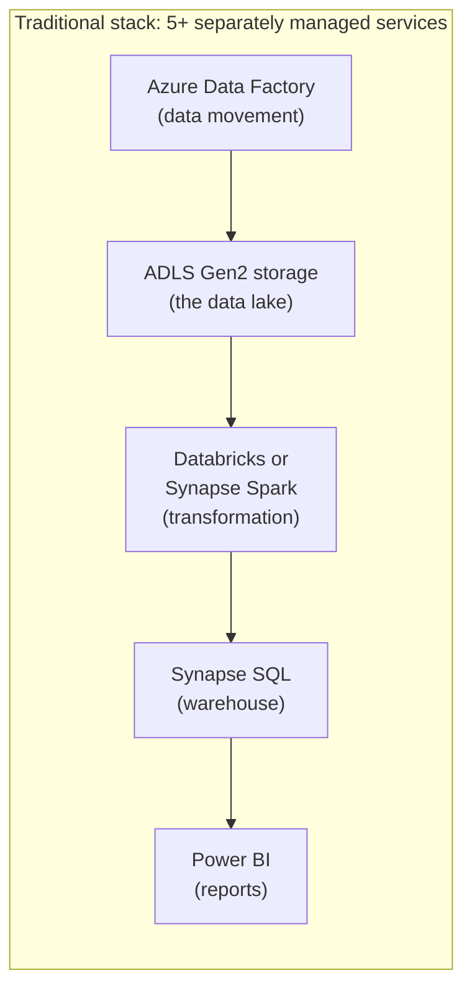
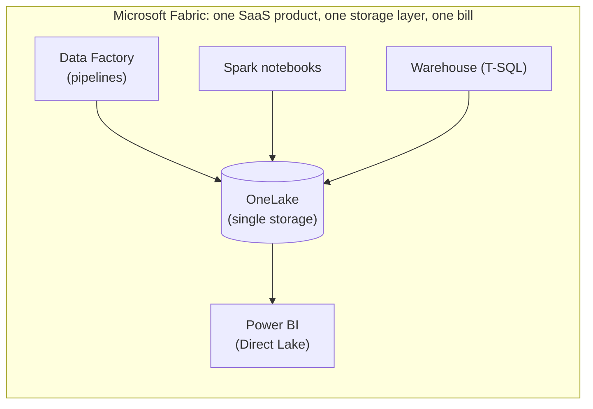
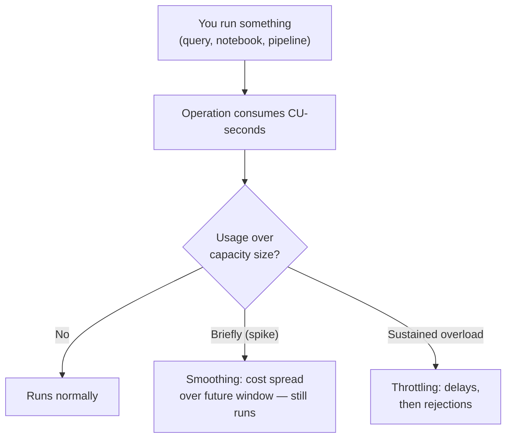

# Lab 00 — Environment Setup: Your Microsoft Fabric Trial Workspace

> **Module:** SK-07 Microsoft Fabric Data Engineer
> **Time estimate:** 2–3 hours (most of it is reading and clicking, not typing)
> **Cost:** $0 — everything in this module runs on the free 60-day Fabric trial
> **What you'll have at the end:** a working Fabric trial, a workspace named `sk07-fabric-training`, a local data folder at `C:\FabricLabs\data`, and the confidence to find your way around the Fabric UI.

---

## Before We Start: What Is Microsoft Fabric?

Here is the one-paragraph elevator pitch, and then we will unpack every word of it over the next few labs.

**Microsoft Fabric is an all-in-one, cloud-based analytics platform delivered as Software-as-a-Service (SaaS).** Instead of stitching together five or six separate Azure services — one for storing data, one for moving it, one for transforming it with Spark, one for SQL warehousing, one for dashboards — Fabric bundles all of those capabilities into a single product with a single login, a single storage layer (called **OneLake**), and a single bill (called a **capacity**). You open a browser, sign in at `app.fabric.microsoft.com`, and everything a data engineering team needs is already wired together. That is the pitch: *less plumbing, more engineering*.

Don't worry if terms like "OneLake" and "capacity" are fuzzy right now. Defining them properly is literally the job of this lab and the next one.

### Why does this lab exist?

Every other lab in SK-07 assumes you have:

1. A working Microsoft Fabric trial.
2. A workspace called **`sk07-fabric-training`** assigned to that trial.
3. A local folder **`C:\FabricLabs\data`** where you will create small CSV files for our fictional client, **FreshCart** (an online grocery startup — you'll meet them properly in Section 2).

This lab does the heavy lifting once so that every later lab can start with a two-minute verification instead of a two-hour setup. If something goes wrong later in the module, come back to the **Troubleshooting** section at the end of this lab — it is the longest troubleshooting section in the whole module, on purpose.

---

## Section 1: Environment Setup

### 1.1 What you need before anything else

| Requirement | Details | Why |
|---|---|---|
| **A work or school Microsoft account** | An account in Microsoft Entra ID (formerly Azure Active Directory), e.g. `you@yourcompany.com` or `you@yourtraining.org` | Fabric trials are only available to **organizational** accounts. Personal accounts (`@outlook.com`, `@gmail.com`, `@hotmail.com`) **cannot** sign up. More on this below. |
| **A modern browser** | Microsoft Edge or Google Chrome, latest stable version. Firefox and Safari mostly work but Microsoft only fully supports Edge/Chrome. | Fabric is entirely browser-based. There is nothing to install to use Fabric itself. |
| **Windows 11 PC** | Any spec is fine — the heavy compute happens in Microsoft's cloud, not on your machine | You only need a browser and a text editor locally. |
| **No Azure subscription** | Really — none. No credit card either. | The Fabric **trial** provides its own compute capacity for 60 days. This is different from most cloud trials, which is why we can run this whole module for free. |
| **(Optional) Power BI Desktop** | Free Windows app | Only used at the very end of the module for report authoring. macOS users skip it and use the browser instead. |

Let's define the first piece of jargon before it trips you up:

> **Microsoft Entra ID** is Microsoft's cloud identity system — the directory where organizations keep their user accounts. When you log into anything Microsoft with a company or school email address, Entra ID is what checks your password. A **tenant** is one organization's private slice of Entra ID: your company's tenant contains your company's users, and nobody else's. Fabric trials, workspaces, and data all live *inside a tenant*.

### 1.2 "But I only have a personal account" — your options

This is the single most common blocker for beginners, so let's handle it head-on. If your only email is `something@gmail.com` or `something@outlook.com`, the Fabric signup page will reject you with *"You can't sign up with a personal account. Use your work or school account instead."*

Your realistic options, in order of preference:

**Option A — Use an account provided by your employer or training program (recommended).**
If you're reading this as part of a training cohort (for example, an `@amalitechtraining.org` or company account), that account is already an Entra ID work account — use it. If you're at a company, ask your IT team whether Fabric trials are enabled in your tenant (some admins disable self-service trials; see Troubleshooting item T2).

**Option B — Create your own brand-new Entra ID tenant (free, ~20 minutes, slightly fiddly).**
You can be your own one-person "organization." Microsoft lets anyone create a free Entra ID tenant:

1. Go to `https://azure.microsoft.com/free` OR directly to the Entra admin center at `https://entra.microsoft.com` and sign in with your personal Microsoft account.
2. In the Entra admin center, go to **Identity → Overview → Manage tenants → Create**.
3. Choose **Microsoft Entra ID** (not B2C), give the organization a name (anything, e.g. `FreshCartLab`), and a domain like `freshcartlab.onmicrosoft.com`.
4. Once the tenant exists, create a **new user** inside it (Identity → Users → New user), e.g. `student@freshcartlab.onmicrosoft.com`, and set a password.
5. That new `...onmicrosoft.com` account **is** a work/school account. Use it to sign up for Fabric in step 1.3.

> ⚠️ **Heads-up about the "M365 Developer Program":** older tutorials (and older versions of this course) told you to join the free Microsoft 365 Developer Program to get a sandbox tenant with 25 users. **That program has been deprecated/restricted** — new sign-ups without a paid Visual Studio subscription are no longer accepted. If a blog post or video tells you to use it, that advice is out of date. Use Option A or B instead.

**Option C — Ask your training provider for a shared tenant.** Some bootcamps provision a tenant with student accounts. If that's you, you likely already have credentials — check your onboarding email.

Whichever option you choose, the end state is the same: **you can sign into `app.fabric.microsoft.com` with a work/school account.** Everything after this point is identical for everyone.

### 1.3 Signing up for the Fabric trial — step by step

**Why a trial, and what do you get?** The Fabric trial gives you **60 days** of a trial capacity roughly equivalent to an **F64** capacity (we'll explain what F64 means in Section 3 — for now: it's a generous amount of cloud compute, more than enough for this whole module) plus **1 TB** of OneLake storage. No credit card, no Azure subscription, and when the 60 days end nothing is charged — your items just become read-only until you attach a paid capacity.

**Step 1 — Open the Fabric portal.**

- **What to do:** In Edge or Chrome, go to **`https://app.fabric.microsoft.com`** and sign in with your work/school account.
- **Why:** This URL is the front door to all of Fabric. (You may notice it looks a lot like the Power BI portal at `app.powerbi.com` — that's because Power BI is one of the workloads *inside* Fabric; they share the same portal.)
- **Expected output:** After signing in you land on the **Fabric home page** — a page with a left navigation bar (Home, Browse, OneLake, Workspaces, ...), a "Create" area, and possibly some getting-started cards. If you've never used Power BI, the page may be nearly empty. That's fine.
- **Verification:** The URL bar shows `app.fabric.microsoft.com` (it may redirect to `app.powerbi.com` — same thing) and the top-right corner shows your initials/profile picture. Click it and confirm the account shown is your **work/school** account, not a personal one.
- **Common mistake:** Being signed into the browser with a personal Microsoft account. The portal will silently use whatever account the browser has cached. **Fix:** use an InPrivate/Incognito window, or click your profile picture → **Sign out**, then sign in with the correct account.
- **Troubleshooting:** "You need a work or school account" error → see Troubleshooting T1. Blank white page → try a different browser or disable aggressive ad-blockers (Fabric's portal is JavaScript-heavy).

**Step 2 — Start the trial.**

- **What to do:** Click your **profile picture / account manager** in the top-right corner. In the panel that opens, look for a button that says **"Start trial"** or **"Free trial"**. Click it. A dialog appears — **"Activate your 60-day free Fabric trial capacity"** — click **Activate** (or **Start trial**). You may be asked to confirm a phone number or just to click through.
- **Why:** Signing in gives you a *seat* in Fabric, but creating anything requires **capacity** (compute). The trial button provisions a personal **Trial capacity** for you.
- **Expected output:** A confirmation like *"Successfully upgraded to a free trial"*, and the account panel now shows **"Trial status: XX days left"**.
- **Verification:** Click your profile picture again — you should see **"Free trial: 60 days left"** (or 59, depending on timing). If you can see that countdown, you have capacity. 🎉
- **Common mistakes:**
  - Looking for the trial button on the home page instead of in the **account manager panel** (profile picture, top right). It lives in the panel.
  - Expecting an email confirmation — there isn't one. The countdown in the panel is your proof.
- **Troubleshooting:** No "Start trial" button at all → Troubleshooting T2 (your tenant admin has disabled trials, or trials aren't available in your region). Button greyed out → T2 as well.

**Step 3 — Confirm Fabric is enabled (not just Power BI).**

- **What to do:** In the bottom-left corner of the portal you'll see an **experience switcher** — an icon labeled with the current workload (it might say **Power BI** or **Fabric**). Click it.
- **Why:** This switcher is how you move between Fabric's *experiences* (Data Engineering, Data Factory, Data Warehouse, Power BI, etc. — Lab_01 tours them all). If Fabric were disabled in your tenant, you would only see Power BI here.
- **Expected output:** A menu (or full-screen picker) listing multiple experiences: **Fabric / Data Engineering / Data Factory / Data Warehouse / Real-Time Intelligence / Data Science / Power BI** (names and grouping shift slightly as Microsoft updates the UI — what matters is that you see *more than just Power BI*).
- **Verification:** You can select **Data Engineering** and the portal's "Create/New" options change to show items like *Lakehouse*, *Notebook*, *Spark Job Definition*.
- **Common mistake:** Panicking because your list of experiences looks slightly different from a screenshot in a video. Microsoft renames and regroups these regularly (e.g., "Synapse Data Engineering" became just "Data Engineering"; "Real-Time Analytics" became "Real-Time Intelligence"). Match on the *concepts*, not the exact labels.
- **Troubleshooting:** Only Power BI appears → Fabric is disabled at the tenant level → Troubleshooting T3.

### 1.4 Create the module workspace: `sk07-fabric-training`

Before creating it, one definition:

> A **workspace** is Fabric's container for related items — think of it as a project folder in the cloud. Everything you build (lakehouses, notebooks, pipelines, reports) lives inside exactly one workspace. Workspaces are also where you control *who* can see and edit things, and *which capacity* pays for the compute.

**Step 4 — Create the workspace.**

- **What to do:**
  1. In the left navigation bar, click **Workspaces**.
  2. Click **+ New workspace** at the bottom of the flyout.
  3. **Name:** type exactly **`sk07-fabric-training`** (lowercase, hyphens — every later lab refers to this exact name).
  4. Expand the **Advanced** section.
  5. Under **License mode / Capacity**, select **Trial** (it may appear as *"Trial capacity"* or *"Fabric trial"* with a radio button).
  6. Click **Apply**.
- **Why:** The name matters because Labs 01–06 and the project all say "open `sk07-fabric-training`" — using the exact name keeps you and the instructions in sync. The **Trial** license mode matters because a workspace without Fabric capacity can only hold Power BI items; lakehouses and notebooks would be greyed out or fail to create.
- **Expected output:** The portal navigates into your new, empty workspace. The header shows `sk07-fabric-training` and, next to or under the name, a small diamond icon (the trial capacity badge) — hovering it says something like *"Trial"*.
- **Verification:** Click **Workspace settings** (gear icon or `...` menu inside the workspace) → **License info** (or **Premium/License** tab). It should read **License mode: Trial**. If it says *Pro* or *Shared*, the workspace is NOT on Fabric capacity — go back and change it (you can change license mode in these same settings after creation; you don't need to delete the workspace).
- **Common mistakes:**
  - Typos: `sk07_fabric_training` (underscores) or `SK07-Fabric-Training` (capitals). Workspace names are display names so capitals won't break anything technically, but consistency saves confusion — use lowercase with hyphens as specified.
  - Skipping the **Advanced** section, leaving license mode at the default **Pro**. Symptoms show up later: "Lakehouse" missing from the New-item menu, or an error like *"This item can't be created in a Pro workspace."*
  - Creating items in **"My workspace"** (your personal default workspace) instead of `sk07-fabric-training`. My workspace works for scratch experiments but can't be shared and doesn't match the labs — always double-check the workspace name in the header before creating anything.
- **Troubleshooting:** "Trial" not offered as a license mode → your trial isn't activated (redo Step 2) or has expired → T2/T6. Workspace creation blocked entirely → some tenants restrict who may create workspaces → T3 (talk to your admin).

### 1.5 Create your local data folder

Throughout this module you will type small CSV files for FreshCart on your own machine, save them to a standard folder, and upload them into Fabric. Let's create that folder now with PowerShell — partly because it's fast, and partly because as a data engineer you should get comfortable doing file operations from a shell instead of clicking.

**Step 5 — Create `C:\FabricLabs\data`.**

- **What to do:** Open **PowerShell** (press `Win`, type `powershell`, Enter — no admin rights needed) and run:

  ```powershell
  New-Item -ItemType Directory -Force -Path "C:\FabricLabs\data"
  ```

- **Why:** `-Force` makes the command **idempotent** — a word you will hear constantly in this course. An idempotent operation can be run once or ten times with the same end result. Here, if the folder already exists, the command succeeds quietly instead of erroring. Every good pipeline is built from idempotent steps.
- **Expected output:**

  ```
      Directory: C:\FabricLabs

  Mode                 LastWriteTime         Length Name
  ----                 -------------         ------ ----
  d-----         7/7/2026  10:00 AM                data
  ```

- **Verification:** Run `Test-Path "C:\FabricLabs\data"` — it must print `True`.
- **Common mistake:** Running this on a machine where `C:\` is locked down by corporate policy. If you get *Access denied*, use a folder under your profile instead — `"$env:USERPROFILE\FabricLabs\data"` — and mentally substitute that path everywhere the labs say `C:\FabricLabs\data`.
- **macOS/Linux note:** `mkdir -p ~/FabricLabs/data` and substitute `~/FabricLabs/data` throughout.

**Step 6 — Create your first FreshCart test file.**

You'll re-create real datasets in Lab_02; this tiny file just proves the end-to-end path (local disk → browser upload) works. Run:

```powershell
@"
test_id,message
1,hello fabric
2,freshcart setup ok
"@ | Out-File -FilePath "C:\FabricLabs\data\setup_test.csv" -Encoding utf8
```

- **Why `-Encoding utf8`:** Windows PowerShell 5.1 writes UTF-16 by default, which many data tools misread as garbage characters. UTF-8 is the universal safe choice for CSV. Make it a habit.
- **Verification:** `Get-Content "C:\FabricLabs\data\setup_test.csv"` prints the three lines back.
- **Common mistake:** In PowerShell, the closing `"@` of a here-string must start at **column 0** (no indentation), on its own line, or you get a confusing parse error.

### 1.6 Optional tools

**Power BI Desktop (Windows only, optional until the final lab).**

- **What to do (pick one):**
  - Microsoft Store: search **"Power BI Desktop"**, install. (Recommended — auto-updates.)
  - Or winget, from PowerShell:

    ```powershell
    winget install Microsoft.PowerBI
    ```

- **Version guidance:** always use the **latest stable** — Power BI Desktop updates monthly and Fabric features (like Direct Lake) need recent builds. Check your version in Power BI Desktop under **Help → About**.
- **Verification:** launch it; you should see the report canvas and be able to sign in (top right) with the same work account.
- **macOS users:** Power BI Desktop does not exist for macOS. You will do all report work in the **browser** (Fabric's web report editor) — every lab that mentions Desktop includes the browser path too.

**A text editor.** Notepad works for our small CSVs; VS Code (`winget install Microsoft.VisualStudioCode`) is nicer. Your call.

### 1.7 Environment verification checklist

Run through this now, and again at the start of any lab if something feels off:

- [ ] I can sign in at `app.fabric.microsoft.com` with a **work/school** account.
- [ ] My account panel (profile picture, top right) shows **Trial: N days left**.
- [ ] The experience switcher (bottom left) shows more than just Power BI.
- [ ] Workspace **`sk07-fabric-training`** exists and its License info says **Trial**.
- [ ] `Test-Path "C:\FabricLabs\data"` returns `True`.
- [ ] `C:\FabricLabs\data\setup_test.csv` exists and contains 3 lines.
- [ ] (Optional) Power BI Desktop launches and signs in.

If every box is checked, your environment is done. The rest of this lab is understanding *what you just built* — do not skip it; Sections 2 and 3 are where the interview answers come from.

---

## Section 2: Business Context — Why Companies Adopt Fabric

### Meet FreshCart

Throughout SK-07 you are the first data engineer at **FreshCart**, a fictional online grocery startup. FreshCart takes orders on a website, delivers groceries from three local warehouses, and is growing fast. Today their "analytics" is a heroic operations manager exporting CSVs and building spreadsheets by hand. Reports are late, numbers disagree between departments, and nobody trusts the dashboard because nobody knows where its data came from.

Your job across this module: build FreshCart a small but *production-shaped* analytics platform on Microsoft Fabric — raw sales data in, trustworthy dashboards out.

### The problem Fabric is designed to solve

Before Fabric (and still today, in many companies), a typical Azure analytics stack looked like this:



Each box is a separate service with its own pricing model, its own security configuration, its own networking, and often its own team. Someone has to make ADF talk to storage, storage talk to Spark, Spark write formats the warehouse can read, and the warehouse feed Power BI efficiently. In real companies, **integrating these services consumes more engineering time than the actual data work**. Failures happen at the seams: expired credentials between services, format mismatches, data copied into three places that drift apart.

Fabric's bet is: collapse the seams.



Everything reads and writes the **same copy of the data** in OneLake, in the same open format (Delta Parquet — Lab_01 explains). No credentials between components. One bill.

### Who cares, concretely?

| Stakeholder | What Fabric changes for them |
|---|---|
| **CFO / budget owner** | One predictable capacity cost instead of six variable service bills; less integration labor to pay for. |
| **Small data team (like you at FreshCart)** | A two-person team can run an end-to-end platform. No infrastructure to patch, size, or network. |
| **Analysts** | Reports read the lake directly (Direct Lake) — fewer stale extracts, fewer "whose number is right?" fights. |
| **IT / security** | One place to govern access instead of five; identity is Entra ID everywhere. |
| **Existing Power BI shops** | Fabric is the same portal they already use — adoption friction is low. This is a huge share of real-world adoption. |

### What happens if the analytics platform fails?

At FreshCart scale: the Monday sales report is wrong, the buying team over-orders strawberries, and perishable stock is written off. At enterprise scale: regulatory reports are late (fines), executives make decisions on stale numbers, and — most corrosive of all — the organization quietly stops trusting data and goes back to gut feel. The reliability practices threaded through this module (verification steps, idempotency, naming discipline) exist because *broken trust is more expensive than broken pipelines*.

---

## Section 3: Concept Explanation

### 3.1 SaaS vs PaaS — the single most important framing

- **PaaS (Platform-as-a-Service):** the cloud gives you managed *building blocks* — a Spark cluster here, a storage account there — and **you** assemble, configure, secure, and connect them. Azure Data Factory, Databricks, and Synapse are PaaS. Powerful, flexible, and a lot of assembly required.
- **SaaS (Software-as-a-Service):** the cloud gives you a *finished product*. You sign in and use it; the vendor runs everything underneath. Gmail is SaaS. **Fabric is SaaS**: you never see a virtual machine, a storage account, or a network setting. You create a "Lakehouse" and Fabric decides how it's stored and computed.

The trade-off, honestly stated: SaaS means **faster and simpler** but **less control**. If your company needs exotic Spark configurations, private networking to on-prem mainframes, or a specific Spark version, PaaS tools give you knobs Fabric hides. For the large majority of analytics workloads, the knobs weren't being used anyway. Interviewers love asking about this trade-off — see Section 6.

### 3.2 The capacity model: F-SKUs, CUs, smoothing, throttling

This is the concept beginners find most alien, so let's build it up slowly.

**The problem:** Fabric is SaaS, so you can't pay "per VM" — there are no VMs to see. But compute isn't free. Microsoft needs a unit to sell you.

**The answer: capacity.** A **capacity** is a pool of compute power you rent by the hour (or get free, in the trial). Every workspace is attached to a capacity, and everything anyone does in that workspace — running a notebook, refreshing a report, executing a pipeline — draws from the pool.

**F-SKUs.** Capacities come in sizes named **F2, F4, F8, F16, F32, F64, F128 ... F2048**. ("SKU" = Stock Keeping Unit, i.e., a product size, like S/M/L t-shirts.) Each doubling doubles the compute. Your **trial is F64-equivalent** — a mid-large size that real companies run production on, which is why the trial feels roomy.

**CUs (Capacity Units).** The number in the SKU is how many **Capacity Units** it provides: an F64 gives 64 CUs. A CU is an abstract unit of compute-per-second. Every operation you run is metered in **CU-seconds**: a small SQL query might cost a few CU-seconds; a big Spark job, many thousands. You don't need to calculate these by hand — Fabric has a Capacity Metrics app that shows consumption — but you should understand the mental model: **capacity = a bucket that refills every second at 64 CUs/second (for F64), and every action scoops from it.**

**Smoothing.** Real workloads are spiky: nothing for an hour, then a huge pipeline at 2 a.m. If Fabric billed spikes literally, you'd need to buy a capacity big enough for your worst second. Instead, Fabric **smooths**: the cost of a spike is spread out over a following window (minutes for interactive queries, up to 24 hours for background jobs like pipeline runs). Plain-English version: *Fabric lets you borrow against the next few hours of your capacity, so short bursts above your size are fine.*

**Throttling.** Borrowing has a limit. If you *sustain* usage above what your capacity provides — the smoothed debt keeps growing — Fabric starts **throttling**: first new interactive queries get delayed, then rejected, and in extreme sustained overload background jobs are too. Plain-English version: *overspend briefly and nothing happens; overspend continuously and Fabric slows you down rather than silently billing you more.* This is a deliberate design difference from pay-as-you-go clouds (where a runaway job produces a scary invoice instead of a slowdown).



**Trial limits to remember:**
- **60 days**, counted from activation (the countdown is in your account panel).
- F64-equivalent compute + **1 TB** OneLake storage.
- One trial per user; your trial capacity is yours, in your tenant's **home region**.
- At expiry: nothing is deleted immediately, but items on trial capacity become unusable until moved to a paid capacity. **Practical advice: finish the module within your 60 days, and export/keep local copies of your notebook code as you go** (the labs remind you).

### 3.3 OneLake — the one-liner (full story in Lab_01)

**OneLake** is Fabric's single, automatic data lake: one logical storage layer for the entire tenant, into which every workspace and every item writes its data, in the open Delta Parquet format. The marketing tagline — "OneDrive for data" — is genuinely apt, and Lab_01 is dedicated to it. For today, just know: when you create things in `sk07-fabric-training`, their data lands in OneLake without you configuring any storage.

### 3.4 Alternatives — what else could FreshCart have chosen?

A one-row preview (Lab_01 has the full comparison table): FreshCart could have built on **Databricks** (more powerful Spark, more assembly), **Snowflake** (excellent warehouse, weaker native orchestration/BI), or **raw Azure services** (maximum control, maximum plumbing). Fabric wins for FreshCart because the team is tiny, already lives in Microsoft 365, and values time-to-value over knob-tweaking. That reasoning — *fit the tool to the team, not just the workload* — is exactly what consultants get paid for.

---

## Section 4: Step-by-Step Implementation — Touring and Verifying Your Environment

You already did the build steps in Section 1. This section is a guided tour that doubles as a deeper verification — you'll poke every part of the UI you'll need in later labs. Nothing you do here can break anything.

### Step 4.1 — Learn the portal's anatomy

- **What to do:** Sign in at `app.fabric.microsoft.com` and just look, matching what you see against this map:

```
┌────────────────────────────────────────────────────────────────┐
│  ☰  Microsoft Fabric        [search bar]        ⚙  ?  👤       │ ← top bar: settings, help, ACCOUNT PANEL (trial countdown lives here)
├──────────┬─────────────────────────────────────────────────────┤
│ Home     │                                                     │
│ Browse   │          main canvas                                │
│ OneLake  │   (home cards, or the contents of                   │
│ Create   │    whatever workspace/item you opened)              │
│ Workspaces│                                                    │
│  ⭐ sk07- │                                                     │
│  fabric-  │                                                    │
│  training │                                                    │
├──────────┤                                                     │
│ [Switcher]│                                                    │ ← bottom-left: EXPERIENCE SWITCHER
└──────────┴─────────────────────────────────────────────────────┘
```

- **Why:** Every later lab gives directions like "left nav → Workspaces" — thirty seconds of orientation now saves many minutes later.
- **Expected output / verification:** You can point at: the account panel (top right), the experience switcher (bottom left), the Workspaces flyout (left nav), and your `sk07-fabric-training` workspace pinned in it (click the pin icon next to the workspace name in the flyout to pin it — do this now).
- **Common mistake:** Confusing **Browse** (recent/shared items across all workspaces) with **Workspaces** (containers). When a lab says "open your workspace," use **Workspaces**, not Browse.

### Step 4.2 — Walk the experience switcher

- **What to do:** Click the experience switcher (bottom left) and select each experience in turn: **Data Factory**, **Data Engineering**, **Data Warehouse**, **Real-Time Intelligence**, **Data Science**, **Power BI**. Each time, click **Create** (or **+ New item**) and *read* the list of item types offered — then press Esc without creating anything.
- **Why:** The switcher doesn't move your data or change your workspace — it only changes *which creation options and menus are emphasized*. Beginners often think experiences are separate products; they're lenses on one product. Seeing the item lists cements what each experience is *for*.
- **Expected output:** Roughly —

  | Experience | Typical items offered |
  |---|---|
  | Data Engineering | Lakehouse, Notebook, Spark Job Definition, Environment |
  | Data Factory | Data pipeline, Dataflow Gen2 |
  | Data Warehouse | Warehouse |
  | Real-Time Intelligence | Eventstream, Eventhouse/KQL Database, Real-Time Dashboard |
  | Data Science | ML Model, Experiment, Notebook |
  | Power BI | Report, Semantic model, Dashboard |

- **Verification:** You saw *Lakehouse* offered under Data Engineering. (In Lab_02 you'll create `freshcart_bronze` there.)
- **Common mistake:** Actually creating an item during the tour and leaving debris. If you accidentally created something, open the workspace, hover the item, `...` menu → **Delete**.
- **Troubleshooting:** An experience missing entirely → usually fine (Microsoft regroups them); as long as Data Engineering, Data Factory, Data Warehouse, and Power BI exist somewhere in the switcher, you're set. Item creation greyed out with a capacity warning → your workspace isn't on trial capacity → re-do Step 4 of Section 1.

### Step 4.3 — Inspect workspace settings

- **What to do:** Open `sk07-fabric-training` → **Workspace settings** (top right of the workspace view, or `...` → Workspace settings). Visit these tabs, *reading only*:
  1. **License info / Premium** — confirm **Trial** again.
  2. **General** — note you could set a workspace image/description (optional: paste a description like *"SK-07 training — FreshCart analytics platform"* — future-you will thank you).
  3. Close settings, then click **Manage access** — you'll see yourself listed as **Admin**.
- **Why:** These three places — license, description, access — are the first things a professional checks when handed an unfamiliar workspace. Build the reflex now.
- **Expected output:** License mode = Trial; you = Admin.
- **Verification:** Screenshot the License info tab and save it — if your trial misbehaves later, "it said Trial on July 7" is useful evidence for support/admins.
- **Common mistake:** None dangerous here — settings tabs are safe to read. Just don't change license mode away from Trial.

### Step 4.4 — Confirm the local ↔ cloud path with a throwaway upload

We'll prove that a file from `C:\FabricLabs\data` can reach Fabric. We need *somewhere* to upload to, so we'll create a **temporary** lakehouse and delete it afterwards. (Don't worry about what a lakehouse *is* yet — Lab_01 and Lab_02 cover it. Today it's just a target for an upload test.)

- **What to do:**
  1. In `sk07-fabric-training`, click **+ New item**, choose **Lakehouse**, name it `tmp_setup_check`, click **Create**.
  2. When the lakehouse view opens, in the **Explorer** pane on the left, right-click (or `...`) on **Files** → **Upload → Upload files**.
  3. Browse to `C:\FabricLabs\data\setup_test.csv`, upload it.
  4. Click **Files** in the Explorer — you should see `setup_test.csv` listed. Click the file name to preview it: two data rows, `hello fabric` and `freshcart setup ok`.
- **Why:** This one test exercises your account, your capacity, your workspace, item creation, and file upload — i.e., every dependency of every later lab — in about ninety seconds.
- **Expected output:** The CSV visible and previewable under Files.
- **Verification:** The preview shows the header `test_id,message` and 2 rows. If the preview shows garbled characters, your file wasn't saved as UTF-8 — re-run the Step 6 command from Section 1.5 (it includes `-Encoding utf8`) and re-upload.
- **Common mistakes:**
  - Uploading into **Tables** instead of **Files**. Tables expects Delta-format data, not raw CSV; the upload option isn't offered there anyway, but people hunt in the wrong place. Raw files go to **Files**.
  - Creating the lakehouse but not seeing it finish provisioning — the first item on a fresh capacity can take a minute. Wait for the Explorer pane to render before uploading.
- **Troubleshooting:** Upload spinner never finishes → corporate proxy or VPN interfering; try without VPN or from another network. "Capacity paused / not available" error → Troubleshooting T6.

- **Clean up (important habit):** Go back to the workspace item list, hover `tmp_setup_check`, `...` → **Delete** → confirm. Also delete the auto-created companion items (a *SQL analytics endpoint* and a *semantic model* with the same name) if they remain — deleting the lakehouse usually removes them together. Leaving throwaway items around is how real workspaces become junk drawers.

### Step 4.5 — Final verification checklist (end of implementation)

- [ ] Workspace `sk07-fabric-training` exists, is pinned, License = Trial, you = Admin.
- [ ] You toured all experiences and know where Lakehouse/Pipeline/Warehouse creation lives.
- [ ] `setup_test.csv` uploaded and previewed successfully.
- [ ] `tmp_setup_check` deleted — the workspace item list is **empty** again.
- [ ] Trial countdown visible in the account panel. **Write the expiry date in your notes right now** — day 60 arrives faster than you think.

---

## Section 5: Production Engineering Practices

Even a setup lab has production lessons. Three habits to start today:

### 5.1 Naming conventions are not cosmetic

We dictated `sk07-fabric-training`, and later labs dictate `freshcart_bronze`, `freshcart_silver`, `freshcart_gold`, `freshcart_warehouse`, `FreshCart_Daily_Ingestion`, `01_bronze_to_silver`, `02_silver_to_gold`. Notice the pattern: **project prefix + purpose**, lowercase-with-underscores for data items, numbered prefixes for ordered notebooks.

**Why it matters — a failure story:** a real team had lakehouses named `LH1`, `test`, `new_test`, and `final_v2_REAL`. A contractor, asked to "clean up test items," deleted `test` — which turned out to be the production bronze layer feeding the CFO's dashboard. Nothing in the name warned them. A convention like `freshcart_bronze` *is documentation that can't fall out of date with the item it names*. In every real engagement, agree on a naming standard in week one and write it down.

### 5.2 Separate workspaces per environment

In this course, one workspace is fine. In production, you'd have at least `freshcart-dev`, `freshcart-test`, and `freshcart-prod` — separate workspaces so that (a) experiments can't touch production data, (b) access can differ (everyone in dev, two people in prod), and (c) deployment between them is an explicit, reviewable act (Fabric has *deployment pipelines* for exactly this). The cheap habit you can practice now: treat `sk07-fabric-training` as if it were prod — no junk items, everything named, everything you create either used or deleted (you already practiced this with `tmp_setup_check`).

### 5.3 Cost awareness — even on a free trial

Your trial is free, but the *behaviors* transfer to paid capacity where every CU-second is money:

- **Know your consumers.** A Spark notebook left running an infinite loop consumes CUs continuously. On a paid F8, one forgotten loop can throttle the whole company's reports (remember Section 3.2: everyone in the workspace shares the bucket).
- **Prefer scheduled over always-on.** Later, when you schedule `FreshCart_Daily_Ingestion`, you'll run it once daily — not every 5 minutes "just in case."
- **Check the meter.** On paid capacities, admins install the **Microsoft Fabric Capacity Metrics app** to see which items burn CUs. Remember it exists; mentioning it in an interview signals operational maturity.
- **Right-size and scale.** Paid F-SKUs can be scaled up/down or paused (paused = no compute cost, storage remains). A common real pattern: run dev capacity paused outside working hours.

### 5.4 Document as you go

Start a plain text/markdown notes file — call it your **runbook** — recording: your trial expiry date, workspace name, the exact names of items as you create them, and anything weird you had to work around. Every later lab assumes you have this. Production teams live and die by runbooks: when the pipeline fails at 2 a.m., the on-call engineer reads the runbook, not the codebase.

---

## Section 6: Reflection

### What you learned

- Microsoft Fabric is a **SaaS** analytics platform: one product, one portal, one storage layer (OneLake), one compute currency (capacity/CUs) — versus the PaaS approach of assembling separate services.
- **Trials require work/school (Entra ID) accounts**; personal accounts must go via an employer/training tenant or a self-created tenant (the old M365 Developer Program route is deprecated).
- The **capacity model**: F-SKUs size the CU bucket, **smoothing** forgives spikes, **throttling** punishes sustained overload.
- Hands-on: activated a 60-day F64-equivalent trial, built `sk07-fabric-training` on trial capacity, created `C:\FabricLabs\data`, and proved the local→cloud upload path.

### Why it matters

Environment setup is where most beginner projects die — not in the clever transformation logic, but in "I can't sign in / the button is greyed out / it worked yesterday." You now have a verified foundation *and* the troubleshooting vocabulary (tenant, capacity, license mode) to diagnose problems instead of restarting from scratch.

### Interview questions

**Q1. "Is Microsoft Fabric SaaS or PaaS, and why does the distinction matter?"**
*Model answer:* Fabric is SaaS — you consume a finished product with no VMs, storage accounts, or networking to manage; Microsoft operates the platform. It matters because it changes the team's job: less infrastructure integration, faster time-to-value, but less low-level control than PaaS options like Databricks or Synapse. The right choice depends on whether the organization actually needs that control.
*Trap:* calling Fabric "IaaS" or saying "it runs on your Azure subscription" — the trial and the product specifically do **not** require an Azure subscription.

**Q2. "What is a Fabric capacity, and what does F64 mean?"**
*Model answer:* A capacity is the pool of compute that all workloads in attached workspaces share, sold in F-SKU sizes; F64 provides 64 Capacity Units — an abstract compute-per-second rate that every operation (queries, Spark, pipelines, report refreshes) is metered against. The trial provides an F64-equivalent capacity for 60 days.
*Trap:* confusing capacity (compute) with storage — OneLake storage is metered separately.

**Q3. "Explain smoothing and throttling in Fabric."**
*Model answer:* Smoothing spreads the cost of short usage spikes over a following time window, so bursty workloads don't require buying peak-sized capacity. Throttling is what happens when overload is *sustained*: Fabric progressively delays and then rejects operations instead of billing overage. Together they make Fabric's cost predictable — the failure mode is a slowdown, not a surprise invoice.
*Trap:* saying throttling kicks in the instant you exceed your SKU — smoothing means brief bursts are fine by design.

**Q4. "Why can't you sign up for Fabric with a personal Outlook/Gmail account, and what would you advise someone who only has one?"**
*Model answer:* Fabric is licensed and governed at the *tenant* (organization) level in Microsoft Entra ID, so it requires an organizational identity. Someone with only a personal account should use an account from their employer or training program, or create their own free Entra ID tenant and a user inside it. (The old M365 Developer Program sandbox is no longer generally available.)
*Trap:* recommending the deprecated Developer Program — dated answer that signals stale knowledge.

**Q5. "What happens when a Fabric trial expires?"**
*Model answer:* After 60 days the trial capacity stops; workspaces attached to it can no longer run workloads and items become inaccessible until the workspace is reassigned to a paid Fabric capacity. Data isn't instantly destroyed, but the safe practice is to export code and critical data before expiry, or purchase/attach capacity in time.
*Trap:* claiming everything is deleted at midnight on day 60 (too alarmist) or that everything keeps working free forever (too relaxed).

**Q6. "Your company already runs ADF + ADLS + Databricks + Power BI. A director asks whether to move to Fabric. What's your 60-second answer?"**
*Model answer:* "It depends on where our pain is. If integration overhead, cross-service security, and data duplication are hurting us, Fabric's unified SaaS model and OneLake reduce them, and our Power BI investment carries over directly. If our value comes from heavily tuned Databricks jobs or fine-grained infrastructure control, we'd lose knobs we actually use. I'd propose a bounded pilot — one workload end-to-end on trial capacity — and measure before migrating anything."
*Trap:* an unconditional yes or no. The interviewer is testing judgment, not enthusiasm.

**Q7. "What's the difference between a workspace and a capacity?"**
*Model answer:* A workspace is a logical container for items (lakehouses, notebooks, pipelines, reports) with its own access roles; a capacity is the compute resource that workspaces attach to and draw CUs from. Many workspaces can share one capacity; each workspace attaches to exactly one capacity at a time.
*Trap:* saying data "lives in the capacity" — data lives in OneLake; capacity is compute.

### Common interview traps recap

- Mixing up **tenant / capacity / workspace** — memorize: tenant = organization, capacity = compute pool, workspace = project container.
- Assuming Fabric needs an Azure subscription (it doesn't; it needs an Entra tenant).
- Treating experiences (Data Engineering, Data Factory, ...) as separate products — they're views of one product.

### Key takeaways

1. **Everything in Fabric hangs off three nouns: tenant → capacity → workspace.** Get those straight and the rest of the module is easy.
2. **The trial is genuinely production-grade (F64-equivalent) — but time-boxed.** Note your expiry date; pace the module inside it.
3. **Verification beats hope.** You verified every setup step today; carry that discipline into every pipeline you ever build.

### Next lab

➡️ **Lab_01_Fabric_Platform_and_OneLake.md** — a proper tour of the Fabric experiences and a deep dive into OneLake: the "OneDrive for data," its path structure, shortcuts, and how Fabric compares to Databricks, Snowflake, and raw Azure. You'll also install the OneLake file explorer so OneLake shows up right inside Windows File Explorer.
