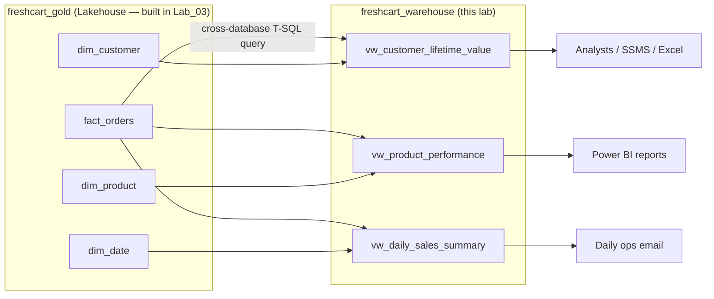
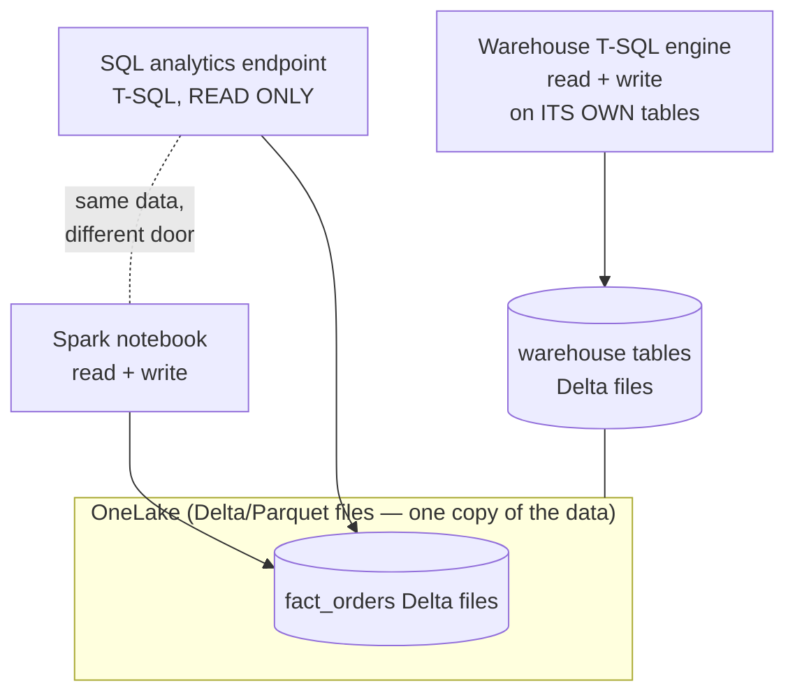

# Lab 04 — Fabric Data Warehouse and SQL Analytics

**Module:** SK-07 Microsoft Fabric Data Engineer
**Estimated time:** 3.5–4.5 hours
**Prerequisites:** Labs 00–03 completed (trial capacity + workspace, OneLake shortcuts, bronze ingestion, silver/gold notebooks)

---

## What You Will Build

In Lab_03 you built a gold star schema (`fact_orders`, `dim_customer`, `dim_product`, `dim_date`) in the `freshcart_gold` lakehouse using PySpark. That data is perfect — but FreshCart's analysts don't write PySpark. They write **T-SQL**, the SQL dialect used by SQL Server, and they connect with tools like SSMS and Excel.

In this lab you will create the `freshcart_warehouse` Fabric Data Warehouse and build a **T-SQL semantic layer** on top of your gold tables:



By the end you will be able to:

1. Explain the difference between a **Warehouse** and a **Lakehouse SQL analytics endpoint** (and win the interview question everyone gets wrong).
2. Create `freshcart_warehouse` and query gold lakehouse tables **cross-database** using three-part names.
3. Write production-grade analytical views with CTEs, `CASE`, `LAG()`, and `NTILE()`.
4. Reconcile view outputs back to the gold fact table (data checking — the habit that separates engineers from script-runners).
5. Explain why views are the "public API" of your warehouse and how a careless rename can break 40 reports.

---

## 1. Environment Setup

Later labs verify prerequisites and add only what's new. Here's the checklist.

### 1.1 Verify prerequisites from earlier labs

Work through this table **before** starting. Every item was built in a prior lab; if any check fails, go back to the lab listed.

| # | Check | How to verify | Built in |
|---|---|---|---|
| 1 | Fabric trial capacity is active | Fabric portal → profile picture (top right) → **Free trial** shows days remaining | Lab_00 |
| 2 | Workspace `sk07-fabric-training` exists | Left nav → **Workspaces** → it appears in the list | Lab_00 |
| 3 | Lakehouse `freshcart_gold` exists with 4 tables | Open the workspace → open `freshcart_gold` → under **Tables** you see `fact_orders`, `dim_customer`, `dim_product`, `dim_date` | Lab_03 |
| 4 | Gold tables have data | In the `freshcart_gold` **SQL analytics endpoint** (explained below), run `SELECT COUNT(*) FROM fact_orders;` — expect a non-zero count (a few thousand rows if you loaded the full sample data) | Lab_03 |
| 5 | Silver tables exist (`silver_orders` etc.) | Open `freshcart_silver` → **Tables** | Lab_03 |
| 6 | Local data folder exists | PowerShell: `Test-Path C:\FabricLabs\data` returns `True` | Lab_00/02 |

**Quick verification query** (run in the `freshcart_gold` SQL analytics endpoint — open the lakehouse, then use the switcher in the top-right corner to flip from "Lakehouse" to "SQL analytics endpoint"):

```sql
SELECT
    (SELECT COUNT(*) FROM fact_orders)   AS fact_orders_rows,
    (SELECT COUNT(*) FROM dim_customer)  AS dim_customer_rows,
    (SELECT COUNT(*) FROM dim_product)   AS dim_product_rows,
    (SELECT COUNT(*) FROM dim_date)      AS dim_date_rows;
```

**Expected output:** one row, four columns, all counts greater than zero. `dim_date` should have thousands of rows (one per calendar day in the range you generated in Lab_03).

**If a count is zero:** re-run the Lab_03 notebooks (`01_bronze_to_silver`, then `02_silver_to_gold`) and re-check. The most common cause is running `02_silver_to_gold` before `01_bronze_to_silver` succeeded.

### 1.2 What's new in this lab

Almost nothing to install — that's the point of a SaaS platform like Fabric. New items:

- **A Fabric Warehouse** (`freshcart_warehouse`) — created inside Fabric in Section 4. Uses your trial capacity; no extra cost.
- **Optional: SQL Server Management Studio (SSMS)** or **sqlcmd** — only if you want to connect from your Windows 11 desktop like a real analyst would (Section 4, Step 9). Both are free:
  - SSMS: download "SSMS" from the Microsoft site (search "download SSMS" — install the latest stable release; version 20.x or newer at the time of writing, but always take latest stable). Installation is a standard Windows installer; accept defaults; ~10 minutes.
  - sqlcmd (lighter option): `winget install sqlcmd` in PowerShell, then verify with `sqlcmd --version`.
  - macOS/Linux users: SSMS is Windows-only; use **Azure Data Studio** or `sqlcmd` (available via Homebrew/apt).

**Common install problems:**

| Problem | Fix |
|---|---|
| `winget` not recognized | Update "App Installer" from the Microsoft Store, or download sqlcmd's MSI directly from Microsoft's GitHub releases |
| SSMS installer hangs at "loading packages" | Close all Visual Studio instances and retry; reboot if needed |
| Corporate proxy blocks download | The desktop connection step is optional — everything else in this lab works entirely in the browser |

### 1.3 Folder check

No new local files are needed for this lab (we work against data already in OneLake). Keep `C:\FabricLabs\data` intact — Lab_05 reuses it.

---

## 2. Business Context

### The problem this lab solves

FreshCart (our fictional online grocery — 200k customers, ~8k orders/day) now has clean, modeled data in the gold lakehouse thanks to your Lab_03 notebooks. But there's a wall between that data and the people who need it:

- **Maya, the retention analyst**, wants to segment customers by purchase behavior so marketing can target lapsed customers with win-back coupons. She's fluent in T-SQL from years of SQL Server work. She has never opened a Spark notebook and doesn't want to.
- **The category managers** want a monthly product performance ranking: which products are growing year over year, which are dying. They consume this via Power BI, which will read from your views.
- **The COO** wants one number every morning: yesterday's revenue, orders, and average basket size.

Right now, answering any of these requires *you* to write a PySpark query. You've become a human API — the bottleneck. Every data team that skips this lab's step ends up with one overworked engineer fielding "can you pull me the numbers for..." Slack messages all day.

### Why companies need a SQL serving layer

- **T-SQL is the lingua franca.** Millions of analysts know SQL; a tiny fraction know PySpark. Meeting consumers where they are multiplies the value of your pipeline.
- **Tools expect SQL.** SSMS, Excel, Power BI, Tableau, dbt — the entire analytics tool ecosystem speaks SQL over a TDS connection (TDS = Tabular Data Stream, the network protocol SQL Server tools use).
- **Views encode business logic once.** "What counts as an At-Risk customer?" should be defined in exactly one place, not re-implemented slightly differently in 12 analysts' personal queries.

### Who consumes the output

| Consumer | Artifact | Frequency |
|---|---|---|
| Retention analyst (Maya) | `vw_customer_lifetime_value` via SSMS/Excel | Weekly campaign planning |
| Category managers | `vw_product_performance` via Power BI | Monthly review |
| COO / ops team | `vw_daily_sales_summary` via a scheduled report | Daily 8 AM |

### What happens if it fails

If a view returns wrong numbers, marketing emails "we miss you!" coupons to FreshCart's *best* customers (who then wonder if their account is broken), category managers discontinue a growing product, and the COO makes staffing decisions on stale revenue. Wrong data that *looks* authoritative is more dangerous than no data — this is why Section 4 includes a mandatory reconciliation exercise and Section 5 covers view governance.

---

## 3. Concept Explanation

### 3.1 Two front doors to the same lake: Warehouse vs SQL analytics endpoint

Here is the single most confusing thing in Fabric for beginners, so let's nail it now.

**Both the Lakehouse and the Warehouse store their tables as Delta Lake files in OneLake.** (Recall from Lab_01: OneLake is Fabric's single, tenant-wide data lake — "OneDrive for data" — and Delta is the open table format that adds transactions and versioning on top of Parquet files.) The difference is *not* where the data lives. The difference is **which engine writes it and what language you can use**:

| | Lakehouse **SQL analytics endpoint** | Fabric **Warehouse** |
|---|---|---|
| What is it? | A **read-only** T-SQL window automatically attached to every lakehouse | A full **read-write** T-SQL database item you create explicitly |
| Who writes the data? | Spark (your notebooks, pipelines, dataflows) | The T-SQL engine (`INSERT`, `UPDATE`, `DELETE`, `MERGE`, `CREATE TABLE AS SELECT`) |
| Can you `CREATE TABLE` in T-SQL? | No | Yes |
| Can you `CREATE VIEW`? | Yes (views are metadata, not data — no write to the lake needed) | Yes |
| Can you `UPDATE` a row in T-SQL? | No — read-only | Yes |
| Underlying storage | Delta in OneLake | Delta in OneLake (same!) |
| Transactions | Read-only queries | Full multi-table T-SQL transactions |
| Typical user | Engineer sanity-checking Spark output; Power BI DirectLake | SQL-first teams building marts, stored procedures, views |

**A term to define: "endpoint."** An endpoint is simply a network address plus a protocol you can connect to — like a labeled door into a building. The SQL analytics endpoint is a door into your lakehouse that only accepts T-SQL and only lets you look, not touch.

You have already used the SQL analytics endpoint without ceremony: in Lab_03 you flipped `freshcart_gold` from "Lakehouse" mode to "SQL analytics endpoint" mode to run `SELECT` checks. That toggle in the top-right of the lakehouse screen is switching doors on the same building.



### 3.2 When to choose which — the decision table

| Situation | Choose | Why |
|---|---|---|
| Transformations are in Spark; you just need to *read* results in SQL | SQL analytics endpoint | Zero extra items to manage; it's already there |
| Team is SQL-first and needs T-SQL `INSERT`/`UPDATE`/`DELETE`/stored procedures | Warehouse | Only the Warehouse gives T-SQL write |
| You need multi-table T-SQL transactions ("debit here, credit there, atomically") | Warehouse | Endpoint is read-only |
| Serving layer for analysts + views + granular SQL permissions | Warehouse (common) or endpoint (fine for read-only views) | Warehouse feels like the SQL Server databases analysts know |
| Semi-structured/streaming data, ML feature engineering | Lakehouse + Spark | Spark handles JSON, ML libraries, streaming |
| Migrating an existing SQL Server/Synapse dedicated pool workload | Warehouse | Closest T-SQL surface match |

**FreshCart's choice:** transformations stay in Spark (Lab_03 notebooks — they already work, and MERGE/OPTIMIZE are natural there), and we add a **Warehouse as the serving layer** because Maya's team wants a database they can own: their own views today, and their own T-SQL summary tables and stored procedures tomorrow. If they only ever needed read-only views, the gold SQL endpoint alone would suffice — knowing that trade-off *is* the skill.

### 3.3 T-SQL surface area: what a Fabric Warehouse does NOT support

The Fabric Warehouse speaks T-SQL, but it is not a 100% clone of SQL Server. It's a distributed, lake-backed engine, and some features don't translate. Knowing the gaps saves you hours of "why is this syntax error happening":

| SQL Server feature | Fabric Warehouse | What to do instead |
|---|---|---|
| `IDENTITY` columns (auto-incrementing keys) | **Not supported** | Generate surrogate keys with `ROW_NUMBER()` in a CTAS, or use hash/business keys (Lab_03 generated keys in Spark) |
| `PRIMARY KEY` / `UNIQUE` / `FOREIGN KEY` constraints | Allowed **only** with `NOT ENFORCED` | Declare them `NOT ENFORCED` for modeling-tool hints; enforce uniqueness in your pipeline (your Lab_03 assertions!) |
| Triggers | Not supported | Do that logic in the pipeline/notebook |
| `MERGE` statement | Historically unsupported; support has been rolling out — **check current docs** | `UPDATE` + `INSERT`, or do merges in Spark as in Lab_03 |
| Some types: `datetime` (use `datetime2(6)`), `money`, `text`, `sql_variant`, `geography` | Not supported | Use `datetime2`, `decimal(19,4)`, `varchar(max)` alternatives |
| Cross-database *writes* / three-part-name INSERT targets in other DBs | Not supported | Write within your own warehouse; read cross-database freely |
| `USE database` to switch context | Not supported | Use three-part names (next section) |
| Manual index tuning (clustered indexes, etc.) | No traditional indexes | The engine is columnar; rely on stats + Delta file health (Section 5.5) |

**Why does this matter for beginners?** Because when you Google "T-SQL customer segmentation," the top answer may use `IDENTITY` or `MERGE` and you'll hit an error that has nothing to do with your logic. Check feature availability first; Microsoft's "T-SQL surface area in Fabric" doc page is the authoritative list, and it changes as Fabric matures — always check "latest" docs.

### 3.4 Cross-database queries with three-part names

A **three-part name** identifies a table as `database.schema.table`:

- **database** — the Fabric item (a lakehouse's SQL endpoint or a warehouse) — e.g., `freshcart_gold`
- **schema** — a namespace inside the database. Lakehouse tables land in `dbo` by default ("dbo" = "database owner", SQL Server's ancient default schema name)
- **table** — e.g., `fact_orders`

Inside `freshcart_warehouse` you can query the gold lakehouse *directly*, with no data copy:

```sql
SELECT TOP 10 * FROM freshcart_gold.dbo.fact_orders;
```

This works because both items sit in the same workspace on the same OneLake — the warehouse engine reads the gold Delta files in place. This is genuinely remarkable if you've worked with older stacks: no linked servers, no ETL copy into the warehouse, no sync lag beyond the endpoint's metadata refresh.

**Alternative: shortcuts.** Recall from Lab_01 that a **shortcut** is a symbolic pointer in OneLake — like a Windows shortcut — that makes data in one place appear in another without copying. You *cannot* create shortcuts inside a Warehouse item itself, but a common pattern is a small "serving" lakehouse next to the warehouse that shortcuts in the gold tables; the warehouse then reads them via three-part names. In our single-workspace setup, direct three-part names to `freshcart_gold` are simpler, and that's what we'll use. Shortcuts earn their keep when gold lives in a *different workspace* (or a different lake entirely — ADLS, S3) and you want a stable local name.

### 3.5 Star schema recap and how SQL queries it

From Lab_03: a **star schema** has one central **fact table** (events with numbers — `fact_orders`: one row per order line, with quantities and amounts, plus foreign keys) surrounded by **dimension tables** (descriptive context — who, what, when: `dim_customer`, `dim_product`, `dim_date`). The T-SQL query pattern is always the same shape:

```sql
SELECT  d.some_attribute, SUM(f.some_measure)
FROM    fact_table f
JOIN    dim_table  d ON f.dim_key = d.dim_key
GROUP BY d.some_attribute;
```

Facts bring the numbers, dimensions bring the labels and filters, `GROUP BY` brings the aggregation. Every view in this lab is a variation of this shape.

### 3.6 Views: the semantic contract

A **view** is a saved `SELECT` statement that behaves like a table. It stores no data — every query against the view re-runs the underlying `SELECT`. Three reasons views are the backbone of a serving layer:

1. **One definition of truth.** "Champion customer" is defined once, in `vw_customer_lifetime_value`, not in 12 analysts' notebooks.
2. **Insulation.** If you rename a column in `fact_orders`, you fix the view once; every report reading the view keeps working. Reports that read base tables directly all break (Section 5.6 tells that story).
3. **Simplification.** Analysts get `revenue_yoy_pct` as a ready column instead of each writing their own window function (and half getting it wrong).

**Alternatives and trade-offs:** materialized tables (faster to query, but stale until refreshed and need orchestration), semantic models in Power BI (great for DAX consumers, invisible to SSMS users), stored procedures (parameterized, but not composable in a `FROM` clause). Views are the default choice for "reusable read logic"; you graduate to summary tables when a view becomes too slow.

---

## 4. Step-by-Step Implementation

Estimated time: ~2.5 hours. Every step: what → why → expected output → verify → common mistakes → troubleshooting.

### Step 1 — Create the warehouse `freshcart_warehouse`

**What:** In the Fabric portal, open workspace `sk07-fabric-training` → **+ New item** → search for **Warehouse** → select it → name it exactly `freshcart_warehouse` (lowercase, underscore — consistent with our naming standard from Lab_00) → **Create**.

**Why:** This provisions the T-SQL read/write engine and an empty database. On trial capacity this takes seconds and costs nothing extra — capacity is consumed only when queries run.

**Expected output:** After ~10–30 seconds you land in the warehouse editor: an object **Explorer** pane on the left (showing `Schemas → dbo`, empty of tables), a ribbon with **New SQL query**, and a data preview canvas.

**Verify:** Go back to the workspace item list — you should see `freshcart_warehouse` with type **Warehouse** *and* a linked **Semantic model** item Fabric auto-creates alongside it (ignore the semantic model for now; it's for Power BI, covered later in the module).

**Common mistakes:**
- Creating a **"Sample warehouse"** instead of an empty Warehouse — the gallery offers a demo-data version; you want the plain one.
- Typos in the name (`freshcart-warehouse` with a hyphen). Rename via the item's `...` menu → **Settings** if so — do it *now*, before anything references it.

**Troubleshooting:** If **Warehouse** doesn't appear in the new-item list, your workspace may not be on Fabric capacity — check workspace settings → **License info** shows *Trial*. Fix in Lab_00's capacity assignment step.

### Step 2 — First cross-database query (three-part names)

**What:** In the warehouse, click **New SQL query** and run:

```sql
-- Read the gold lakehouse from inside the warehouse: no copy, no ETL.
SELECT TOP 10
    f.order_id,
    f.customer_key,
    f.product_key,
    f.order_date_key,
    f.quantity,
    f.line_amount
FROM freshcart_gold.dbo.fact_orders AS f;
```

(If your Lab_03 fact table uses slightly different column names — e.g., `total_amount` instead of `line_amount` — check yours first with `SELECT TOP 1 * FROM freshcart_gold.dbo.fact_orders;` and substitute consistently through this lab. From here on this lab assumes: `fact_orders(order_id, customer_key, product_key, order_date_key, quantity, unit_price, line_amount)`, `dim_customer(customer_key, customer_id, customer_name, city, signup_date)`, `dim_product(product_key, product_id, product_name, category, unit_cost)`, `dim_date(date_key, full_date, year_number, month_number, month_name, day_name, is_weekend)`.)

**Why:** This proves the core Fabric superpower — the warehouse engine reading lakehouse Delta files in place — before we build anything on top of it.

**Expected output:** 10 rows in the results grid, with integer keys and decimal amounts.

**Verify:** Row values look sane: positive quantities, `order_date_key` as `yyyymmdd` integers (e.g., `20260615`).

**Common mistakes:**
- Two-part name `dbo.fact_orders` → error `Invalid object name`, because that table isn't *in this warehouse*. Cross-database reads always need all three parts.
- `USE freshcart_gold;` → not supported in Fabric; three-part names replace it.

**Troubleshooting:** `Invalid object name 'freshcart_gold.dbo.fact_orders'` with correct spelling usually means the SQL endpoint's metadata hasn't synced a very recently created table — wait a minute, or open the gold SQL endpoint once to nudge discovery. Also confirm the lakehouse and warehouse are in the same workspace.

### Step 3 — (Optional detour) The shortcut pattern

**What (read, or do if curious):** To see the shortcut alternative from Section 3.4: you would create a lakehouse next to the warehouse, choose **Get data → New shortcut → Microsoft OneLake → freshcart_gold**, pick the four gold tables, and the tables appear under the new lakehouse's `Tables` — readable through *its* SQL endpoint with three-part names. We skip this in FreshCart because gold is already in our workspace; keep the pattern in your pocket for multi-workspace architectures (it also gives you a rename-stable local alias if the source team reorganizes).

**Common mistake to remember:** shortcuts are **read-only** through the shortcut (Lab_01) — you can never "fix" data through a shortcut, which is a feature, not a bug.

### Step 4 — Create a schema for the serving views

**What:** In a new query in `freshcart_warehouse`:

```sql
CREATE SCHEMA serving;
```

**Why:** A **schema** is a folder for database objects. Putting analyst-facing views in `serving` (instead of default `dbo`) makes the public API visually obvious: *if it's in `serving`, reports may use it; anything else is engine-room internals*. This convention does governance work for free.

**Expected output:** `Commands completed successfully.`

**Verify:** In the Explorer pane, refresh — `serving` appears under **Schemas**.

**Common mistakes:** Running `CREATE SCHEMA` in the *gold SQL endpoint* window instead of the warehouse. Check the database name shown at the top of the query tab. (Creating schemas/views on the endpoint is possible, but our design puts serving objects in the warehouse.)

**Troubleshooting:** `There is already an object named 'serving'` — you ran it twice; harmless, move on.

### Step 5 — Build `vw_customer_lifetime_value`

**What:** This is Maya's segmentation view. Read the annotated walkthrough below, then run the full statement.

Concepts used, in one paragraph each:

- A **CTE** (Common Table Expression, the `WITH name AS (...)` block) is a named, temporary result set that exists only for the duration of one query. Why use it: it lets you build logic in readable *stages* — first summarize each customer, then classify — instead of one unreadable nested query. Think of CTEs as paragraphs in an essay.
- **`CASE`** is SQL's if/else. We use it to turn raw numbers ("last ordered 95 days ago, spent 2,400") into business labels ("At Risk, high value") — encoding the *business definition* into the database, once.
- **`DATEDIFF(day, a, b)`** counts days between two dates. **`NULLIF(x, 0)`** returns NULL when x is 0 — the standard divide-by-zero guard.

Segmentation rules agreed with FreshCart marketing (note them in the view comment — Section 5.4 explains why):

| Segment | Definition |
|---|---|
| New | First order within the last 30 days |
| Champion | 10+ orders AND ordered within last 30 days |
| At Risk | Previously active but no order in 60–120 days |
| Lapsed | No order in more than 120 days |
| Active | Everyone else with a recent order |

```sql
CREATE VIEW serving.vw_customer_lifetime_value AS
/* ---------------------------------------------------------------
   PURPOSE : One row per customer with lifetime metrics + segment.
   CONSUMERS: Retention team (Maya), win-back campaign automation.
   SOURCE  : freshcart_gold.dbo.fact_orders / dim_customer / dim_date
   RULES   : Segment thresholds agreed with Marketing, 2026-07.
             Change them HERE ONLY — never in downstream reports.
   OWNER   : data-engineering@freshcart.example
   --------------------------------------------------------------- */
WITH customer_orders AS (
    -- Stage 1: collapse the fact grain (order line) to one row per customer
    SELECT
        f.customer_key,
        COUNT(DISTINCT f.order_id)          AS total_orders,
        SUM(f.line_amount)                  AS lifetime_revenue,
        MIN(d.full_date)                    AS first_order_date,
        MAX(d.full_date)                    AS last_order_date
    FROM freshcart_gold.dbo.fact_orders AS f
    JOIN freshcart_gold.dbo.dim_date    AS d
      ON f.order_date_key = d.date_key
    GROUP BY f.customer_key
),
customer_metrics AS (
    -- Stage 2: derive recency/tenure and average order value
    SELECT
        co.customer_key,
        co.total_orders,
        co.lifetime_revenue,
        co.first_order_date,
        co.last_order_date,
        DATEDIFF(day, co.last_order_date,  CAST(GETDATE() AS date)) AS days_since_last_order,
        DATEDIFF(day, co.first_order_date, CAST(GETDATE() AS date)) AS customer_tenure_days,
        co.lifetime_revenue / NULLIF(co.total_orders, 0)            AS avg_order_value
    FROM customer_orders AS co
)
-- Stage 3: attach names and apply the business segmentation
SELECT
    c.customer_id,
    c.customer_name,
    c.city,
    m.total_orders,
    m.lifetime_revenue,
    m.avg_order_value,
    m.first_order_date,
    m.last_order_date,
    m.days_since_last_order,
    m.customer_tenure_days,
    CASE
        WHEN m.customer_tenure_days <= 30                                    THEN 'New'
        WHEN m.total_orders >= 10 AND m.days_since_last_order <= 30          THEN 'Champion'
        WHEN m.days_since_last_order BETWEEN 60 AND 120                      THEN 'At Risk'
        WHEN m.days_since_last_order > 120                                   THEN 'Lapsed'
        ELSE 'Active'
    END AS customer_segment
FROM customer_metrics            AS m
JOIN freshcart_gold.dbo.dim_customer AS c
  ON m.customer_key = c.customer_key;
```

**Why the CASE order matters:** `CASE` evaluates top-down and stops at the first match. `New` is checked first so a 20-day-old customer with 1 order isn't misfiled; `Champion` before `At Risk` so a heavy buyer at day 61 isn't... actually, walk through it: a customer with 15 orders whose last order was 70 days ago → not New, not Champion (recency fails), hits At Risk. Correct — a Champion gone quiet is *exactly* who marketing wants to catch. Being able to trace `CASE` fall-through like this is a common interview exercise.

**Expected output:** `Commands completed successfully.` — creating a view returns no rows.

**Verify:**

```sql
SELECT customer_segment, COUNT(*) AS customers,
       CAST(AVG(lifetime_revenue) AS decimal(12,2)) AS avg_ltv
FROM serving.vw_customer_lifetime_value
GROUP BY customer_segment
ORDER BY customers DESC;
```

Expect one row per segment with plausible counts. With the sample data most customers land in one or two segments depending on how the generated order dates relate to *today's* date — if **everyone** is `Lapsed`, that's not a bug in your SQL; your sample data's newest orders are simply >120 days old. That's a correct answer to the data you have (and a nice lesson: always ask "is the data weird or is my query wrong?" — check `MAX(last_order_date)` to decide).

**Common mistakes:**
- `COUNT(f.order_id)` instead of `COUNT(DISTINCT f.order_id)` — the fact table is at *order line* grain (one row per product per order), so plain COUNT counts lines, inflating order counts. Grain errors are the #1 star-schema bug.
- Forgetting `NULLIF` → divide-by-zero error the first time a data glitch produces a 0-order customer.
- `CREATE VIEW` must be the only statement in its batch — if you get `'CREATE VIEW' must be the first statement in a query batch`, run it in its own query window or separate with a line containing only `GO` (SSMS) / run separately (Fabric editor).

**Troubleshooting:** To change a view after creating it, use `CREATE OR ALTER VIEW serving.vw_customer_lifetime_value AS ...` — re-runnable (idempotent — safe to run repeatedly with the same result, a property we keep demanding from Lab_02 onward).

### Step 6 — Build `vw_product_performance`

**What:** Monthly revenue per product with year-over-year comparison and a 1–10 performance tier. Two new tools:

- **`LAG(expr, n) OVER (PARTITION BY ... ORDER BY ...)`** is a **window function**: it computes a value across a "window" of related rows *without collapsing them* like GROUP BY does. `LAG(revenue, 12)` reaches back 12 rows within each product's month-ordered series — i.e., the same month last year. Why 12 rows and not "same month last year" by date math: it's simpler and correct *if* every product has a row for every month, which our stage guarantees only for months the product actually sold. We therefore also guard by joining on exact month; see the `prior_year` column logic below using `LAG` on a per-month-number partition — the same technique the archive lab used for supply costs.
- **`NTILE(10) OVER (ORDER BY ...)`** deals rows into 10 equal buckets — deciles. Tier 1 = top ~10% of products by revenue that month. Business people love deciles because "tier 1 product" needs no explanation.

```sql
CREATE VIEW serving.vw_product_performance AS
/* ---------------------------------------------------------------
   PURPOSE : Product × month revenue, YoY growth, decile tier.
   CONSUMERS: Category managers (Power BI monthly review).
   NOTE    : yoy_revenue_pct is NULL for a product-month with no
             same-month sales last year. NULL means "no comparison
             possible", NOT zero growth. Do not COALESCE it to 0.
   --------------------------------------------------------------- */
WITH monthly_product_revenue AS (
    -- Stage 1: one row per product per calendar month
    SELECT
        p.product_id,
        p.product_name,
        p.category,
        d.year_number,
        d.month_number,
        d.month_name,
        SUM(f.line_amount)                 AS monthly_revenue,
        SUM(f.quantity)                    AS units_sold,
        COUNT(DISTINCT f.order_id)         AS order_count
    FROM freshcart_gold.dbo.fact_orders AS f
    JOIN freshcart_gold.dbo.dim_product AS p ON f.product_key   = p.product_key
    JOIN freshcart_gold.dbo.dim_date    AS d ON f.order_date_key = d.date_key
    GROUP BY p.product_id, p.product_name, p.category,
             d.year_number, d.month_number, d.month_name
),
with_yoy AS (
    -- Stage 2: same-month-last-year via LAG within (product, month#) ordered by year.
    -- Partitioning by month_number means the "previous row" for (Apples, June 2026)
    -- is (Apples, June 2025) — exactly the YoY comparison we want, and it is
    -- naturally NULL when last June had no sales (no fake zeroes).
    SELECT
        *,
        LAG(monthly_revenue) OVER (
            PARTITION BY product_id, month_number
            ORDER BY year_number
        ) AS same_month_last_year_revenue
    FROM monthly_product_revenue
)
-- Stage 3: growth % and decile tier within each month
SELECT
    product_id,
    product_name,
    category,
    year_number,
    month_number,
    month_name,
    monthly_revenue,
    units_sold,
    order_count,
    same_month_last_year_revenue,
    CAST(
        (monthly_revenue - same_month_last_year_revenue) * 100.0
        / NULLIF(same_month_last_year_revenue, 0)
        AS decimal(10,2)
    ) AS yoy_revenue_pct,
    NTILE(10) OVER (
        PARTITION BY year_number, month_number
        ORDER BY monthly_revenue DESC
    ) AS performance_tier   -- 1 = top decile this month
FROM with_yoy;
```

**Expected output:** `Commands completed successfully.`

**Verify:**

```sql
-- Top tier for the most recent month in the data
SELECT TOP 15 product_name, category, monthly_revenue, yoy_revenue_pct, performance_tier
FROM serving.vw_product_performance
WHERE year_number  = (SELECT MAX(year_number)  FROM serving.vw_product_performance)
  AND month_number = (SELECT MAX(month_number) FROM serving.vw_product_performance
                      WHERE year_number = (SELECT MAX(year_number) FROM serving.vw_product_performance))
ORDER BY performance_tier, monthly_revenue DESC;
```

Expect tier values 1–10, revenue descending within tier 1, and `yoy_revenue_pct` NULL wherever your sample data has less than a year of history (likely for most rows — that's correct, not broken).

**Common mistakes:**
- `NTILE(10) OVER (ORDER BY monthly_revenue DESC)` **without** the `PARTITION BY year_number, month_number` — that ranks products across *all months at once*, so a strong month dominates every tier. Tiers must be computed per month.
- Window functions can't go in a `WHERE` clause (`WHERE NTILE(10)... = 1` is invalid) — filter in an outer query, which is precisely why consumers query the view and filter `performance_tier = 1`.
- Integer division: `* 100 /` on integers truncates; the `* 100.0` forces decimal math.

**Troubleshooting:** If `yoy_revenue_pct` is NULL *everywhere*, run `SELECT MIN(year_number), MAX(year_number) FROM serving.vw_product_performance;` — you need at least 13 months of order history to see any YoY value. The Lab_02 sample generator produced ~18 months; if you loaded a shorter slice, this column being NULL is expected.

### Step 7 — Build `vw_daily_sales_summary`

**What:** The COO's one-glance daily table — simplest view, and the backbone of the reconciliation exercise.

```sql
CREATE VIEW serving.vw_daily_sales_summary AS
/* ---------------------------------------------------------------
   PURPOSE : One row per calendar day with core trading KPIs.
   CONSUMERS: COO daily email, ops dashboard, Lab_05 pipeline checks.
   GRAIN   : one row per date that has at least one order.
   --------------------------------------------------------------- */
SELECT
    d.full_date,
    d.day_name,
    d.is_weekend,
    COUNT(DISTINCT f.order_id)                                   AS total_orders,
    COUNT(DISTINCT f.customer_key)                               AS unique_customers,
    SUM(f.quantity)                                              AS total_units,
    SUM(f.line_amount)                                           AS total_revenue,
    CAST(SUM(f.line_amount) / NULLIF(COUNT(DISTINCT f.order_id), 0)
         AS decimal(12,2))                                       AS avg_order_value
FROM freshcart_gold.dbo.fact_orders AS f
JOIN freshcart_gold.dbo.dim_date    AS d
  ON f.order_date_key = d.date_key
GROUP BY d.full_date, d.day_name, d.is_weekend;
```

**Verify:**

```sql
SELECT TOP 7 * FROM serving.vw_daily_sales_summary ORDER BY full_date DESC;
```

Expect the 7 most recent trading days; weekend rows typically show higher grocery order counts (that pattern was baked into the Lab_02 sample data).

**Common mistakes:** Using `INNER JOIN` here means days with zero orders simply don't appear. For an ops view that must show "yesterday = 0 orders" as an *alarm*, you'd flip the query to drive from `dim_date` with a `LEFT JOIN` to the fact. We keep INNER for simplicity but note the difference — an interviewer may ask exactly this.

### Step 8 — Use the visual query editor once

**What:** In the warehouse ribbon choose **New visual query**. Drag `freshcart_warehouse`'s Explorer... actually the visual editor works on tables in the current database: drag any table (or use it on the gold endpoint side) onto the canvas, then use the **+** transformations: **Group by** → group on a column, aggregate `COUNT`. Watch the preview grid update.

**Why bother, when you can write SQL?** Two reasons: (1) it's the Power Query-style diagram interface many analysts on your team will use, and you need to speak their language; (2) it's a fast way to eyeball a table's distribution without typing. Note its limits — visual queries build read-only explorations, not views; serious logic lives in SQL.

**Expected output:** A step diagram at top, live results below.

**Verify:** Click **View SQL** (where offered) to see the generated SQL — a nice trick: prototype visually, steal the SQL, refine it into a view.

**Common mistake:** trying to save a visual query *as a view* — save the SQL version instead.

### Step 9 — (Optional) Connect from your desktop: SSMS or sqlcmd

**What:** Every warehouse (and every SQL endpoint) exposes a **SQL connection string** — the address desktop tools use.

1. In the workspace item list, hover `freshcart_warehouse` → `...` → **Copy SQL connection string**. (Same menu exists on the gold SQL analytics endpoint.) You get something like `xxxxxxxx.datawarehouse.fabric.microsoft.com`.
2. **SSMS:** Connect → Database Engine → Server name = pasted string → Authentication = **Microsoft Entra MFA** (Entra ID is Azure Active Directory's current name; MFA = multi-factor authentication) → your training account → Connect. Expand **Databases → freshcart_warehouse → Views** — there are your three views.
3. **sqlcmd** (PowerShell):

```powershell
sqlcmd -S "<paste-connection-string>" -d freshcart_warehouse -G -Q "SELECT TOP 5 full_date, total_revenue FROM serving.vw_daily_sales_summary ORDER BY full_date DESC;"
```

`-G` requests Entra (Azure AD) authentication — a browser sign-in window pops up.

**Why:** This is *the* moment the serving layer becomes real: the exact experience Maya has. Anything you can do here, she can.

**Expected output:** 5 rows of dates and revenue in your terminal/SSMS grid.

**Common mistakes:** choosing "SQL Server Authentication" (username/password) — Fabric only accepts Entra ID; using the *workspace* URL instead of the SQL connection string.

**Troubleshooting:** `Login failed`/firewall errors on a corporate network usually mean TCP port 1433 outbound is blocked — this step is optional; the browser editor does everything else in this lab.

### Step 10 — Data checking: reconcile views to the gold fact

**What:** Prove the views tell the truth by reconciling their totals to the source fact table. **Reconciliation** = comparing the same business number computed by two independent routes; if they match, both are probably right, and if they don't, you've caught a bug before the COO did.

```sql
-- Reconciliation 1: total revenue — fact vs daily summary view
WITH fact_total AS (
    SELECT SUM(line_amount) AS revenue FROM freshcart_gold.dbo.fact_orders
),
view_total AS (
    SELECT SUM(total_revenue) AS revenue FROM serving.vw_daily_sales_summary
)
SELECT
    f.revenue                    AS fact_revenue,
    v.revenue                    AS view_revenue,
    f.revenue - v.revenue        AS difference,
    CASE WHEN ABS(f.revenue - v.revenue) < 0.01 THEN 'MATCH ✓' ELSE 'MISMATCH ✗' END AS status
FROM fact_total f CROSS JOIN view_total v;
```

```sql
-- Reconciliation 2: order counts — fact vs customer LTV view
SELECT
    (SELECT COUNT(DISTINCT order_id) FROM freshcart_gold.dbo.fact_orders) AS fact_orders,
    (SELECT SUM(total_orders) FROM serving.vw_customer_lifetime_value)     AS view_orders;
```

```sql
-- Reconciliation 3: no customers lost by the joins
SELECT
    (SELECT COUNT(DISTINCT customer_key) FROM freshcart_gold.dbo.fact_orders) AS customers_in_fact,
    (SELECT COUNT(*) FROM serving.vw_customer_lifetime_value)                  AS customers_in_view;
```

**Expected output:** Reconciliation 1 → `MATCH ✓` with difference 0.00. Reconciliations 2 and 3 → both columns equal.

**If they DON'T match, debug in this order:**
1. **Join fan-out** — an inner join to a dimension with duplicate keys multiplies fact rows and *inflates* view totals. Check: `SELECT customer_key, COUNT(*) FROM freshcart_gold.dbo.dim_customer GROUP BY customer_key HAVING COUNT(*) > 1;` (should return no rows — your Lab_03 assertions guarded this; here's where that pays off).
2. **Join drop-out** — fact rows whose key has no dimension match vanish from inner joins, *deflating* totals. Check: `SELECT COUNT(*) FROM freshcart_gold.dbo.fact_orders f LEFT JOIN freshcart_gold.dbo.dim_date d ON f.order_date_key = d.date_key WHERE d.date_key IS NULL;` (should be 0 — if not, your Lab_03 `dim_date` range doesn't cover all order dates; extend it and re-run `02_silver_to_gold`).
3. **Grain confusion** — recount with/without DISTINCT to see if lines vs orders explains the gap.

Make this a habit: **every new view gets a reconciliation query before anyone consumes it.** In Lab_05 we automate exactly this kind of check inside the pipeline.

### Step 11 — Explore lineage

**What:** In the workspace, switch the view selector (top right of the item list) to **Lineage**. You'll see a graph: bronze → notebooks → silver/gold → warehouse and its semantic model.

**Why:** This is Fabric's built-in impact-analysis map — click an item to see everything downstream. Remember it; the failure story in 5.6 is about teams that didn't.

**Verify:** Clicking `freshcart_gold` highlights `freshcart_warehouse` downstream (the cross-database dependency is tracked at item level; individual view-to-table column lineage is not fully mapped, which is why documentation in view headers still matters).

---

## 5. Production Engineering Practices

### 5.1 Views as the stable public API — never let reports hit base tables

Treat your warehouse like a software library: base tables are private implementation; the `serving` schema is the published interface. Rules FreshCart adopts today:

- Reports, exports, and analyst queries read **only** `serving.*` views.
- Base tables (and the gold lakehouse tables) may change shape any time *provided the views are updated in the same change* — consumers never notice.
- New consumer need → new view or new column on an existing view; **never** "just point Power BI at `fact_orders` for now." "For now" is how 40-report disasters begin (see 5.6).
- Breaking changes to a view (removing/renaming a column) get the same ceremony as a breaking API change: find consumers via lineage, announce, migrate, then change.

### 5.2 Avoid `SELECT *` — in views, forever

`SELECT *` inside a view definition is a time bomb: the view captures the column list at creation, so when the base table gains or reorders columns, the view can silently misalign or break on refresh; downstream `INSERT ... SELECT` consumers break positionally; you also drag wide columns nobody needs through a **columnar** engine that would otherwise read only the columns requested (that column-pruning is the whole performance point of columnstore/Parquet). Explicit column lists cost you 30 seconds of typing and buy you deterministic contracts. All three views above list every column deliberately.

### 5.3 Security: three nested layers

Fabric security is layered like an office building — campus pass, floor key, room key:

1. **Workspace roles** (campus): Admin / Member / Contributor / Viewer, set in workspace → **Manage access**. A *Viewer* can read items but not create or modify. Coarse — applies to everything in the workspace.
2. **Item permissions** (floor): share just the warehouse with a user via the item's **Share** dialog without giving any workspace role — e.g., grant Maya "Read" + "ReadData" on `freshcart_warehouse` only. She never sees your bronze lakehouse.
3. **SQL granular permissions** (room): classic T-SQL `GRANT`/`DENY`/`REVOKE` inside the warehouse:

```sql
-- Analysts may query serving views, nothing else:
GRANT SELECT ON SCHEMA::serving TO [maya.analyst@freshcart.example];
DENY  SELECT ON SCHEMA::dbo     TO [maya.analyst@freshcart.example];
```

The `serving`-schema convention now pays off twice: one `GRANT` covers the whole public API. On your solo trial tenant you can't fully rehearse multi-user grants, but write them anyway — permission scripts belong in version control like any other code. Principle: **least privilege** — grant the minimum access that lets someone do their job, because every extra grant is attack/blast surface.

### 5.4 Documentation of view logic

Every view in this lab starts with a header comment block: purpose, consumers, source, business rules, owner. Why in the view itself and not a wiki? Because `sp_helptext` / the object Explorer shows the definition to anyone who can query it — documentation that travels with the object can't go stale in a forgotten Confluence page. Add to that a lightweight registry (a markdown table in your repo) mapping view → consumers → SLA, which is what you'll wish existed the first time you must answer "can I change this column?"

### 5.5 Performance: columnar storage and statistics

- Warehouse and lakehouse data is **columnar** (Parquet inside Delta): a query touching 4 of 40 columns reads ~10% of the bytes. This is why explicit column lists (5.2) are also a performance practice.
- The engine keeps **statistics** — small summaries (row counts, min/max, value distribution) per column — to plan joins efficiently (small table broadcast vs shuffle). Fabric creates/updates them automatically; know they exist because a badly estimated join is the usual suspect when a query is suddenly slow. You can inspect and update manually (`UPDATE STATISTICS`) — rarely needed, good to know.
- View-on-view-on-view chains multiply optimizer work and human confusion — keep nesting ≤ 2 deep; if a view gets slow and hot, materialize it as a summary table refreshed by your Lab_05 pipeline.
- Delta file health matters even for the warehouse reading gold: the `OPTIMIZE` you run in `02_silver_to_gold` (Lab_03) is what keeps these cross-database reads fast. Everything connects.

### 5.6 Failure story: the rename that broke 40 reports

A retail company (composite of real incidents) had reports pointed directly at warehouse base tables — "temporarily," for two years. An engineer renamed `total_amount` to `gross_amount` during a cleanup, tested the *pipeline* (green), and went home. Overnight, 40 Power BI reports failed refresh with cryptic column errors. Finance walked into a Monday exec meeting with blank dashboards; the fix took a day; trust took a quarter.

What would have prevented it, in order of power:
1. **Views as API (5.1):** the rename happens in the base table *and* the view alias in one change: `SELECT gross_amount AS total_amount ...`. Zero consumers affected — you can even deprecate the old name gradually.
2. **Impact analysis before change:** Fabric's **Lineage view** (Step 11) and each item's **Impact analysis** pane show downstream dependents. Making "check lineage" a mandatory pre-change step turns unknown blast radius into a checklist item.
3. **Reconciliation checks (Step 10)** in the pipeline would have flagged the breakage at 2 AM to the on-call engineer, not at 9 AM to the CFO.

The meta-lesson: schema changes are deployments, not edits.

---

## 6. Reflection

### What you learned

You turned a Spark-only gold layer into a T-SQL serving layer that real analysts can use: created a warehouse, queried the lakehouse cross-database with three-part names, encoded business logic (segments, YoY, deciles) into documented views, reconciled outputs to source, and adopted the "views are the public API" discipline. Architecturally, you now understand Fabric's central trick: many engines, one copy of data in OneLake.

### Interview questions with model answers

**Q1. What's the difference between a Fabric Warehouse and a Lakehouse SQL analytics endpoint?**
*Model answer:* Both expose T-SQL over Delta tables stored in OneLake — the difference is write capability and which engine owns the data. The SQL analytics endpoint is an automatic, **read-only** T-SQL layer over lakehouse tables that Spark writes; you can create views but not tables, and no DML. The Warehouse is a full T-SQL database: DDL, DML, multi-table transactions, owned by the SQL engine. Choose the endpoint when Spark does the writing and you just need SQL reads; choose the Warehouse for SQL-first teams needing T-SQL writes.
*Trap:* Saying "the warehouse is faster" or "the warehouse stores data differently" — both store Delta in OneLake; performance differences are workload-dependent, not architectural tiers.

**Q2. How do you query a lakehouse table from a warehouse without copying data?**
*Model answer:* Same-workspace items share OneLake, so use a three-part name — `SELECT ... FROM freshcart_gold.dbo.fact_orders` — from inside the warehouse; the engine reads the Delta files in place. Cross-database *reads* are supported; cross-database *writes* aren't. For cross-workspace or external (ADLS/S3) sources, create OneLake shortcuts into an adjacent lakehouse first.
*Trap:* Proposing `USE freshcart_gold;` — not supported in Fabric — or proposing a Copy activity, which needlessly duplicates data the lake already shares.

**Q3. Why put views between reports and base tables?**
*Model answer:* Views are a stable contract: they define business logic once (segment rules, YoY math), insulate consumers from schema changes (rename underneath, alias in the view), simplify complex logic for analysts, and give a clean `GRANT SELECT ON SCHEMA::serving` security boundary. Reports on base tables couple every consumer to your physical schema — one rename breaks them all.
*Trap:* "Views make queries faster." Standard views store nothing and add zero speed; the benefits are contract, correctness, and security. (Materialized/summary tables are the performance tool.)

**Q4. Your fact table is one row per order *line*. An analyst reports the "orders per customer" number looks ~3× too high. Diagnose.**
*Model answer:* Classic grain bug: they used `COUNT(order_id)` which counts lines (~3 lines per order at FreshCart) instead of `COUNT(DISTINCT order_id)`. Generally: know the fact grain, use DISTINCT for entity counts above that grain, and reconcile against an independent computation before publishing.
*Trap:* Jumping to "duplicate data" — check the *query's* grain handling before blaming the pipeline (though duplicate dimension keys causing join fan-out is the second suspect; test both).

**Q5. Explain LAG() and NTILE() and where you'd use them.**
*Model answer:* Both are window functions — they compute across a set of related rows without collapsing them like GROUP BY. `LAG(x, n) OVER (PARTITION BY ... ORDER BY ...)` fetches x from n rows earlier in the ordered partition — e.g., partition by product and month-number, order by year, and LAG(revenue) gives same-month-last-year for YoY. `NTILE(k)` deals partition rows into k equal buckets — NTILE(10) partitioned per month gives monthly revenue deciles. Key detail: window functions can't appear in WHERE; filter in an outer query.
*Trap:* Forgetting PARTITION BY (LAG crossing product boundaries; NTILE ranking across all months at once) — interviewers probe exactly this.

**Q6. What common SQL Server features are missing in Fabric Warehouse, and how do you cope?**
*Model answer:* No IDENTITY columns (generate keys via ROW_NUMBER/CTAS or upstream in Spark); PK/FK/unique constraints only as NOT ENFORCED (enforce quality in pipeline assertions); no triggers; historically no MERGE (do upserts in Spark or UPDATE+INSERT — check current docs, the surface grows); some types unsupported (use datetime2 not datetime); no USE-database switching (three-part names). The habit: verify surface-area docs before porting SQL Server code.
*Trap:* Assuming NOT ENFORCED constraints validate data — they're metadata hints for tools/optimizer; a duplicate "primary key" will load without error.

**Q7. A stakeholder asks whether the daily summary numbers are right. What do you do before saying yes?**
*Model answer:* Reconcile via an independent route: totals from the raw fact vs totals through the view (revenue, distinct orders, distinct customers) — differences point to join fan-out (duplicate dim keys), drop-out (unmatched keys on inner joins), or grain errors. Then spot-check a couple of individual days against source. Ideally these checks run automatically in the pipeline, so the answer is "yes, and here's the check that proves it every morning."
*Trap:* "The pipeline succeeded, so the data is right." Green pipelines move wrong data perfectly well.

**Q8. How is security layered in Fabric for a warehouse?**
*Model answer:* Three levels: workspace roles (Admin/Member/Contributor/Viewer — coarse, whole workspace), item permissions (share a single warehouse with Read/ReadData without any workspace role), and SQL granular permissions inside the database (GRANT/DENY on schemas, objects, even columns). Apply least privilege: an analyst gets item-level access plus `GRANT SELECT ON SCHEMA::serving`, and DENY/no-grant on internals.
*Trap:* Stopping at workspace roles — giving an analyst Viewer on the workspace exposes *every* item, including raw bronze data they shouldn't see.

### Real-world applications

- Every "modern data platform" ends with exactly this pattern: engineered core + SQL semantic layer. Same shape as dbt marts on Snowflake or authorized views on BigQuery — the Fabric names differ, the architecture transfers.
- CLV segmentation views like `vw_customer_lifetime_value` directly drive CRM campaigns (the segment column becomes an email-audience filter).
- Decile/YoY product views are the backbone of retail category management everywhere.

### Key takeaways

1. Lakehouse endpoint = read-only SQL door; Warehouse = full T-SQL database. Same OneLake underneath — one copy of data, many engines.
2. Three-part names give copy-free cross-database reads; shortcuts extend the trick across workspaces and clouds.
3. Fabric Warehouse T-SQL ≠ SQL Server T-SQL: no IDENTITY, NOT ENFORCED constraints, check the surface-area docs.
4. Views are the public API: explicit columns, header docs, a `serving` schema, and no report ever touches a base table.
5. Reconcile before you publish. Green ≠ correct.
6. Check lineage/impact analysis before any schema change — renames are deployments.

**Next:** In **Lab_05** you'll stop running things by hand: the `FreshCart_Daily_Ingestion` pipeline will orchestrate ingestion and both notebooks on a schedule, alert you on failure, and log every run — turning everything you've built in Labs 02–04 into a production system.
