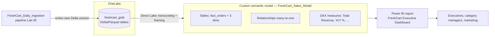

# Lab 06 — Semantic Models and Direct Lake Power BI

> **Module:** SK-07 Microsoft Fabric Data Engineer
> **Estimated time:** 3–4 hours
> **Prerequisites:** Labs 00–05 completed (you need the `freshcart_gold` lakehouse with `fact_orders`, `dim_customer`, `dim_product`, and `dim_date`, plus the working `FreshCart_Daily_Ingestion` pipeline from Lab 05)
> **What you'll build:** A custom **Direct Lake semantic model** on top of your gold lakehouse, complete with relationships, DAX measures, and a two-page Power BI report — all in the browser, all reading data straight from OneLake with **zero data copies and zero scheduled refreshes**.

---

## Why this lab exists (read this first)

Everything you have built so far in this module — the bronze/silver/gold lakehouses (Lab 02–03), the warehouse views (Lab 04), the scheduled pipeline (Lab 05) — has one ultimate purpose: **someone in the business needs to look at a chart and make a decision.**

That "someone" is FreshCart's leadership team. They do not write PySpark. They do not write T-SQL. They open a Power BI report on their phone at 7:45 AM and ask: *"How was revenue yesterday? Are repeat customers growing?"*

This lab is where you, the data engineer, hand your work over to the business. The handover artifact is called a **semantic model**, and in Fabric it can read your Delta tables *directly* from OneLake using a storage mode called **Direct Lake** — no nightly "refresh the dataset" job, no stale copies. When your Lab 05 pipeline finishes at 2 AM, the dashboard is current at 2:01 AM.

This is also the lab that connects SK-07 back to SK-06 (Power BI). In SK-06 you built models in Power BI Desktop with Import mode. Here you'll see how Fabric changes that workflow — and why Direct Lake is the headline feature of the whole platform.

---

## 1. Environment Setup

Lab 00 did the heavy lifting. This section only **verifies** what you need and adds one *optional* install.

### 1.1 What you need already in place

Open your browser (Microsoft Edge or Chrome), go to `https://app.fabric.microsoft.com`, sign in with the same work/school account you used in Lab 00, and open the workspace **`sk07-fabric-training`**.

Verify this checklist. Every item was built in an earlier lab — the lab where you built it is in parentheses:

| # | Artifact | Type | Built in |
|---|----------|------|----------|
| 1 | `freshcart_bronze` | Lakehouse | Lab 02 |
| 2 | `freshcart_silver` | Lakehouse | Lab 03 |
| 3 | `freshcart_gold` | Lakehouse | Lab 03 |
| 4 | `freshcart_warehouse` | Warehouse | Lab 04 |
| 5 | `FreshCart_Daily_Ingestion` | Data pipeline | Lab 05 |
| 6 | `01_bronze_to_silver`, `02_silver_to_gold` | Notebooks | Lab 03 |

**How to verify:** In the workspace item list, use the **Filter** dropdown (top right of the item list) and select *Lakehouse* — you should see three lakehouses. Then filter by *Data pipeline* — you should see `FreshCart_Daily_Ingestion`.

**Verify the gold tables exist and have data.** Click `freshcart_gold` to open it. In the **Tables** section of the Explorer pane on the left you should see at least:

- `fact_orders`
- `dim_customer`
- `dim_product`
- `dim_date`

Click `fact_orders`. A data preview grid should appear on the right showing rows of order data.

**Expected output:** A grid with columns like `order_key` (or `order_id`), `customer_key`, `product_key`, `date_key`, `quantity`, `unit_price`, `line_amount` (your exact column names come from your Lab 03 notebook `02_silver_to_gold`).

> **Column-name note:** Throughout this lab I use the gold schema from Lab 03: `fact_orders(order_id, customer_key, product_key, date_key, quantity, unit_price, line_amount)`, `dim_customer(customer_key, customer_id, customer_name, city, segment, signup_date)`, `dim_product(product_key, product_id, product_name, category, brand, current_price)`, `dim_date(date_key, date, year, month, month_name, quarter, day_of_week, is_weekend)`. If your columns differ slightly (e.g., you named it `revenue` instead of `line_amount`), substitute your names — the *pattern* is what matters. If you're unsure, open notebook `02_silver_to_gold` and read the final `write` cells to see exactly what you created.

**Common mistakes at this stage:**

- **Tables show but preview is empty.** Your Lab 05 pipeline may have failed on its last run, or you truncated during a backfill experiment. Open the **Monitoring hub** (left navigation → Monitor), check the last run of `FreshCart_Daily_Ingestion`, and re-run it manually if needed (Lab 05, section 4.3 covers manual runs).
- **You see `Unidentified` folders under Tables.** That means a Delta table's log is unreadable — usually from copying files manually instead of writing via Spark. Re-run notebook `02_silver_to_gold`.
- **Wrong workspace.** If the workspace shows no items at all, check the workspace switcher (left nav, bottom) — you may be in "My workspace" instead of `sk07-fabric-training`.

**Troubleshooting — trial capacity paused:** If items open with an error like *"This item can't be opened because the capacity is paused,"* your 60-day Fabric trial has expired or been paused. Check **Settings (gear icon) → Admin portal → Capacity settings → Trial** — you may be able to start a new trial. This is why the module README tells you to finish within 60 days.

### 1.2 Optional: install Power BI Desktop

**Everything in this lab happens in the browser.** You do *not* need Power BI Desktop. But it is worth having installed because (a) you used it in SK-06, (b) some advanced modeling operations (calculation groups, some RLS testing workflows) are more comfortable in Desktop, and (c) real BI teams use both.

To install the latest version on Windows 11, open **PowerShell** and run:

```powershell
winget install Microsoft.PowerBI
```

**Why winget?** `winget` is Windows 11's built-in package manager. It always fetches the latest stable release, so you never have to hunt down an installer or worry about versions. Power BI Desktop updates monthly; "latest stable" is always the right answer.

**Expected output:** winget downloads and runs the installer; you'll see a progress bar ending in `Successfully installed`.

**How to verify:** Press the Windows key, type `Power BI Desktop`, and confirm the app appears. Launch it once; it should open to a blank report canvas.

**Common install problems:**

- *"winget is not recognized"* — winget ships with the "App Installer" package. Install/update **App Installer** from the Microsoft Store, then reopen PowerShell.
- *Store-blocked corporate machine* — download the `.exe` installer from `https://aka.ms/pbidesktopstore` alternative page: `https://www.microsoft.com/en-us/download/details.aspx?id=58494`, or simply skip Desktop entirely — again, **this lab is 100% browser-based**.
- *macOS/Linux learners:* Power BI Desktop is Windows-only. Use the browser for everything (which is exactly what this lab does anyway).

### 1.3 No new folders, no new environment variables

Nothing to add. Your local `C:\FabricLabs\data` folder from Lab 00 is untouched by this lab — Direct Lake reads from OneLake, not your laptop.

---

## 2. Business Context

### 2.1 The problem being solved

FreshCart's data platform now works end-to-end: files land, the `FreshCart_Daily_Ingestion` pipeline runs nightly, bronze → silver → gold flows through your notebooks, and the warehouse serves clean T-SQL views like `vw_daily_sales_summary` (Lab 04).

But here's the uncomfortable truth: **nobody outside your team has seen any of it.** The Head of Sales still gets a hand-built Excel file every Monday from an analyst who exports CSVs. That Excel file:

- is a week old by the time anyone reads it,
- has formulas that quietly broke when a category was renamed,
- defines "revenue" differently than Finance's version of the same file.

FreshCart's leadership has asked for one thing: **a live dashboard with agreed-upon numbers.** One definition of "Total Revenue." One definition of "Repeat Customer %." Available every morning, current as of last night's pipeline run.

### 2.2 Why companies need semantic models

A dashboard is only as trustworthy as the layer beneath it. If ten analysts each write their own `SUM(...)` against raw tables, you get ten slightly different revenue numbers — a phenomenon so common it has a name: **"multiple versions of the truth."** It destroys confidence in data teams faster than any outage.

The industry answer is a **semantic model** (older names: *dataset*, *cube*, *tabular model*): a governed layer that sits between the physical tables and the reports, containing:

- **which tables** analysts are allowed to see (gold only — never bronze/silver),
- **how the tables relate** (fact → dimensions),
- **the official calculations** (measures like Total Revenue), defined *once*, reused everywhere.

Every report built on the model inherits the same definitions. When Finance and Sales both drag "Total Revenue" onto a chart, they get the identical number, because it's the identical formula.

### 2.3 Where this is used in industry

Everywhere Power BI is deployed at scale — which, given Power BI's market share, means most large enterprises. Retailers (like our fictional FreshCart, or real ones like grocery chains) run executive daily-sales dashboards on exactly this pattern. In Fabric shops specifically, *gold lakehouse → Direct Lake semantic model → Power BI report* is the reference serving architecture Microsoft itself recommends.

### 2.4 Who consumes the output

- **Executives** — KPI cards and trends on page 1 of your report.
- **Category managers** — product/category breakdowns.
- **Marketing** — customer segment and repeat-purchase analysis (page 2).
- **Analysts** — they connect Excel or build *their own* reports on *your* semantic model, reusing your measures.

Notice the shift: in Labs 02–05 your "consumer" was the next pipeline stage. Now your consumers are **people**, and your deliverable is a **contract**: stable table names, stable measure definitions, correct numbers.

### 2.5 What happens if it fails

- **Model unavailable** → every report built on it shows errors → executives open their morning dashboard to broken visuals → your team's credibility takes the hit, regardless of whose fault it is.
- **Model silently stale** (the classic Import-mode failure — a full story in section 5.9) → worse than broken, because *nobody notices*. Decisions get made on old numbers.
- **Wrong measure definition** → FreshCart reports wrong revenue to its board. In a public company, this class of error has regulatory consequences.

This is why section 5 treats the semantic model as a **production artifact** with naming conventions, documentation, and change control — not a throwaway click-together.

---

## 3. Concept Explanation

This is the most concept-dense lab in the module. Take it slowly; every term below appears in the hands-on section and in interviews.

### 3.1 What is a semantic model?

A **semantic model** is a metadata layer that describes your data in *business terms* so that reporting tools can query it correctly. Concretely, it is a definition of:

1. **Tables** — a curated subset of your physical tables (we'll pick `fact_orders` and the three dims from `freshcart_gold`).
2. **Relationships** — declared links between tables ("each row in `fact_orders` matches one row in `dim_customer` via `customer_key`"). Relationships are what let a user filter a chart by `customer_name` and have the revenue numbers respond — the filter *travels* across the relationship from the dimension into the fact.
3. **Measures** — named calculations written in **DAX** (Data Analysis Expressions, Power BI's formula language — you met it in SK-06). Example: `Total Revenue = SUM(fact_orders[line_amount])`.
4. **Formatting and presentation metadata** — display formats (`$#,0`), hidden columns, folder organization, descriptions.

Think of it as **the analyst-facing API of your data platform**. Your PySpark code and Delta tables are the implementation; the semantic model is the public interface. And like any API, its consumers depend on it not changing carelessly.

**Why does it exist as a separate layer?** Because raw tables are hostile to non-engineers. `fact_orders.line_amount` means nothing to a sales director; "Total Revenue" formatted as currency does. And because calculations must be centralized — the alternative (every report re-implements every formula) is the "multiple versions of the truth" failure from section 2.2.

**Alternatives:** dbt metric layers / semantic layers like Cube or AtScale (tool-agnostic but another system to run), Looker's LookML (locked to Looker), or "no semantic layer, just SQL views" (works for simple cases — your Lab 04 views are a mini version of this — but views can't define reusable measures, formats, or relationships that BI tools understand natively). In the Microsoft ecosystem, the Power BI semantic model is the standard, and it's what the Fabric platform is built around.

### 3.2 Storage modes: Import vs DirectQuery vs Direct Lake

Every semantic model has to answer one question: **when a user clicks a chart, where does the data physically come from?** There are three answers, and this comparison is the intellectual core of this lab (and a top-tier interview topic).

#### Import mode — copy everything into memory

The model **copies** the data from the source into its own highly compressed, in-memory, column-oriented storage engine (called **VertiPaq** — remember that name). Queries are answered from this in-memory copy.

- **Pros:** blazing fast queries (VertiPaq is arguably the fastest analytical engine per dollar in existence); full DAX feature support; works with any source.
- **Cons:** the copy goes stale the moment the source changes. You must **schedule refreshes**, each refresh re-reads the source (load on it), refreshes can fail silently, and large models take a long time to refresh. Data is duplicated (source + model copy).
- **When used:** SK-06 was all Import mode. It remains the right default for small/medium data from non-Fabric sources.

#### DirectQuery mode — copy nothing, translate every click into SQL

The model stores **no data**. Every user interaction is translated live into a SQL query against the source (for a lakehouse, that's the SQL analytics endpoint).

- **Pros:** always current, no refresh needed, no duplication, no memory limits.
- **Cons:** every click waits for a SQL round-trip — typically seconds, not milliseconds. Dashboards feel sluggish. Some DAX functions are restricted. The source database takes the full interactive query load (a dashboard with 8 visuals fires 8+ queries per click, per user).
- **When used:** huge datasets that can't fit in memory, or strict "must be real-time" requirements — accepted as a performance trade-off.

#### Direct Lake mode — the Fabric innovation: no copy, no SQL translation

Here is the plain-words version of how Direct Lake works, and why it's clever.

Recall from Lab 02–03 that Delta tables are stored as **Parquet files** in OneLake. Parquet is a *columnar* format — data is stored column by column, compressed. VertiPaq (the Import-mode engine) is *also* columnar and compressed, and its internal format is close enough to Parquet that Microsoft built a bridge:

> **Direct Lake loads the Parquet column data from OneLake straight into the VertiPaq-style in-memory engine, on demand, without an intermediate refresh/copy step.**

Two terms you must be able to explain in plain words:

- **Transcoding** — the on-the-fly conversion of Parquet column segments into the engine's in-memory format when a query first needs them. Think of it as "paging columns into memory as needed." Only the columns actually used by visuals get loaded — one more reason star schemas with narrow, purposeful columns matter. After the first query touches a column, it's warm in memory and subsequent queries are Import-mode fast.
- **Framing** — the model's *snapshot pointer* into the Delta table. A Delta table is a sequence of versions (you used time travel in Lab 03). At any moment, the Direct Lake model is "framed" to one specific version — a consistent set of Parquet files. When your pipeline writes new data, Fabric **reframes** the model to the new version (by default automatically, moments after the write). Reframing is a *metadata* operation — it just updates the pointer and drops now-stale column segments from memory. It is **not** a data refresh; nothing is copied. That's why a Direct Lake dashboard shows new data within moments of a pipeline finishing, while an Import model would wait for its next scheduled refresh.

**Summary table — memorize this:**

| | Import | DirectQuery | Direct Lake |
|---|--------|------------|-------------|
| Data copied into model? | Yes (full copy) | No | No (loaded on demand from OneLake Parquet) |
| Query speed | Fastest | Slowest (SQL per click) | Near-Import once columns are warm |
| Freshness | As of last refresh | Real-time | Moments after each Delta write (reframing) |
| Scheduled refresh needed? | Yes | No | No (framing handles it) |
| Source required | Anything | SQL-capable source | Delta tables in OneLake (Fabric) |
| Failure mode to fear | Silent staleness | Slow dashboards / source overload | DirectQuery fallback (below) |

#### DirectQuery fallback — the fine print

Direct Lake has limits. When a query *can't* be answered by the Direct Lake engine, the model can silently **fall back to DirectQuery** against the SQL analytics endpoint: the numbers stay correct, but that query runs at DirectQuery speed. What triggers fallback:

1. **SKU guardrails exceeded.** Each Fabric capacity size (**SKU** — "stock keeping unit," the T-shirt size of your capacity: F2, F64, trial ≈ F64, etc.) has hard limits on how much a Direct Lake model may hold in memory — measured in things like *max rows per table* (hundreds of millions on smaller SKUs, billions on larger) and *max model memory*. Exceed a guardrail → queries fall back. FreshCart's data is tiny; you will never hit this in the lab, but at a real client it's the first thing to check when a Direct Lake model is mysteriously slow.
2. **Features the Direct Lake engine doesn't support** — e.g., SQL views (a Direct Lake table must map to a real Delta *table*, not a view), certain data types, or (in classic Direct Lake models) row-level security defined in the SQL endpoint.

Fallback behavior is configurable on the model (`Automatic` / `ForceDirectQuery` / `DirectLakeOnly` — the last makes queries *fail* instead of silently degrading, which some teams prefer so problems are visible). You'll look at this setting in section 4.

#### Which mode should FreshCart use?

Direct Lake, without hesitation: the data is already Delta in OneLake, the business wants morning-after-pipeline freshness, and the data volume is far below any guardrail. This decision pattern — *data born in Fabric gold → Direct Lake* — is the default recommendation you should carry into the TrendMart capstone.

### 3.3 Default semantic model vs custom semantic model

When you created `freshcart_gold` in Lab 03, Fabric historically auto-provisioned a **default semantic model** with the same name — an automatic model containing every table in the lakehouse. (Microsoft has been phasing default models out for new lakehouses; your workspace may or may not show one. Either way, the lesson stands.)

**Never build production reports on the default model.** Why:

- It contains **everything** — every table Fabric finds, including staging or scratch tables, with no curation.
- You don't fully control it — its lifecycle is tied to the lakehouse, tables can appear in it automatically, and it can't be renamed, moved, or governed like a normal item.
- It ships with **no relationships, no measures, no formatting** — so every report author reinvents them (multiple versions of the truth, again).

A **custom semantic model** is one *you* create deliberately: you choose the tables, define the relationships and measures, and own it as a versioned, documented artifact. That's what we build in section 4. Treat the default model (if present) as a demo convenience only.

### 3.4 Star schema recap (30 seconds)

You built this in Lab 03, so briefly: a **star schema** puts measurable events in a central **fact table** (`fact_orders` — one row per order line, with numeric measures and foreign keys) surrounded by descriptive **dimension tables** (`dim_customer`, `dim_product`, `dim_date` — one row per entity, with the attributes people filter and group by). It's called a star because the diagram looks like one.

Semantic models *want* star schemas. The Power BI engine is optimized for exactly this shape: filters flow from dims to facts across many-to-one relationships, dimension columns are low-cardinality (compress beautifully), and the fact table stays narrow. A model built on one giant wide table, or on a tangle of snowflaked/many-to-many relationships, is slower, harder to reason about, and produces wrong-looking numbers when filters propagate unexpectedly. **Your Lab 03 gold design pays off right now.**

### 3.5 DAX measures — a gentle re-introduction

You met DAX in SK-06; here's the refresher through a data engineer's lens.

A **measure** is a named DAX formula evaluated **at query time, in the context of whatever filters the user has applied**. That last part is the magic and the mind-bender:

```dax
Total Revenue = SUM(fact_orders[line_amount])
```

This is *one* definition, but it produces a *different number in every cell of every visual*: in a bar chart by category, each bar computes the SUM over only that category's rows; add a year slicer and each bar now sums only that category *and* that year. The set of active filters is called the **filter context**, and measures are formulas that respond to it.

Two function families you'll use today:

- **Aggregators:** `SUM`, `COUNTROWS`, `DISTINCTCOUNT`, `DIVIDE` (always prefer `DIVIDE(a, b)` over `a / b` — it returns blank instead of an error on divide-by-zero).
- **`CALCULATE`** — the most important function in DAX. It evaluates an expression **under a modified filter context**. `CALCULATE([Total Revenue], SAMEPERIODLASTYEAR(dim_date[date]))` means "compute Total Revenue, but shift the date filter back one year." This is how year-over-year, market-share, and "% of total" calculations work. If you understand `CALCULATE`, you understand DAX.

A note on **measures vs calculated columns**: a calculated column is computed row-by-row and *stored* in the table; a measure is computed on demand. In Direct Lake models, **DAX calculated columns are not supported** — the tables are your Parquet files, and you can't bolt computed columns onto them from the model side. This is a *feature* disguised as a limitation: any row-level derivation belongs upstream in your `02_silver_to_gold` notebook, where it's computed once, tested, and available to every consumer — not just this model. Engineers own row-level logic in Spark; the model owns aggregation logic in DAX. Clean separation.

### 3.6 Row-level security (RLS) — an introduction

**Row-level security** restricts *which rows* a user can see, based on who they are. Example: FreshCart regional managers should only see orders from their own city. You define a **role** (e.g., "Accra Manager") with a DAX filter expression on a table (e.g., `dim_customer[city] = "Accra"`), then assign users to the role. When an Accra manager opens any report on the model, every visual behaves as if the other cities' rows don't exist.

Why introduce it now and not fully implement it? Two reasons: (1) your trial tenant likely has only one user (you), so there's nobody to test against; (2) RLS on Direct Lake has real caveats — on classic Direct Lake models, defining RLS *in the model* is supported, but security defined at the *SQL endpoint* level forces DirectQuery fallback, and RLS interacts with fallback in ways you must test deliberately. Section 5.7 covers the production guidance. For now: know what RLS is, know it exists at the *semantic model* layer (not the report layer — report-level filters are cosmetic and trivially bypassed), and know it's a capstone-level topic to design carefully.

### 3.7 The full picture



---

## 4. Step-by-Step Implementation

> **Heads-up about UI drift:** Fabric's UI changes monthly. Button labels below match the Fabric portal as of mid-2026; if a label has shifted slightly (e.g., "New semantic model" vs "New Power BI semantic model"), look for the nearest equivalent. The *concepts and sequence* never change: pick tables → relate them → mark the date table → write measures → hide keys → build report → verify Direct Lake.

### Step 4.1 — Open the gold lakehouse and create a new custom semantic model

**What to do:**

1. In workspace `sk07-fabric-training`, click **`freshcart_gold`** to open the lakehouse.
2. In the lakehouse ribbon at the top, click **New semantic model**.
3. A dialog appears:
   - **Name:** type exactly `FreshCart_Sales_Model`
   - **Workspace:** confirm `sk07-fabric-training`
   - **Table list:** tick **only** these four tables:
     - ☑ `fact_orders`
     - ☑ `dim_customer`
     - ☑ `dim_product`
     - ☑ `dim_date`
   - Leave everything else (any staging or experiment tables) **unticked**.
4. Click **Confirm** (or **Create**).

**Why:** Creating the model *from the lakehouse* like this produces a **Direct Lake** model automatically — the tables are bound to the Delta tables in OneLake, no copy made. Selecting only the star-schema tables is the "curation" that makes this a *custom* model rather than a dump-everything default model (section 3.3).

**Expected output:** The browser opens the **semantic model editing view**: a canvas showing your four tables as boxes with their column lists, a **Data** pane on the right, and a ribbon with tabs like **Home** and **Reporting**. There may be zero lines between the tables — that's expected; relationships come next. (If Fabric auto-detected some relationships from column names, fine — you'll verify each one in Step 4.2 anyway.)

**How to verify it's really Direct Lake:** Go back to the workspace, find `FreshCart_Sales_Model` (type: *Semantic model*), click its **… → Settings**. Under settings you'll find the storage/connection info indicating Direct Lake. Even more directly: in the model editor, tables bound to OneLake show storage mode **Direct Lake** in the table properties pane (click a table header → Properties → Advanced → Storage mode). Check `fact_orders`: it should say **Direct Lake**, not Import, not DirectQuery.

**Common mistakes:**

- **Selecting every table in the lakehouse.** You get a cluttered model with scratch tables analysts shouldn't see. If you did this: in the model editor use **Edit tables** (Home ribbon) to untick the extras.
- **Editing the default semantic model instead of creating a new one.** If the model you're editing has *the same name as the lakehouse* and you never got a naming dialog, you're in the default model. Back out and use **New semantic model** explicitly.
- **Typo in the name.** The name is your contract with report authors (and with the rest of this lab). Rename via workspace **… → Settings → Rename** if needed.

**Troubleshooting:**

- *"New semantic model" button is grayed out or missing* → you may have Viewer-only rights on the workspace (you're Admin on your own trial, so this usually means you're in the wrong workspace), or you're in the lakehouse's *SQL analytics endpoint* view instead of the *Lakehouse* view — check the mode switcher at the top right of the lakehouse and switch to **Lakehouse**.
- *A table is missing from the pick list* → it's not a Delta table (check for it under **Unidentified** in the lakehouse Explorer) — re-run `02_silver_to_gold`.

### Step 4.2 — Create the relationships

You'll create three relationships. All three follow the same pattern: **many-to-one, from the fact table's foreign key to the dimension's key, single-direction filtering (dimension filters fact).**

**What to do (exact clicks, first relationship spelled out fully):**

1. In the model editor's diagram view, locate `fact_orders` and `dim_customer`.
2. Click and hold `customer_key` **in `fact_orders`**, drag it onto `customer_key` **in `dim_customer`**, and release. A **New relationship** dialog opens. (Alternative if drag-and-drop fights you: ribbon → **Manage relationships** → **New relationship**, then pick the tables/columns from dropdowns.)
3. In the dialog, set every field deliberately — do not trust defaults blindly:
   - **From table:** `fact_orders`, column `customer_key`
   - **To table:** `dim_customer`, column `customer_key`
   - **Cardinality:** **Many to one (*:1)** — many order lines belong to one customer.
   - **Cross-filter direction:** **Single** — filters flow from `dim_customer` *into* `fact_orders`, not backwards.
   - **Make this relationship active:** ☑ checked.
4. Click **Save** (or **OK**).

Repeat for the other two:

| From (fact side) | To (dimension side) | Cardinality | Direction |
|---|---|---|---|
| `fact_orders[product_key]` | `dim_product[product_key]` | Many to one | Single |
| `fact_orders[date_key]` | `dim_date[date_key]` | Many to one | Single |

**Why these settings:**

- **Many-to-one** is the star-schema shape: thousands of fact rows share each dimension row. If Fabric proposes *one-to-one*, it means it found duplicate keys — a data quality bug in your gold build, not a modeling choice (see troubleshooting).
- **Single direction** keeps filter flow predictable: slicing by product category filters orders; slicing by an order attribute does *not* filter the product list. **Bidirectional** filtering looks convenient but creates ambiguous filter paths and wrong totals in non-obvious ways — the standing rule is *single direction unless you have a specific, understood reason* (the classic exception, many-to-many bridge tables, is beyond this lab).

**Expected output:** Three lines on the canvas connecting `fact_orders` to each dimension. Each line shows `*` at the fact end and `1` at the dimension end, with a single arrowhead pointing toward the fact table (the direction filters travel).

**How to verify:** Ribbon → **Manage relationships**. You should see exactly three rows, all Active, all *:1. No relationship should exist *between two dimensions* (e.g., dim_customer ↔ dim_product) — if one snuck in via autodetect, delete it.

**Common mistakes:**

- **Dragging the wrong direction and accepting a flipped cardinality (1:*) with "To" and "From" swapped.** The dialog's From/To matter less than the cardinality symbols — just make sure the `*` sits on `fact_orders` in every case.
- **Relating on the wrong columns** — e.g., `fact_orders[customer_key]` to `dim_customer[customer_id]` (the *natural* key instead of the *surrogate* key). Revenue will show as blank or lump under one customer. Relate surrogate key to surrogate key, exactly as your Lab 03 notebook populated them.
- **Leaving an auto-detected bidirectional relationship in place.** Open each relationship and confirm **Single**.

**Troubleshooting:**

- *Dialog refuses Many-to-one, insisting on Many-to-many:* your dimension has duplicate key values. Verify in the lakehouse SQL endpoint: `SELECT customer_key, COUNT(*) c FROM dim_customer GROUP BY customer_key HAVING COUNT(*) > 1;` — if rows return, your Lab 03 dedup (MERGE keys) has a bug; fix the notebook and re-run. **Do not** accept many-to-many to make the dialog go away — you'd be plastering over a data bug.
- *Line appears dashed:* the relationship is inactive — open it and tick Active.

### Step 4.3 — Mark `dim_date` as the date table

**What to do:**

1. In the model editor, click the **`dim_date`** table header to select it.
2. On the ribbon, find **Mark as date table** (it may be under a table tools/context menu — or right-click the table header and choose **Mark as date table**).
3. In the dialog, choose the date column: **`date`** (the actual `date`-typed column, *not* the integer `date_key`).
4. Fabric validates the column (contiguous, unique, no nulls) and confirms.

**Why:** DAX **time intelligence** functions — including `SAMEPERIODLASTYEAR`, which you'll use in Step 4.4 — need to know which table is *the* calendar and which column is its date grain. Marking the date table tells the engine "when someone filters by year/month, translate that into date ranges on this column." Without it, time-intelligence functions can silently return wrong or blank results. This is also why Lab 03 built `dim_date` as a *contiguous* calendar (every date present, no gaps) — that contiguity is exactly what the validation checks.

**Expected output:** A confirmation that validation passed; `dim_date` may show a small calendar-like indicator.

**How to verify:** Re-open the Mark-as-date-table dialog; it should show the setting already applied with `date` selected.

**Common mistakes / troubleshooting:**

- *Validation fails: "contains null values" or "must be contiguous"* → your `dim_date` has a gap or a null. Query it via the SQL endpoint (`SELECT MIN(date), MAX(date), COUNT(*) FROM dim_date`) — the row count must equal the day-span. Fix in `02_silver_to_gold` and re-run.
- *Picked `date_key` (an int like 20260315) instead of `date`* → validation fails on data type. Pick the true date column.

### Step 4.4 — Create the DAX measures

You'll create five measures. For each: in the **Data** pane, right-click the **`fact_orders`** table → **New measure**, then type the formula into the formula bar and press **Enter**.

> **Why house all measures on `fact_orders`?** Measures technically float free of tables (their "home table" is just an address), but a consistent home makes them findable. Convention: put measures on the fact table they primarily aggregate, or in a dedicated measure table (section 5.3). We'll use `fact_orders`.

**Measure 1 — Total Revenue**

```dax
Total Revenue = SUM ( fact_orders[line_amount] )
```

*Explanation:* Adds up `line_amount` over every fact row *visible in the current filter context* (section 3.5). This one measure powers cards, trends, and bars alike. If your gold column is named differently (e.g., `revenue`), substitute it.

**Set the format:** with the measure selected, open the **Properties** pane (or the Measure tools ribbon) → **Format: Currency**, 0 decimal places (executive dashboards don't need cents). This format now follows the measure into *every* report — set once, correct everywhere.

**Measure 2 — Order Count**

```dax
Order Count = DISTINCTCOUNT ( fact_orders[order_id] )
```

*Explanation:* `fact_orders` has one row per order **line**, so `COUNTROWS` would count lines, not orders — a subtle grain bug that produces plausible-looking wrong numbers (the worst kind). `DISTINCTCOUNT` on the order identifier counts *orders*. **Grain awareness is the #1 skill that separates engineers who build trustworthy models from those who don't.** Format: Whole number, thousands separator.

**Measure 3 — Average Order Value**

```dax
Average Order Value =
DIVIDE ( [Total Revenue], [Order Count] )
```

*Explanation:* Two things to notice. First, it's built from **other measures** (in square brackets, no table prefix — the convention that visually distinguishes measure references from column references). Measures composing measures is how DAX stays maintainable: if Total Revenue's definition ever changes, AOV inherits the fix automatically. Second, `DIVIDE` instead of `/`: on a day with zero orders, `/` throws an error into your visual; `DIVIDE` returns a clean blank. Format: Currency, 2 decimals.

**Measure 4 — Revenue YoY %**

```dax
Revenue YoY % =
VAR CurrentRevenue = [Total Revenue]
VAR PriorRevenue =
    CALCULATE ( [Total Revenue], SAMEPERIODLASTYEAR ( dim_date[date] ) )
RETURN
    DIVIDE ( CurrentRevenue - PriorRevenue, PriorRevenue )
```

*Explanation, line by line:*

- `VAR ... RETURN` defines named intermediate values — the DAX equivalent of intermediate variables in Python. Use them always; they make measures readable and debuggable.
- `CALCULATE ( [Total Revenue], SAMEPERIODLASTYEAR ( dim_date[date] ) )` is section 3.5's `CALCULATE` in action: "evaluate Total Revenue, but *replace the current date filter* with the same period shifted back one year." Viewing March 2026? `PriorRevenue` is March 2025. Viewing all of 2026? Prior is all of 2025. One formula, every granularity. `SAMEPERIODLASTYEAR` **only works because Step 4.3 marked the date table** — if you skipped it, this measure returns garbage or blanks.
- The `RETURN` line is the standard growth formula, safely divided.

Format: **Percentage**, 1 decimal place.

> **Expected quirk:** if your FreshCart dataset only spans one year of orders, YoY shows blank (no prior-year rows exist). That's *correct* behavior — note it, don't "fix" it. The Lab 05 backfill exercise gave you multi-day history; if your dim_date and orders span under a year, the measure proves itself in the capstone where TrendMart's data spans multiple years.

**Measure 5 — Repeat Customer %**

```dax
Repeat Customer % =
VAR CustomersWithMultipleOrders =
    COUNTROWS (
        FILTER (
            VALUES ( fact_orders[customer_key] ),
            CALCULATE ( DISTINCTCOUNT ( fact_orders[order_id] ) ) > 1
        )
    )
VAR AllCustomers =
    DISTINCTCOUNT ( fact_orders[customer_key] )
RETURN
    DIVIDE ( CustomersWithMultipleOrders, AllCustomers )
```

*Explanation:*

- `VALUES ( fact_orders[customer_key] )` produces the list of distinct customers *in the current filter context* (e.g., only customers who ordered this month, if a month filter is active).
- `FILTER ( ..., CALCULATE(DISTINCTCOUNT(fact_orders[order_id])) > 1 )` walks that customer list and keeps those with more than one distinct order. The inner `CALCULATE` performs **context transition** — it turns "the current customer row we're inspecting" into a filter, so the distinct count is *per customer*. (Context transition is intermediate DAX; if it feels slippery, that's normal — file it under "re-read after the capstone.")
- The denominator is all active customers; the ratio is the repeat rate marketing asked for.

Format: Percentage, 1 decimal.

**Expected output after all five:** The Data pane shows five measures (calculator icons) under `fact_orders`.

**How to verify each measure works:** the model editor doesn't render visuals, so do a quick smoke test: ribbon → **Reporting** tab → **New report** *(don't build anything yet — this is just a scratch canvas)*, drop a **Card** visual, drag **Total Revenue** into it. You should see a currency-formatted number that roughly matches Lab 04's check query — run this in the `freshcart_gold` SQL analytics endpoint to compare:

```sql
SELECT SUM(line_amount) AS total_revenue FROM fact_orders;
```

The card and the query must agree. **If they don't, stop and investigate — never proceed with a model whose flagship number you can't reconcile.** Close the scratch report without saving.

**Common mistakes:**

- *"Cannot find column 'line_amount'"* → column name mismatch with your gold schema; check the real name in the Data pane and adjust.
- *Created a **calculated column** instead of a measure* (chose "New column"). In Direct Lake, new DAX columns aren't supported and this errors — which conveniently tells you that you clicked the wrong thing. Use **New measure**.
- *Measure landed on the wrong table* → cosmetic, not functional. Fix via the measure's **Home table** property.
- *YoY blank everywhere even with 2+ years of data* → Step 4.3 was skipped, or the visual isn't using `dim_date` fields for its axis (time intelligence needs the date table's columns on the visual, not some other date column).

### Step 4.5 — Hide the keys and polish the model

**What to do:** In the Data pane, click the **eye icon** (or right-click → **Hide in report view**) on every column report users should never touch:

- `fact_orders`: `customer_key`, `product_key`, `date_key`, `order_id`, and *all raw numeric columns you've wrapped in measures* (`line_amount`, `quantity`, `unit_price`) — hiding the raw columns forces everyone through your governed measures instead of dragging `Sum of line_amount` onto a chart with the wrong aggregation.
- `dim_customer`: `customer_key`, `customer_id`
- `dim_product`: `product_key`, `product_id`
- `dim_date`: `date_key`

(If you prefer to leave `quantity` visible for ad-hoc analysis, at least hide the keys — keys are never negotiable.)

**Why:** Surrogate keys are plumbing. A report author who drags `customer_key` into a table gets meaningless integers; worse, one who drags it into a card gets `Sum of customer_key` — a real screenshot from a real executive deck at more than one real company. Hiding is part of the model-as-product mindset: expose the interface, hide the implementation.

Also do:

- **Descriptions:** select `Total Revenue` → Properties → **Description**: `Sum of order line amounts (gross revenue before refunds). Owner: Data Engineering.` Repeat for the others. Descriptions surface as tooltips for report authors — cheap documentation with high leverage.
- **Sort month names correctly:** select `dim_date[month_name]` → Properties → **Sort by column** → `month`. Otherwise charts sort April, August, December… alphabetically — the single most common rookie chart bug in existence.

**Expected output:** Hidden columns render grayed/struck-through in the Data pane; they'll be invisible in report view.

**Verification:** In the next step's report view, expand `dim_customer` in the field list — you should see `customer_name`, `city`, `segment`, but no keys.

### Step 4.6 — Build the Power BI report, page 1: Executive Overview

**What to do:**

1. From the workspace (or the model editor's Reporting tab), select `FreshCart_Sales_Model` → **Create report** → **Start from scratch** (label may be "New report"). The browser report editor opens: blank canvas, **Data** pane (your model's fields), **Visualizations** pane.
2. Rename the page: double-click the `Page 1` tab at the bottom → type `Executive Overview`.
3. **Three KPI cards across the top.** Click a blank canvas spot → in Visualizations pick **Card** → drag `Total Revenue` into its field well. Resize (~one-sixth of canvas width) and place top-left. Repeat with two more cards: `Order Count`, `Average Order Value`. Align them in a row. *(Optional fourth card: `Revenue YoY %`.)*
4. **Revenue trend line.** Click blank canvas → **Line chart** → drag `dim_date[date]` to **X-axis** and `Total Revenue` to **Y-axis**. If the X-axis shows a date *hierarchy* (Year/Quarter/Month/Day), that's fine — use the drill arrows on the visual header to view at month level. Place it across the middle of the canvas, wide.
5. **Category bar chart.** Click blank canvas → **Clustered bar chart** → drag `dim_product[category]` to **Y-axis** and `Total Revenue` to **X-axis**. Bars auto-sort by revenue descending. Place bottom-left.
6. **Slicer.** Click blank canvas → **Slicer** → drag `dim_date[year]` into it (or `dim_customer[city]` — pick the cut FreshCart's execs argue about most; `year` is the safe default). In the slicer's header dropdown you can switch style (List/Dropdown/Tile). Place it top-right or as a left rail.
7. Click any slicer value and watch **every visual on the page respond** — this is the relationships from Step 4.2 doing their job: the slicer filters `dim_date`, the filter flows across the many-to-one relationship into `fact_orders`, and every measure recomputes.
8. **Save:** File → **Save**, name it `FreshCart Executive Dashboard`, workspace `sk07-fabric-training`.

**Why this layout:** Executive pages follow a convention — headline numbers top (cards), trend center (line), composition bottom (bars), controls at the edge (slicer). Executives scan top-left → bottom-right; put the most important number top-left.

**Expected output:** A page where three currency/number cards agree with your SQL reconciliation, a line chart shows daily/monthly revenue movement, bars rank categories, and the slicer cross-filters everything.

**Common mistakes:**

- *Dragged a raw column instead of a measure* — if you see `Sum of line_amount` in a field well, you missed hiding raw columns in 4.5, or dragged from the wrong place. Use the measures.
- *Line chart shows one lonely dot* — X-axis is at Year level; drill down (forked-arrow icon) to month/day.
- *Bar chart shows categories but identical bar lengths* — you put a dimension attribute in the value well instead of `Total Revenue`.
- *Blank visuals* — a relationship is missing/inactive (Manage relationships, Step 4.2) or you related the wrong key columns.

### Step 4.7 — Report page 2: Customer Analysis

**What to do:**

1. Click the **+** next to the page tabs → rename the new page `Customer Analysis`.
2. **Segment performance table.** Add a **Table** visual → drag in: `dim_customer[segment]`, `Total Revenue`, `Order Count`, `Average Order Value`, `Repeat Customer %`. Each measure computes *per segment* automatically — one row per segment, four governed numbers each. This tiny visual is the entire "single source of truth" argument made visible: the same measures, sliced a new way, with zero new formulas.
3. **Top customers.** Add another **Table** (or bar chart) → `dim_customer[customer_name]` + `Total Revenue`. Sort by Total Revenue descending (click its column header). To show only the top 10: with the visual selected, open the **Filters** pane → on `customer_name` set **Filter type: Top N**, Show items: Top 10, By value: `Total Revenue` → **Apply filter**.
4. Optional garnish: a slicer on `dim_date[year]` here too, and a card with `Repeat Customer %`.
5. **Save** again.

**Expected output:** Page 2 shows a compact segment table and a top-10 customers list.

**Verification:** Cross-check the top customer's revenue with SQL:

```sql
SELECT TOP 3 c.customer_name, SUM(f.line_amount) AS revenue
FROM fact_orders f
JOIN dim_customer c ON f.customer_key = c.customer_key
GROUP BY c.customer_name
ORDER BY revenue DESC;
```

The top-3 names and values must match the visual. This habit — reconcile the model against SQL on the same tables — is how professionals sign off on a semantic model.

**Common mistakes:** Top-N filter applied *by* the wrong field (must be *by* the measure), or forgetting **Apply filter** (Top N doesn't apply until clicked).

### Step 4.8 — Verify Direct Lake is actually active (the payoff step)

Now prove the headline claim: **new pipeline data appears in the report without any dataset refresh.**

**Part A — confirm the mode.**

1. Workspace → `FreshCart_Sales_Model` → **… → Settings**. Confirm the model is bound to `freshcart_gold` via OneLake/Direct Lake (no gateway, no import schedule configured).
2. Also note the **Direct Lake behavior / fallback** setting (may live in the model's settings or in the model editor under model properties): default **Automatic** means silent DirectQuery fallback when needed. Leave it on Automatic, but *remember it exists* — section 5.6 discusses when teams choose `DirectLakeOnly`.

**Part B — the freshness experiment.**

1. Open `FreshCart Executive Dashboard`, page 1. Note **Order Count** and **Total Revenue** exactly (write them down).
2. In another browser tab, drop a new day's order file into ingestion the way Lab 05 taught you — either place a new CSV in `C:\FabricLabs\data` and upload it to the landing zone, or simply run the pipeline for a date not yet processed: open `FreshCart_Daily_Ingestion` → **Run** with the appropriate `processDate` parameter (Lab 05, backfill section). Wait for the run to show **Succeeded** in the Monitoring hub.
3. Return to the report tab and click the **Refresh visuals** icon on the report toolbar (circular arrow — this re-runs the *queries*, it does **not** trigger any data refresh).
4. **Expected output:** Order Count and Total Revenue have increased by exactly the new file's contribution. No dataset refresh was scheduled, none ran.

**What just happened, in the vocabulary from section 3.2:** your pipeline's notebook wrote a new **Delta version** of `fact_orders`; Fabric **reframed** `FreshCart_Sales_Model` to point at the new version (a metadata pointer flip); the affected column segments were dropped from memory and **transcoded** back in from the new Parquet files on the next query. Copy count: zero. Refresh schedule: none. *This* is why Direct Lake exists.

**Troubleshooting:**

- *Numbers didn't change:* (1) confirm the pipeline run actually succeeded and wrote rows — check the run's activity output row counts (Lab 05); (2) confirm you clicked *Refresh visuals* (browser F5 also works); (3) check the model's refresh settings — if someone disabled the automatic OneLake-change detection ("Keep your Direct Lake data up to date" toggle in model settings → Refresh), reframing won't happen automatically; re-enable it or click the model's manual **Refresh now** (which for Direct Lake performs reframing only — it's near-instant, another tell that no data is being copied).
- *Numbers changed but a visual errors:* rare mid-reframe hiccup; refresh visuals again.

**Part C — fallback awareness test (observational, no breakage required).**
You can't easily *force* a guardrail fallback with FreshCart-sized data, so instead verify you know **where to look**: the reliable check is **Performance Analyzer** (report editor → **Optimize** ribbon → Performance analyzer → Start recording → interact with a visual → expand its DAX query entry). Direct Lake queries show as regular DAX against the model; if a visual falls back you'll see a **DirectQuery** entry inside it. Record one interaction now and confirm your visuals show *no* DirectQuery lines — that's your proof of pure Direct Lake operation. Remember the triggers from 3.2: SKU guardrails, views-as-tables, unsupported features. When the capstone reviewer asks "how do you *know* you're not silently in fallback?" — this is the answer.

### Step 4.9 — Share the report (brief)

**What to do:** Open the report → **Share** button (top right) → in the dialog, note the options: send a link, and the checkbox governing whether recipients also get **build permission on the underlying semantic model** (needed only if they'll create their own reports on it — this is the "analysts reuse your model" scenario from 2.4). On a single-user trial tenant there's nobody to share with, so just close the dialog — the point is knowing where it lives.

**Apps vs shared reports, in two sentences:** sharing links is fine for a handful of colleagues; at scale, organizations bundle reports into a **Power BI app** (workspace → **Create app**) — a packaged, versioned, permission-managed "storefront" of reports, so consumers get a stable app while you edit drafts in the workspace behind it. For FreshCart's five executives a shared report suffices; for TrendMart's client delivery in the capstone, mention an app as the distribution mechanism in your documentation.

**One governance note before you move on:** everything consumers see now depends on `FreshCart_Sales_Model`. Sharing a *report* implicitly exposes *model* query results. If RLS were required (section 3.6), it must be on the **model** before sharing anything — a report-level filter is not security.

---

## 5. Production Engineering Practices

Each practice below: what it is, why it matters, and how it would have saved a real (composite-but-representative) team.

### 5.1 Never build on the default semantic model

**Practice:** Production reports connect only to custom, deliberately named semantic models. The default model (where it exists) is treated as a demo artifact.

**Why:** The default model auto-includes tables, can't be governed as an independent artifact, and encourages relationship/measure sprawl per report. A team that shipped 14 reports on a default model discovered they couldn't rename a staging table in the lakehouse without breaking half of them — because *every* table had leaked into the model and authors had grabbed whatever looked right.

### 5.2 The semantic model is a contract — treat schema changes like API changes

**Practice:** Once reports exist on `FreshCart_Sales_Model`, its table names, visible column names, and measure names are a **public interface**. Renaming `Total Revenue` or dropping `dim_product[category]` breaks downstream reports exactly like renaming a REST endpoint breaks clients. Before changing gold table schemas (upstream in `02_silver_to_gold`), run Fabric's **lineage view** (workspace → Lineage) to see everything that depends on the table — this is the same **Impact Analysis** discipline the Lab 03 gold checklist demanded, now with real dependents. Additive changes (new columns, new measures) are safe; renames and removals need a deprecation window and a heads-up to report owners.

**Failure story:** an engineer "cleaned up" a gold column name (`line_amount` → `net_line_amount`) on a Friday. Monday, the executive dashboard's every visual read *"can't display the visual."* The fix took five minutes; rebuilding trust took a quarter. Nothing about the pipeline failed — the *contract* failed.

### 5.3 Measure naming conventions and organization

**Practice:** Agree on conventions and enforce them in review:

- Business names, Title Case, no abbreviations: `Total Revenue`, not `tot_rev` or `SumLineAmt`.
- Variant suffix patterns applied consistently: `Revenue YoY %`, `Revenue MTD`, `Revenue LY`.
- Every measure has a **description** (owner + definition + caveats).
- 15+ measures? Group them with **display folders** (Properties → Display folder), or move them to a dedicated empty "measure table," so the field list stays navigable.

**Why:** Measures are the vocabulary the whole company will use in meetings. Sloppy naming compounds: six months in, someone finds `Rev2`, `Revenue (new)`, and `Total Revenue FINAL` and has no idea which one the CEO's dashboard uses.

### 5.4 Separation of duties: data engineer vs BI developer

**Practice:** In mature teams, roles split along the line this lab just walked: the **data engineer** owns everything through gold (tables, grain, quality, keys, row-level derivations — your Labs 02–05) and often the *model skeleton* (tables, relationships, date table). The **BI developer** owns measures, report UX, and stakeholder iteration. The gold schema + model is the handshake between them.

**Why it matters even when both roles are you** (as in this module and the capstone): the discipline of asking *"does this logic belong in Spark or in DAX?"* keeps systems maintainable. Rule of thumb: **row-level logic → Spark (upstream, tested once); aggregation-time logic → DAX (context-aware by nature).** A team that computed customer lifetime value in a 40-line DAX measure — recomputed on every click, impossible to unit test — moved it to a gold table (like Lab 04's `vw_customer_lifetime_value` logic) and cut dashboard load times by 6× while making the number testable in CI.

### 5.5 Performance: keep it star-shaped, watch cardinality

**Practice:**

- **Star schema only** in the model — no snowflake chains, no fact-to-fact relationships, no wide "one big table" imports alongside the star.
- **Exclude high-cardinality columns you don't need** — free-text comments, GUIDs, URLs, and timestamp-to-the-millisecond columns are compression poison for a columnar engine and inflate Direct Lake memory use (pushing you toward guardrails). Don't select them into the model (Edit tables), or drop them from gold entirely if nothing consumes them. If you need timestamps, keep a date column (365 distinct values/year — compresses superbly) rather than a datetime (millions of distinct values).
- **Keep only visible what's used.** Every column in the model is a column that can be transcoded into precious capacity memory.
- Upstream hygiene you already do helps directly: **OPTIMIZE** (Lab 03) produces well-sized Parquet files, which makes transcoding faster. Your Delta maintenance *is* BI performance work.

**Why:** VertiPaq-style engines live and die by per-column compression, and compression is a function of **cardinality** (distinct-value count). One careless `order_notes` free-text column can occupy more memory than the rest of the model combined.

### 5.6 Refresh and framing behavior after pipeline runs — make it explicit

**Practice:** Document, in the model description or your runbook, exactly how freshness works: *"Direct Lake model; reframes automatically after each Delta write; expected staleness ≤ minutes after `FreshCart_Daily_Ingestion` completes (schedule: daily 02:00, Lab 05)."* Decide the fallback policy consciously: **Automatic** (degrade gracefully but silently) vs **DirectLakeOnly** (fail loudly — some teams prefer visible failure over silent slowness, exactly like preferring a pipeline failure alert over a silently empty table in Lab 05). Add a freshness indicator to the report itself: a card showing latest `dim_date[date]` with data, or a `Last Order Date = MAX(fact_orders_related_date)`-style measure — so consumers can *see* currency instead of assuming it.

**Why:** "Is this up to date?" is the most-asked question in BI. Answer it on the canvas, permanently.

### 5.7 RLS: powerful, easy to get wrong

**Practice:** If row-level security is required: define roles on the **semantic model** (never rely on report filters), keep role filter expressions simple and on **dimension** tables (`dim_customer[city] = "Accra"` — the relationship propagates it to facts), test with **View as role** *and* with a real second account, and re-test after every model change. On Direct Lake specifically: know your model flavor's constraints — classic Direct Lake models support model-defined RLS, but security defined at the SQL-endpoint layer forces DirectQuery fallback, which changes both performance and behavior. Test performance *with a role applied*, not just as admin.

**Failure story:** a team demoed RLS by testing "View as role" only, shipped, and later found a service account in *no* role could see *all* rows — because a model with defined roles still lets non-role members with build permission query it in ways they hadn't checked. Security testing means testing the negative cases.

### 5.8 Documentation

**Practice:** Minimum viable model documentation, kept in the workspace (or your repo):

- Purpose + owner + consumers of `FreshCart_Sales_Model`.
- Data dictionary of visible fields and all measures (name, DAX, business definition, caveats — e.g., "Revenue is gross, excludes refunds until Lab-backlog item #12").
- Freshness contract (5.6) and upstream lineage (which pipeline, which notebooks — cite Lab 05's audit log as the operational evidence).
- Change log.

Descriptions on measures (4.5) are the in-tool layer; this document is the off-tool layer. In the TrendMart capstone, this document is a **graded deliverable** (see `Project/04_Deliverables.md`).

### 5.9 Failure story: the Import model that lied for a week

The composite story this whole lab has been building toward. A retail analytics team ran their sales dashboard on an **Import-mode** model with a nightly 03:00 refresh. One Tuesday, the refresh started failing (an upstream credential expired). Power BI dutifully **kept serving the last successful copy** — Monday's data — with every visual rendering perfectly. Green dashboard, stale numbers. The refresh-failure emails went to a former employee's mailbox. For **eight days**, merchandising made stock decisions on frozen numbers, until a store manager noticed the dashboard didn't show a promotion everyone knew had launched. Post-mortem findings: no freshness indicator on the canvas, alerting pointed at a dead mailbox, and — the structural cause — **a storage mode whose failure state is indistinguishable from success**.

The team's fixes map exactly to this module: alerts to a team channel (Lab 05's alerting), a last-data-date card on every page (5.6), and — where the data lived in OneLake — migration to **Direct Lake**, whose failure modes are *loud* (visual errors if the source breaks) rather than *silent*, and whose freshness comes from framing rather than a schedulable, forgettable, failable copy job. Import mode isn't bad; **unmonitored Import mode is a stale-data time bomb.** Direct Lake removes the bomb for Fabric-resident data.

---

## 6. Reflection

### 6.1 What you learned

You closed the loop on the entire FreshCart platform: from CSVs in `C:\FabricLabs\data` (Lab 02) through medallion notebooks (Lab 03), warehouse views (Lab 04), and orchestration (Lab 05) to a governed, self-freshening analytical product. Specifically, you can now: explain the three storage modes and choose between them; explain transcoding, framing, and DirectQuery fallback in plain words; build a custom Direct Lake semantic model with correct many-to-one single-direction relationships and a marked date table; write foundational DAX measures including time intelligence (`CALCULATE` + `SAMEPERIODLASTYEAR`); curate a model like a product (hidden keys, formats, descriptions); build and verify a two-page executive report; and *prove* freshness by watching a pipeline run flow into visuals with zero refresh.

### 6.2 Why it matters

Data engineering is judged by what the business can *do* with the data. Engineers who can carry their pipelines the last mile into a trustworthy semantic layer are dramatically more valuable than those who stop at "the table is loaded" — and in the Fabric ecosystem, Direct Lake makes that last mile a first-class engineering concern (Delta versions, framing, guardrails) rather than a separate BI silo. This is also precisely what the TrendMart capstone grades: its **mandatory Power BI Direct Lake dashboard** deliverable assumes everything in this lab.

### 6.3 Interview questions with model answers

**Q1. Compare Import, DirectQuery, and Direct Lake. When would you choose each?**
*Model answer:* Import copies data into an in-memory columnar engine (VertiPaq) — fastest queries, but freshness depends on scheduled refreshes that can fail or silently go stale. DirectQuery stores nothing and translates every interaction into SQL against the source — always current but slow per click and heavy on the source. Direct Lake, Fabric-only, loads Parquet column segments from Delta tables in OneLake directly into the in-memory engine on demand — near-Import speed with no copies and no refresh schedule; freshness comes from reframing to new Delta versions. Choose Import for modest non-Fabric sources, DirectQuery for genuinely huge or must-be-realtime SQL sources, Direct Lake whenever the data already lives as Delta in OneLake.

**Q2. What are "framing" and "transcoding" in Direct Lake?**
*Model answer:* Framing is the model's pointer to a specific Delta table version — a consistent snapshot of Parquet files; when the table gets new data, the model *reframes* to the new version, a near-instant metadata operation, not a data copy. Transcoding is the on-demand conversion of Parquet column data into the engine's in-memory format the first time a query needs a column — so only used columns consume memory, and they're warm afterward.

**Q3. What causes DirectQuery fallback in a Direct Lake model, and how do you detect it?**
*Model answer:* Fallback occurs when the Direct Lake engine can't serve a query: capacity SKU guardrails exceeded (row counts / model memory beyond the SKU's limits), the "table" is actually a SQL view, or an unsupported feature (e.g., SQL-endpoint-level security on classic models). Detection: Performance Analyzer shows a DirectQuery event inside the visual's query. It's configurable — Automatic (silent fallback), or DirectLakeOnly to fail loudly instead, which some teams prefer for observability.

**Q4. Why build a custom semantic model instead of using the lakehouse's default one?**
*Model answer:* The default model is uncurated (auto-includes tables), lifecycle-bound to the lakehouse, and carries no relationships, measures, or formatting — so every report reinvents logic, producing multiple versions of the truth. A custom model is a deliberately curated, governed contract: chosen tables, defined relationships, centralized measures, documentation, and independent lifecycle.

**Q5. Explain what `CALCULATE` does, using a YoY measure as the example.**
*Model answer:* `CALCULATE` evaluates an expression under a *modified filter context*. In `CALCULATE([Total Revenue], SAMEPERIODLASTYEAR(dim_date[date]))`, the current date filter (say, March 2026) is replaced by the same period shifted a year back (March 2025), so the same Total Revenue definition yields the prior-year figure; YoY % is then (current − prior) / prior via `DIVIDE`. It requires a marked date table for the time-intelligence function to work reliably.

**Q6. Your fact table has one row per order line. An exec asks for "number of orders." What's the trap?**
*Model answer:* Grain. `COUNTROWS(fact_orders)` counts *lines*, inflating the order count. Correct: `DISTINCTCOUNT(fact_orders[order_id])`. More generally, every measure must be written with the fact grain consciously in mind — grain mistakes produce plausible wrong numbers, the most dangerous kind.

**Q7. Where do you put derivation logic — the Spark notebook or a DAX measure — and why?**
*Model answer:* Row-level derivations (cleansing, categorization, per-row amounts) belong upstream in Spark/gold: computed once, testable, reusable by all consumers — and Direct Lake doesn't support DAX calculated columns anyway. Aggregation-time logic that must respond to user filters (totals, ratios, time intelligence) belongs in DAX measures, because only the model knows the filter context at query time.

**Q8. What is row-level security, and at which layer must it be implemented?**
*Model answer:* RLS restricts which rows a user sees via role-based DAX filters (e.g., `dim_customer[city] = "Accra"`), typically on dimensions so relationships propagate the restriction to facts. It must live on the **semantic model** — report-level filters are presentation, not security, and are trivially bypassed by anyone with build access. On Direct Lake, verify the model flavor's constraints (SQL-endpoint-defined security can force DirectQuery fallback) and test with real role assignments including negative cases.

### 6.4 Common interview traps

- **"Direct Lake is just DirectQuery on files."** No — DirectQuery translates each query to SQL at the source; Direct Lake loads columns into an in-memory engine and answers there. Confusing them signals surface-level knowledge.
- **"Direct Lake means never thinking about refresh."** Mostly — but you must understand framing (and that auto-reframing can be disabled), and that upstream Delta hygiene (OPTIMIZE) affects transcoding performance.
- **Bidirectional relationships as a default.** Saying "I set relationships to Both so filters work everywhere" is a red flag; the expected answer is single-direction with justified exceptions.
- **Not knowing the default-model pitfall.** "I connected Power BI to the lakehouse and it just worked" invites the follow-up you now can answer.
- **`a / b` instead of `DIVIDE`** in a whiteboard measure — small, but interviewers notice.

### 6.5 Real-world applications

Every Fabric adoption ends in this pattern; it's the platform's flagship demo and its most common production workload. Retail daily-sales dashboards, SaaS usage analytics, finance close reporting — anywhere Delta gold tables exist, a Direct Lake model is the serving layer. The role split in 5.4 mirrors actual job postings: "Analytics Engineer" roles sit exactly on the gold-schema/semantic-model boundary you practiced today.

### 6.6 Key takeaways

1. The semantic model is the **analyst-facing API** of your platform — curated tables, declared relationships, centralized measures. Treat it as a contract.
2. **Direct Lake = Parquet → memory, on demand.** Framing gives freshness without refresh; transcoding gives speed without copies; fallback is the fine print you monitor.
3. **Never** production-build on the default model; **always** single-direction many-to-one star relationships; **always** mark the date table before time intelligence.
4. Grain awareness (Order Count!) and `CALCULATE` fluency are the two DAX skills that matter most.
5. Row-level logic in Spark, aggregation logic in DAX, keys hidden, measures named for humans, freshness visible on the canvas.
6. Silent staleness is worse than loud failure — design so problems announce themselves.

### 6.7 Where next

You have now completed all seven labs. Head to the **`Project/`** folder and read `01_Business_Scenario.md`: **TrendMart**, an e-commerce client, needs the full platform you just practiced — medallion batch pipelines with realistic messy file arrivals *and* a mandatory **Power BI Direct Lake dashboard** as a graded deliverable. Everything from Lab 00 through this page is fair game. Budget 15–20 hours, work like a consultant, and reconcile every headline number against SQL before you present it — just like you did in Step 4.6.
